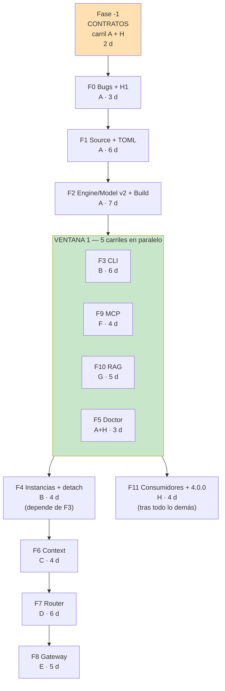
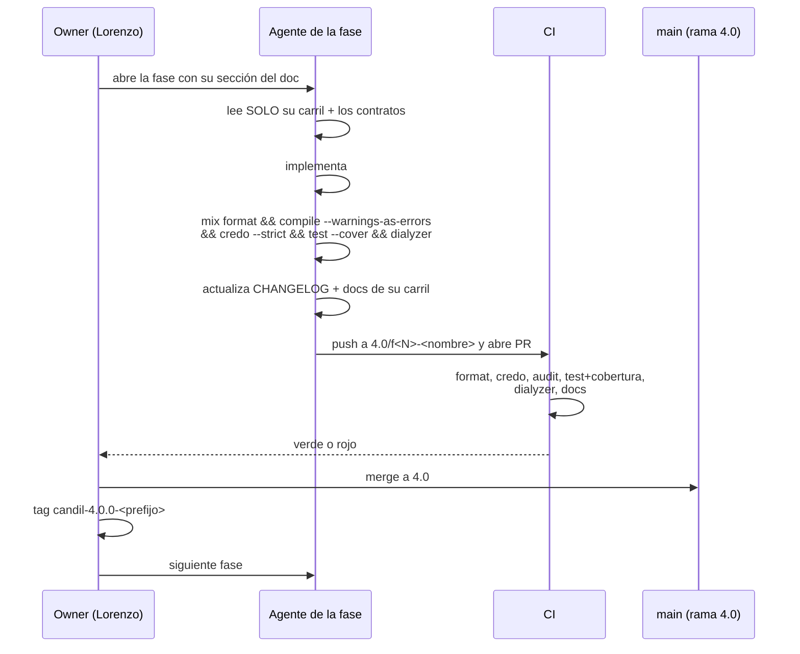

# Candil 4.0 — Plan de ejecución paralela

> **Para qué existe este documento.** El plan de 12 fases es una **cadena**, no
> un árbol: F0 depende de F1, F1 de F2… Eso significa que las fases **no** se
> paralelizan. Lo que sí se paraleliza es el trabajo **dentro** de las fases, y
> eso solo funciona si los contratos están congelados antes de empezar.
>
> Este documento define: qué se congela, qué ficheros toca cada carril, en qué
> ventanas se solapan los carriles, y cómo se merges sin pisarse.
>
> **Fecha**: 2026-10-01 · **Rama**: `4.0` · **Tag de partida**: `4.0-work-start`

---

## 1. El diagnóstico

Tres hechos que determinan todo lo demás:

**1. Las fases son una cadena.** F0 → F1 → F2 → … → F11. Ninguna fase puede
saltarse a la anterior. Un agente que empiece F7 sin F2 va a descubrir en F6 que
`Model` no tiene `port`, y va a reescribir cosas que otro agente está tocando.

**2. Dentro de cada fase sí hay paralelismo real**, porque Elixir fuerza
`Foo.Bar` a vivir en `lib/candil/foo/bar.ex`. Los directorios son fronteras
naturales: si dos agentes no comparten directorio, no pueden pisarse.

**3. El riesgo real no es el código, es el contrato.** El modo de fallo
característico de varios agentes sobre el mismo repo es el *contract drift*:
dos asumen formas distintas de `Model` o `Engine`, cada una razonable por separado,
y el merge es un desastre que nadie sabe arreglar.

**La respuesta a los tres: congelar los contratos antes de escribir una línea de
cuerpo.**

---

> **ESTADO: CERRADA.** La Fase -1 se ejecutó en ocho rebanadas y está
> verificada: 519 tests, 8 de 8 gates en verde, 63.1 % de cobertura. Este
> apartado se conserva como descripción de lo que se hizo y de por qué; el
> estado actual está en [`HANDOFF.md`](HANDOFF.md).
>
> Lo que resultó ser **más de lo que decía aquí**: H1, el bug que bloqueaba
> la absorción de ropero, quedó resuelto y probado dentro de la Fase -1, y no
> dentro de la Fase 0 como estaba planificado.

## 2. Fase -1 — Contratos (2 días, carril único, antes de F0)

Se escribe **todo el andamiaje de tipos y firmas**, sin implementaciones, y se
verifica que compila, pasa los tests y pasa dialyzer.

### 2.1 Qué contiene

| Qué | Dónde |
|---|---|
| `Model`, `Engine`, `Source`, `Build`, `Provider`, `Session`, `Decision`, `Chunk` — structs completos con **todos** los campos de v4 | los ficheros de siempre |
| `@type` de todo el dominio | idem |
| **Todas** las funciones públicas nuevas, con `@spec` correcto y cuerpo `raise "not implemented"` o `{:error, :not_implemented}` | ficheros nuevos |
| Árbol de supervisión completo en `Candil.Application` | `application.ex` |
| **Todas** las deps de v4 en `mix.exs`: `toml`, `nimble_options`, `plug`, `bandit`, `escript` | `mix.exs` |
| Fixtures de test: un TOML de ejemplo, un `MockSource` | `test/support/` |
| `.credo.exs` ajustado al estilo nuevo | `.credo.exs` |

**Criterio de aceptación de Fase -1**

```bash
mix format --check-formatted
mix compile --warnings-as-errors      # 0 warnings
mix credo --strict --format=oneline   # 0 issues
mix test                              # 0 failures
mix dialyzer                          # 0 errores
mix docs                              # 0 warnings
```

Y una comprobación manual: `grep -rn "not implemented" lib/ | wc -l` devuelve un
número **igual** al número de funciones planificadas. Ni una de más, ni una de
menos. Si sobra una, se planificó algo que no hacía falta. Si falta una, alguien
va a descubrirla en su fase y tocará un contrato.

### 2.2 La regla que lo sostiene

> **Los ficheros de contrato son propiedad del carril A para el resto del
> proyecto. Ningún otro carril los edita. Si un carril necesita un campo nuevo,
> no lo añade: abre un PR contra el carril A y espera.**

Esto es lo que evita el *contract drift*. No es burocracia: es la razón de que
esto funcione.

**Coste**: 2 días. **Ahorro**: es lo que evita tener que re-basar cuatro fases.

---

## 3. Los carriles

Cada carril tiene un conjunto de ficheros **exclusivo**. Un carril que toca un
fichero de otro es un bug del plan, no una excepción.

| Carril | Ficheros exclusively suyos | 무게 |
|---|---|---|
| **A · Núcleo** | `model.ex` `engine.ex` `engine_pool.ex` `source.ex` `build.ex` `store.ex` `config.ex` `config_manager.ex` `provider.ex` `error.ex` `detector.ex` `detector/**` `installer.ex` `cost.ex` `rate_limiter.ex` `cancellation.ex` `telemetry.ex` `health.ex` `application.ex` · `engine/**` `http/**` `inference/**` `backend/**` | F0 F1 F2 |
| **B · CLI** | `cli.ex` `cli/**` `mix/tasks/**` | F3 F4 |
| **C · Context** | `context.ex` `context/**` | F6 |
| **D · Router** | `router.ex` `router/**` | F7 |
| **E · Gateway** | `gateway.ex` `gateway/**` | F8 |
| **F · MCP** | `mcp.ex` `mcp/**` | F9 |
| **G · RAG** | `rag.ex` `rag/**` | F10 |
| **H · Docs/CI** | `README.md` `CHANGELOG.md` `docs/**` `.github/**` `mix.exs` (solo `groups_for_modules`) | transversal |

### 3.1 Las dos reglas que evitan conflictos de merge

**`mix.exs` solo lo toca H.** Los demás carriles piden deps o grupos de docs
dejando un comentario, y H los aplica al principio de su fase. Es lo que evita
el conflicto más frecuente: todos wanting to add a line to the same file.

**Un fichero, un PR.** Si un carril necesita tocar un fichero de otro, el cambio
va en un PR **separado** contra el carril dueño, y se mergea antes de continuar.
Nunca "de paso" en un PR de otra cosa.

---

## 4. El grafo de dependencias



### 4.1 Por qué F5 puede ir en la ventana 1

Doctor necesita `Store`, `Source`, `Build` y `EnginePool` — todo carril A, todo
listo tras F2. **No necesita la CLI.** Es el carril más independiente de todos
y por eso va el primero en la ventana.

### 4.2 Por qué F9 y F9/F10 pueden ir tan pronto

MCP depende de `Candil.Tool`, que **ya existe desde 3.0**. RAG depende de
`Candil.embed/3`, que existe desde 3.0. Ninguno de los dos toca nada que las
fases 0-2 modifiquen. Son los dos candidatos más claros a paralelismo real, y
por eso van en la ventana 1 y no donde estaban en el plan original.

### 4.3 La ruta crítica

```
Fase-1 → F0 → F1 → F2 → F3 → F4 → F6 → F7 → F8 → F11
  2      3    6    7     6    4    4    6    5    4   =  47 días
```

F5, F9 y F10 **no** están en la ruta crítica. Se mueven de fecha sin coste.

### 4.4 Qué gana el paralelismo, con honestidad

| | días |
|---|---|
| Plan original, todo en serie | 57-67 |
| Con ventanas paralelas | **47-55** |

Se ahorran **10-12 días**, no la mitad. Y el ahorro real no es de calendario: es
que **nadie re-basa una fase a medio hacer**.

Un aviso honesto: la ganancia de calendario viene de tener 3-5 personas
trabajando a la vez. Si se ejecuta con un solo agente aunque sea rápido, este
documento no ahorra nada — pero **el congelado de contratos sigue valiendo**,
porque es lo que evita que el agente único tenga que releer 3.000 líneas de
documento antes de cada fase.

---

## 5. Protocolo de trabajo por fase

Cada fase es un ciclo cerrado. No se empieza la siguiente hasta que la anterior
está **mergeada**.



### 5.1 Qué lee un agente al arrancar

Exactamente tres cosas:

1. **Su sección del documento de diseño** (§ de su fase, ~2-4 KB). No las 124 KB.
2. **La lista de ficheros de su carril** (§3 de este documento).
3. **Las firmas congeladas** de los contratos que va a usar.

Y **nada más**. Un agente que necesita leer más de tres ficheros para empezar
está empezando mal, y eso es información útil.

### 5.2 Qué NO puede hacer un agente

| Prohibido | Por qué |
|---|---|
| Editar un fichero de otro carril | conflicto de merge garantizado |
| Añadir un campo a un struct de contrato | contract drift (§2.2) |
| Tocar `mix.exs` | solo H (§3.1) |
| Cambiar una decisión de diseño | la decisión está tomada y documentada. Si es mala, se cambia en el doc primero, no en el código |
| Mover código entre carpetas | rompe la propiedad del carril |
| `git push --force` | corrompe el trabajo de otro carril |

### 5.3 El bucle de verificación de cada fase

```bash
# el guion que todo agente ejecuta antes de abrir su PR
set -euo pipefail
mix format
mix format --check-formatted
mix deps.unlock --check-unused
mix compile --force --warnings-as-errors
mix credo --strict --format=oneline
mix test --cover
mix dialyzer
mix docs
```

Más el **criterio de aceptación de su fase** del documento de diseño, que es un
comando con una salida esperada concreta. Eso no es opcional ni se negocia: un
PR cuyo criterio de aceptación no se ejecutó no entra.

---

## 6. Los PRs

| Fase | Rama | Tag al mergear |
|---|---|---|
| -1 | `4.0/contratos` | — |
| F0 | `4.0/f0-bugs` | `candil-4.0.0-alpha.0` |
| F1 | `4.0/f1-source` | `candil-4.0.0-alpha.1` |
| F2 | `4.0/f2-build` | `candil-4.0.0-alpha.2` |
| F3 | `4.0/f3-cli` | `candil-4.0.0-alpha.3` |
| F4 | `4.0/f4-instancias` | `candil-4.0.0-alpha.4` |
| F5 | `4.0/f5-doctor` | `candil-4.0.0-alpha.5` |
| F6 | `4.0/f6-context` | `candil-4.0.0-beta.1` |
| F7 | `4.0/f7-router` | `candil-4.0.0-beta.2` |
| F8 | `4.0/f8-gateway` | `candil-4.0.0-beta.3` |
| F9 | `4.0/f9-mcp` | `candil-4.0.0-rc.1` |
| F10 | `4.0/f10-rag` | `candil-4.0.0-rc.2` |
| F11 | `4.0/f11-release` | `candil-4.0.0` |

- Todos los PRs van contra **`4.0`**, no contra `main`.
- `main` se actualiza al final, con un PR de `4.0` → `main`.
- `main` tiene branch protection con 1 approving review: eso se cumple de
  verdad, no saltándoselo.

---

## 7. Economía de tokens

Cinco reglas, y valen más que cualquier optimización de prompt:

**1. El documento de diseño ES la especificación.** Un agente que re-deriva una
decisión que ya está escrita en el doc ha gastado 3.000 tokens para fabricar algo
peor. La sección de su fase es el input.

**2. Nunca pegar un fichero entero en un prompt.** Referenciar ruta y rango de
líneas. Un `read` de 200 líneas cuesta menos que un fichero de 800 en el prompt,
y devuelve lo mismo.

**3. Un agente de docs por fase, no uno por fichero.** El CHANGELOG, el README y
`groups_for_modules` los escribe **el agente de la fase**, en su propio PR. Diez
agentes editando el CHANGELOG hacen diez merge conflicts y diez entradas
inconsistentes.

**4. El verificador recibe la salida, no el código.** Para comprobar que los tests
pasan, se le da el resultado del comando. No necesita el `lib/` entero.

**5. Lo que ya se sabe, no se busca.** Las versiones de los repos, los hechos
sobre ropero, la revisión de MCP, el nombre de los módulos: están todos en el
documento de diseño. Un agente que los redescubre está leyendo 10 snapshots para
llegar a lo que está escrito.

---

## 8. Documentación

El carril H mantiene, en cada fase:

| Artefacto | Regla |
|---|---|
| `README.md` | Ejemplo ejecutable y **verificado**. Si el ejemplo no corre, no está. |
| `CHANGELOG.md` | Formato Keep a Changelog. Una sección por fase, con los nombres de función reales. |
| `docs/DESIGN.md` | Enlaza a `proyecto 4.0/candil-4.0-final.md`, no lo copia. |
| `docs/CONFIG.md` | El TOML comentado, siempre **sincronizado con el código**. Un `candil config example` que lo genera es mejor que un fichero escrito a mano. |
| `groups_for_modules` en `mix.exs` | Sin módulos renombrados, porque ExDoc los convierte en enlaces muertos en silencio. Lo comprueba el job de `docs` del CI. |
| `mix docs` | Debe construir sin warnings. Gate del CI. |

### 8.1 Sobre dialyzer y benchee

**Dialyzer: sí, como gate duro.** Ya estaba en `mix.exs`; ahora tiene su propio
job con caché de PLT. Para una librería donde `Model`, `Engine` y `Source` son
structs públicos documentados, es donde se cazan los cambios de contrato que
rompen a los consumidores. Sin él, C13 (el major de semver) es una promesa sin
nadie que la verifique.

**Benchee: sí, pero con lupa.** Solo para rutas donde una regresión es plausible
**y** el documento de diseño afirma algo sobre rendimiento:

- `Candil.Source` — streaming con `Range` y checksum en bloques
- `Candil.RAG.Chunker` — el solapamiento y el coste por chunk
- `Candil.RAG` — RRF y búsqueda lineal del índice en memoria
- `Candil.Conversation.TokenEstimator` — está en el camino crítico de `Context.Builder`

Y **nada más**. Un benchmark que mide el arranque de un GenServer no informa de
nada. Coste: `benchee` ya es dep de `alaja`, así que no añade nada al ecosistema.

**Benchee no corre en el CI.** Un job de benchmarks en cada push es caro y
nadie lo lee. Se corre a mano antes de un tag, y el resultado se pega en el PR
del tag. El CI solo lo ejecuta en el `schedule` semanal, para detectar deriva.

---

## 9. Checklist de arranque de cada agente

```markdown
- [ ] He leído el §N de `proyecto 4.0/candil-4.0-final.md` de MI fase
- [ ] Sé qué ficheros son míos (§3) y no voy a tocar ningún otro
- [ ] He leído las firmas congeladas que voy a implementar
- [ ] Mi rama es `4.0/f<N>-<nombre>`
- [ ] He hecho `git fetch && git checkout 4.0 && git pull` antes de crear la rama
- [ ] NO he editado ningún struct de contrato
- [ ] NO he tocado `mix.exs`
- [ ] `mix format && mix compile --warnings-as-errors && mix credo --strict
      && mix test --cover && mix dialyzer && mix docs` → todo verde
- [ ] El criterio de aceptación de mi fase se ejecuta y da la salida esperada
- [ ] He actualizado CHANGELOG y README en MI PR
- [ ] El PR va contra `4.0`, no contra `main`
- [ ] No he hecho `git push --force`
```

Si una casilla no se puede marcar, **para y pregunta**. No se improvisa.

---

## 10. Lo que este plan no resuelve

- **Los tests.** Un agente que escribe el módulo y sus tests en el mismo PR
  tiende a escribir tests que pasan. Los tests de un carril los escribe **otro**
  agente, después, leyendo el módulo como usuario. Cuesta el doble y es el
  único momento en que se cazan de verdad los bugs.
- **Los cambios de diseño.** Si una fase resulta estar mal, el documento se
  actualiza **primero** y el código después. Al revés se pierde la decisión.
- **El `escript` y el empaquetado de la CLI.** F3 deja la CLI verde en local;
  el empaquetado y la instalación son una fase aparte, no contemplada aquí.
