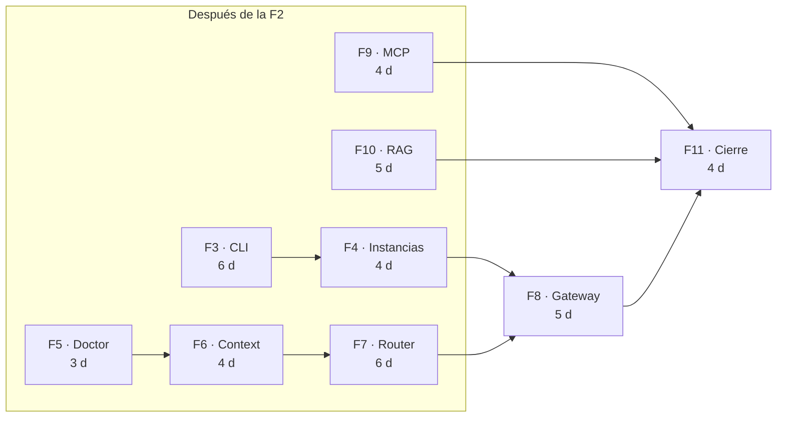
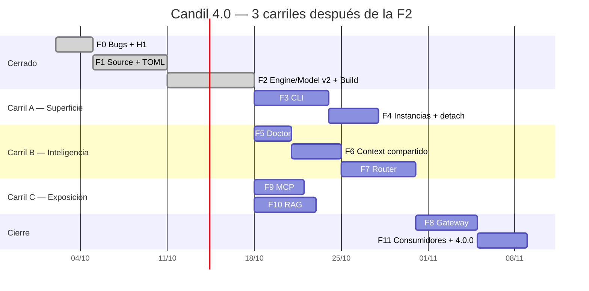

# Candil 4.0 — replanificación de las fases

> Sustituye al `gantt` y a la Parte IV de `candil-4.0-final.md`, y a la
> secuencia implícita de `PLAN-VENTANA-PARALELA.md`. La numeración de las fases
> **no cambia** —las ramas, los tags y los merges ya existen—; lo que cambia es
> **el orden y las dependencias**.
>
> Fecha: 2026-10-03 · Origen: auditoría de las 8 fases

---

## El hallazgo

El gantt del plan es una cadena:

```
F0 → F1 → F2 → F3 → F4 → F5 → F6 → F7 → F8 → F9 → F10 → F11
```

Cuarenta y un días después de la F2, todo secuencial. Pero las dependencias que el
propio plan declara en el texto **no son esas**:

| Fase | El gantt dice que depende de | En realidad depende de |
|---|---|---|
| **F5** doctor | F4 | `Store`, `Source`, `Build`, `EnginePool` — **todo listo tras la F2**. Solo pide `Config.Hydrate` a la F3, que es un módulo |
| **F6** context | F5 | nada de la F3 ni de la F4. Usa `candil run` **solo en el test de integración**, que se puede dejar para el final |
| **F7** router | F6 | F6, y modelos en `Store`. `candil` solo para el criterio |
| **F9** MCP | F8 | **`Candil.Tool`, que existe desde 3.0.** El README dice que depende de la 8 "porque el MCP se enchufa como un endpoint más", pero no toca el gateway |
| **F10** RAG | F9 | **`Candil.embed/3`, también de 3.0.** Lo mismo |

**Lo que en realidad son tres carriles, no uno:**



| Carril | Fases | Días | sesiones |
|---|---|---|---|
| **A · Superficie** | F3 → F4 | 10 | 1 sesión |
| **B · Inteligencia** | F5 → F6 → F7 | 13 | 1 sesión |
| **C · Exposición** | F9, F10 (a la vez) | 5 | 1-2 sesiones |

**Camino crítico:** `max(10, 13, 5) + 5 + 4 = 22 días` después de la F2.
**El plan actual: 41.** Se ahorran **unos 19 días de los 57-67**, sin escribir una
línea de código.

---

## El gantt nuevo



**F8 espera a F7, no a F9 ni a F10.** El gateway enruta, y el router es F7. F9 y
F10 pueden terminar después, y de hecho pueden empezar antes.

---

## Fases nuevas antes de empezar

Dos fases de medio día, que es lo que cuesta que la paralelización sea real en vez
de teórica.

### F0.5 · Convenciones — 0.5 d

Existe porque hoy los ocho gates, la política de commit, el nombre de rama, las
trampas del entorno y `CANDIL_DATA_DIR` están **copiados en los ocho README de
fase**, y ya han divergido: la rama imposible está en la F2 y no en la F6, el
mirror de Hex está en la F5 y no en la F2, la base de tests es "702" en unas y
"623" en otras.

**Seis de las nueve contradicciones de la auditoría son la misma cosa: información
duplicada que se desincroniza.** No es falta de atención, es una ley.

| Fichero | Qué lleva |
|---|---|
| `4.0/AGENTS.md` | toolchain, los ocho gates, la rama **con guion**, ventana de commit 20:00-02:00, mirror de Hex, `CANDIL_DATA_DIR`, las ocho trampas del entorno |
| `4.0/lanes.md` | qué carril está abierto, quién, desde cuándo |

Los README de fase pasan a ser **solo lo específico de esa fase** y a enlazar el
`AGENTS.md`. Bajan a un tercio de tamaño y no pueden divergir.

### F2.5 · Smoke tests — 0.5 d

Porque la lección de `alaja` ya está escrita y aquí no se aplicó: *smoke tests al
final de cada proyecto, ejecutan binarios reales, los snapshots no se tocan sin
revisión humana*.

Los criterios de aceptación que de verdad catan bugs —el output del doctor
coincide con la §17, el cliente OpenAI de PyPI imprime, `router test` con su
formato— son **prosa**, y la prosa no se ejecuta.

```elixir
# test/support/smoke_case.ex
defmodule Candil.SmokeCase do
  use ExUnit.Case
  @moduletag :smoke
  @moduletag :external_resource   # <- no falla el CI si no se puede correr
end
```

```bash
mix test --only smoke          # corre todos de golpe
mix test --only smoke --exclude parity
```

La F5 es la candidata piloto: tiene output literal en el documento, y un snapshot de
eso detecta un cambio de comportamiento que ningún unitario ve.

---

## La puerta de decisiones, antes de F9 y F10

**F9 y F10 no arrancan hasta que estén resueltas las dos decisiones de diseño.** No
es burocracia: es que un agente que empieza con la decisión abierta la toma por su
cuenta, y es cara.

| | Decisión | Por qué bloquea |
|---|---|---|
| **F9** | ¿`2026-07-28` (Current) o `2025-11-25` (Legacy)? | Cambia si hay `initialize` o hay `server/discover`. Es un día de diferencia de trabajo, y un día de **tirar la fase** si se elige mal |
| **F10** | ¿el diseño del README (SQLite + chunking por función) o el del plan (memoria + configurables)? | Ocho divergencias. Los dos documentos vivos producen dos RAG |

Las dos caben en **una mañana**. Se resuelven en un documento corto, se anotan en
`HANDOFF.md`, y los carriles arrancan.

**Lo que sí arranca sin esperar:** F3, F4, F5, F6, F7. Ninguna depende de esas dos
decisiones.

---

## Los criterios de aceptación, sin depender de la CLI

Este es el detalle mecánico que hace que los carriles B y C sean reales.

Cinco de las nueve fases usan `./candil algo` en su criterio de aceptación, y eso
las ata a la F3. Pero el plan **ya resuelve el caso** en la F2, que valida el TOML
con `mix run -e 'Candil.Store.get_model(:coder)'` porque la CLI no existía.

**La misma forma vale para todo:**

```bash
# antes, atado a la F3:
$ ./candil doctor

# forma que funciona sin la CLI:
$ mix run -e 'Candil.Doctor.doctor()' |> IO.inspect()
```

Regla del replan: **el criterio de aceptación de una fase se expresa siempre en
`mix run -e`, y la forma `./candil ...` es una confirmación secundaria una vez la
F3 está mergeada.**

Con eso, F5, F6 y F7 no dependen de la F3 para nada, y F9 y F10 tampoco.

**Excepción:** la F3 y la F4 sí usan `./candil`, porque son la CLI. Y la F11 usa
`./candil doctor` porque es el release gate y ahí la forma larga es la correcta.

---

## La coordinación: lo que cuesta el paralelismo

Tres ficheros los tocan todos. Con 3 carriles son 3 conflictos garantizados en cada
merge.

| Fichero | Conflicto | Solución |
|---|---|---|
| `mix.exs` → `groups_for_modules` | tres PRs tocan la misma lista | **Nadie lo toca.** Cada carril lo pide en el PR y **el carril H lo aplica una vez al final** |
| `HANDOFF.md` §2 | todos escriben el mismo apartado | **Solo la sesión de merge.** Cada carril deja su §2 en el `deliverable.md` |
| `CHANGELOG.md` | todos añaden al `Unreleased` | **Fragmentos por carril**: `.changelog/f5.md`, y la sesión de merge los concatena |

Con eso, **los carriles no se tocan en ningún fichero**, y el único punto de
contrención es la sesión de merge. Es lo mismo que ya funciona con las deps de
GitHub y el `override: true`.

**Y una cuarta, que es la importante:** los tests. La `PLAN-VENTANA-PARALELA` ya lo
dice y tiene razón: *"un agente que escribe el módulo y sus tests escribe tests
que pasan"*. Por eso la sesión revisora **siempre a `max`**, sin excepciones, y
lee el PR **sin el diff del autor** — que es como el autor sesga la revisión.

---

## El plan, fase a fase

### Carril A — Superficie

| Fase | Qué | Qué cambia respecto al plan |
|---|---|---|
| **F3** | CLI con Alaja | Sin cambios. Sigue siendo 6 d y sigue bloqueando el criterio de las demás, por lo que usa `mix run -e` |
| **F4** | Instancias, detach, engines externos | + **D2**: `EnginePool` deja de ser API pública, `instances.json` es la única verdad entre procesos |

### Carril B — Inteligencia

| Fase | Qué | Qué cambia |
|---|---|---|
| **F5** | Doctor | + **D9** (el primer check nuevo). Es la fase piloto de los smoke tests |
| **F6** | Context compartido | + **D4** (política de desbordamiento, `strict` por defecto) y **D8** (`Conversation` → deprecated) y **D9** (check de context) |
| **F7** | Router | + **D1** (`quality_class`) y **D6** (señal de acierto) y **D9** (check de router) |

### Carril C — Exposición

| Fase | Qué | Qué cambia |
|---|---|---|
| **F9** | MCP | + **D9** (check de la revisión). **Empieza tras la puerta de decisiones** |
| **F10** | RAG | + **D9** (check de RAG). **Empieza tras la puerta de decisiones** |

### Cierre

| Fase | Qué | Qué cambia |
|---|---|---|
| **F8** | Gateway | + **D5** (`reasoning_effort`) y **D9** (check de gateway). Es el punto de unión de A y B |
| **F11** | Consumidores, docs, 4.0.0 | + **D10** (la issue de botica) y **D7** como criterio de cierre (paridad del TOML contra ropero, sin necesitar 17 GB) |

---

## Y si solo tienes una sesión

**El replan sigue siendo mejor, y por un motivo que no es el calendario.**

Reordena a **riesgo primero**:

```
F5 (1 d, a medias) → F6 (4) → F7 (6) → F3 (6) → F4 (4) → F8 (5) → F9 (4) → F10 (5) → F11 (4)
```

La razón: **el riesgo del plan está en F6, F7, F9 y F10** —aislamiento de
contexto, decisión de modelo, protocolo, retrieval. F3 y F4 son las más seguras
que vas a tener. Poner lo seguro primero significa que llegas a lo arriesgado con
el contexto fresco y con la-feira del calendario para reaccionar a un bloqueo.

Con el orden viejo llegas a la F7 —que es la única fase con `max` de base y la que
tiene decisiones sin escribir— en el día 23 de 41, sin margen.

---

## Lo que este replan promete, y lo que no

**Promete:** unos 19 días menos de calendario, a cambio de 2-3 sesiones
paralelas y un punto de contención al final. Y un orden que pone el riesgo delante
aunque no haya paralelismo.

**No promete:** que el trabajo sea menos. Las fases siguen siendo las mismas con
sus mismos 57-67 días de contenido. Lo que cambia es **cuándo se puede empezar
cada una**, no cuánto cuesta hacerla.

**Y no cambia:** los tags, los números de fase, los nombres de carril, ni los
criterios de aceptación ejecutables, que eran lo mejor del plan y siguen intactos.
