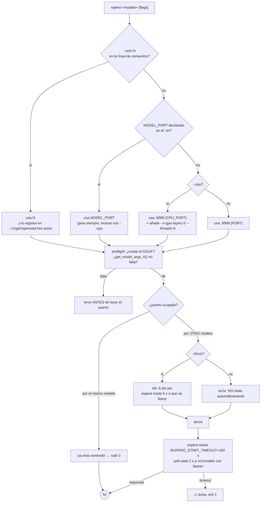
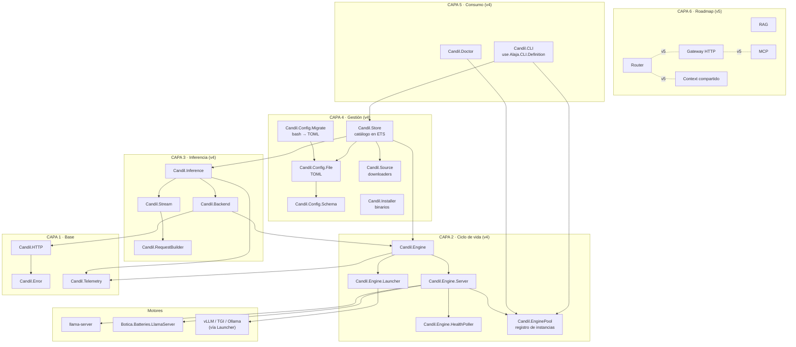
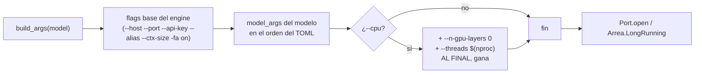
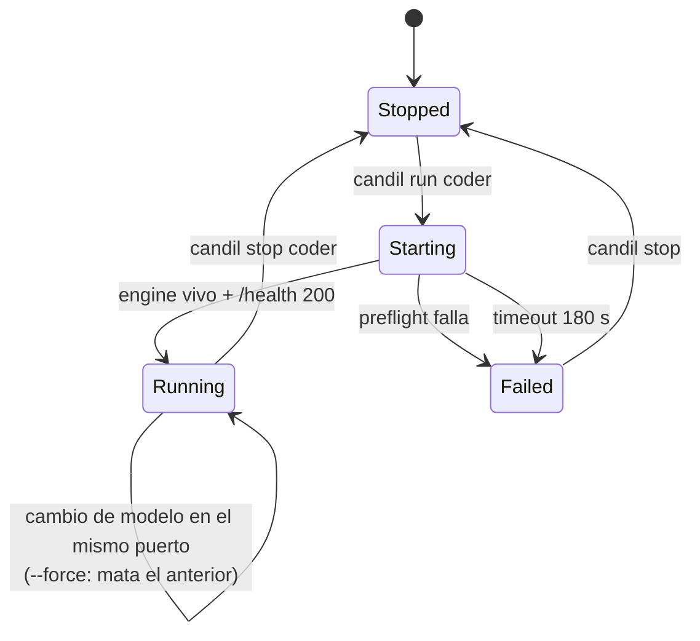
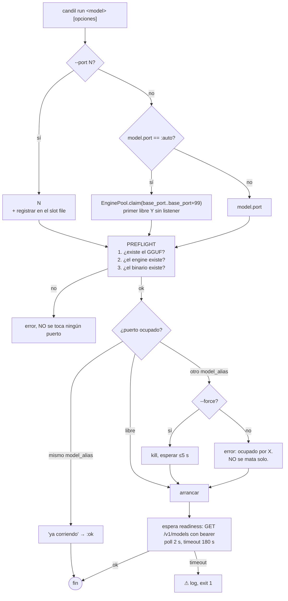
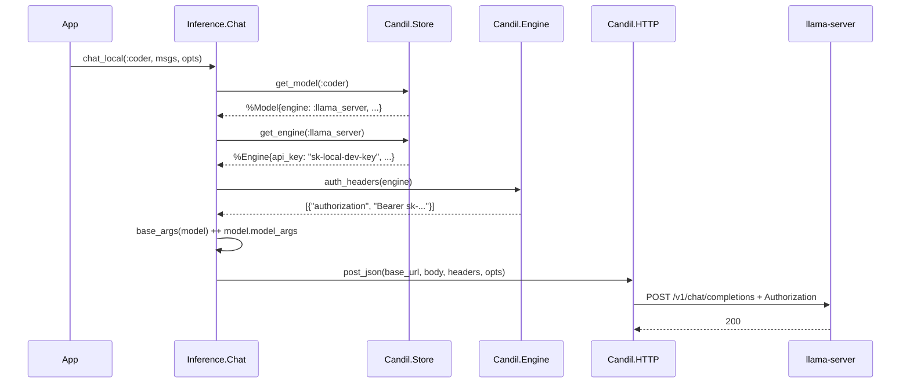
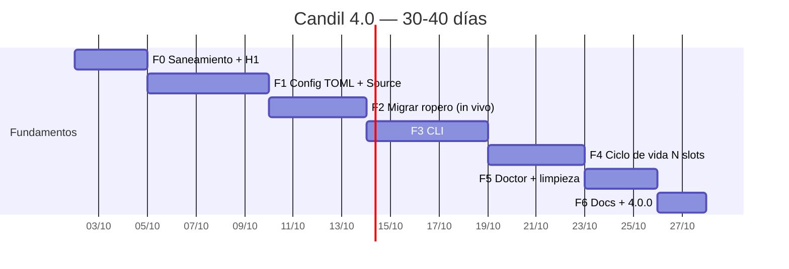

# Candil 4.0 — Documento final de diseño, migración y ejecución

> **Documento maestro DEFINITIVO.** Supersede a `version 1.md`, `version 2.md` y
> `version 3.md`. Autocontenido: no requiere leer nada más para ejecutarlo.
>
> **Fecha**: 2026-10-01 · **Estado**: decisiones cerradas · **Decide**: Lorenzo
> **Ejecuta**: por asignar
>
> **Base**: los tres documentos previos + lectura íntegra de los snapshots del
> código real de `candil` 3.0.0, `ropero`, `elpaso`, `botica`, `posadero`,
> `alaja`, `apero`, `arrea`, `trebejo`.
>
> **Destino**: `~/cacafuti/lasaca/PENDIENTE/principal/candil-4.md`

---

## ⚠️ Cómo leer este documento respecto a los tres anteriores

Los tres documentos previos tienen un problema de fondo: **describen un
producto que Candil todavía no es, y dan por bueno el estado del código sin
verificarlo contra la fuente**. Este documento corrige eso.

Tres cambios de fondo respecto a v3 (el mejor de los tres):

1. **Añadimos 9 hallazgos verificados que los tres documentos no contienen**, y
   cuatro de ellos son bloqueantes para el diseño (§2.3). El más grave: **la
   ruta local de Candil no puede hablar con los servidores de ropero** porque
   manda cabeceras fijas y sin API key.
2. **Reordenamos las fases.** El orden de v3 (TOML → CLI → Router → Context →
   MCP → RAG → migrar) pone la migración de ropero en la fase 7 de 11, cuando
   la migración es **el objetivo declarado** y depende de un bug que está en la
   fase 0. Reordenamos para que la absorción ocurra pronto y sirva de
   validador del resto.
3. **Añadimos criterios de aceptación verificables** a cada fase. Ningún fase
   termina con "funciona": termina con un comando exacto que debe salir en verde.

Lo que se mantiene de los documentos previos: la estructura de seis capas, el
`consumer` como concepto de primera clase, TOML como fuente de verdad, ETS por
defecto, y el mapeo de ElPaso. Eso estaba bien y sigue estando bien.

---

# PARTE I — Contexto

## 1. Resumen ejecutivo

**Candil 4.0 es la absorbing de `ropero` y de la parte útil de `elpaso` para
convertir Candil 3.0.0 en la librería de IA del ecosistema.**

Candil 3.0.0 tiene una arquitectura sana (49 módulos, separación Engine /
Backend / Provider / Inference, tests, dialyzer limpio) pero **tres de sus cuatro
callbacks de `Candil.Backend` son stubs** y **su camino local de inferencia está
cerrado a la autenticación**. `ropero` resuelve ambos problemas en bash: sabe
arrancar `llama-server` con los flags correctos por modelo, y sabe hablar con
sus propios servidores porque los lanza con `--api-key` y siempre manda el
bearer.

El plan: **traer esa capacidad a Elixir, conservando los modelos, los flags y
los puertos de ropero exactamente como están hoy**, añadir la config en TOML y
un CLI con Alaja, y luego portar el router y el gateway de ElPaso.

**Esfuerzo**: 30-40 días de trabajo concentrado.

**Lo que NO se hace en v4** (y por qué está en el Apéndice D):
RAG, MCP, Context compartido, multi-nodo, Postgres, web. Esos son v5. Los tres
documentos previos los metían todos en v4 y eso multiplicaba el riesgo sin
desbloquear nada de la migración.

---

## 2. Estado real verificado

### 2.1 Candil 3.0.0 — inventario

Verificado contra el snapshot `snap-candil.txt` (49 ficheros en `lib/`).

| Capa | Módulos | Estado |
|---|---|---|
| **App** | `Candil.Application` (Registry, Config, Cancellation, Tool, EnginePool, DynamicSupervisor) | ✅ |
| **Config** | `Config` (3 tablas ETS), `ConfigManager` | ⚠️ ETS-only, sin fichero |
| **Dominio** | `Model`, `Provider`, `Engine` | ✅ structs con validación |
| **Ciclo engine** | `Engine`, `Engine.Server`, `Engine.Server.External`, `Engine.Launcher`, `Engine.HealthPoller`, `EnginePool` | ⚠️ ver B6, B7 |
| **Instalación** | `Installer`, `Detector`, `Detector.{GPU,Models,Release}` | ⚠️ ver B8 |
| **Inferencia** | `Inference`, `Inference.Chat`, `Inference.Embeddings`, `RequestBuilder`, `Stream`, `HTTP`, `HTTP.Client`, `HTTP.Retry` | ⚠️ ver B1, B5 |
| **Backend** | `Backend`, `Backend.LlamaCpp`, `Backend.OpenAICompat` | ❌ 3 de 4 callbacks stub |
| **Conversación** | `Conversation`, `Conversation.Context`, `Conversation.TokenEstimator` | ✅ |
| **Tools/Agent** | `Tool`, `Tools`, `Structured`, `Agent` | ⚠️ dependen de los backends rotos |
| **Runtime** | `Cost`, `Health`, `Telemetry`, `Cancellation`, `RateLimiter`, `Error` | ✅ |

**Deps actuales** (`mix.exs`): `apero` y `arrea` por **GitHub** (no Hex),
`jason`, `mox` (test), `credo`, `dialyxir`, `excoveralls`, `ex_doc`.
`trebejo` se usa vía `Code.ensure_loaded?` **sin estar declarada como dep**.

**Config**: no existe `config/config.exs`, ni `runtime.exs`, ni `test.exs`. Solo
dos claves `Application.get_env` en todo el código:

- `Application.get_env(:candil, Candil.Config, [])` — el catálogo
- `Application.get_env(:candil, :registry, Candil.Registry)` — el Registry

### 2.2 Los 8 bugs de Candil (verificados uno a uno)

| # | Ubicación | Qué pasa | Consecuencia |
|---|---|---|---|
| **B1** | `Backend.LlamaCpp.chat/3` | devuelve `{:error, %Error{reason: :backend_unavailable}}` | `Agent.run/3` y `Structured.complete/4` **nunca funcionan** |
| **B2** | `Backend.LlamaCpp.chat_stream/3` | ídem, stub | sin streaming local por backend |
| **B3** | `Backend.OpenAICompat.chat_stream/3` → `build_chunk_stream/1` | devuelve un stream de 1 chunk vacío con `Process.sleep(50)` | **peor que no tener streaming**: el llamador cree que funciona |
| **B4** | `Backend.OpenAICompat.embed/3` | `Enum.map` con una request por texto | 100 textos = 100 round-trips. La doc promete batch |
| **B5** | `Config.register_provider/1` → `validate_api_key/1` | solo acepta `{:system, "VAR"}` o `nil`; el README muestra un string plano | `raise ArgumentError` siguiendo el README |
| **B6** | `Detector.safe_arch/0` | `Code.ensure_loaded?(Trebejo.OS)` → si no está, devuelve `:unknown` en silencio | la descarga del binario falla después sin decir por qué. `trebejo` no está en `mix.exs` |
| **B7** | `EnginePool` | LRU de N donde **nadie llama `evict/0`**. `put/1` es `cast` (fire-and-forget) | no es un pool, es un registro de la última cosa escrita. El nombre miente |
| **B8** | `Installer.verify_checksum/2` | `File.read(path)` completo para modelos de **17 GB** | OOM. Verificado: `qwen.env` descarga un GGUF de 17.7 GB |
| **B9** | tests | `config_test.exs:9` hace `delete_all_objects(:apero_llm_engines, :undefined)` (aridad y nombre obsoletos); `engine_test.exs:39-42` espera `~/.apero/llm/bin` y el código devuelve `~/.candil/llm/bin` | tests stale. **El código tiene razón en ambos casos** |

### 2.3 🔴 Los 4 hallazgos que los tres documentos no contienen

Estos son los que **cambian el diseño**. Los tres documentos previos los
pasaron por alto y hacen que la migración, tal como está planificada, falle.

#### 🔴 H1 — La ruta local de Candil no puede hablar con los servidores de ropero

**Verificado.** `Inference.Chat.do_chat_local/3`:

```elixir
HTTP.post_json("#{base_url}/v1/chat/completions", body, [], opts)
#                                                       ↑ cabeceras fijas a []
```

Idéntico en `do_embed_local/3` (`HTTP.post_json(url, body, [], [])`) y en
`Stream.chat/4`.

`ropero` arranca **todos** sus servidores con `--api-key "$LLAMA_API_KEY"`
(default `sk-local-dev-key`) y su propio chequeo lo confirma:

```bash
get_model_on_port() {
    curl -sf --max-time 2 \
        -H "Authorization: Bearer $LLAMA_API_KEY" \
        "http://127.0.0.1:$1/v1/models" | grep -o '"id":"[^"]*"' | ...
}
```

**Consecuencia**: todo servidor de ropero responde **401** a Candil. No hay
forma de inyectar cabeceras por `opts` en la ruta local.

**Esto ya está documentado en tu propio código.** `posadero` —que ya depende
de candil— se saltó de Candil y escribió su propio cliente:

> `Candil` está pensado para hablar con motores que él mismo arranca, y su camino
> local (`Candil.Inference` → `Candil.HTTP.post_json/4`) manda **las cabeceras
> fijas a `[]`**: no hay forma de inyectar `Authorization: Bearer`. Los
> servidores de ropero responden 401 sin esa cabecera. Es decir: por el camino
> local de Candil, el RAG no puede funcionar contra la configuración real de
> ropero.
>
> — `posadero/lib/posadero/llm/ropero.ex`, moduledoc

`Posadero.LLM.Ropero` existe **porque Candil no puede**. Y tiene un segundo
problema documentado en el mismo sitio:

> El puerto de un modelo no es una propiedad del modelo: sale de su *provider*,
> y un mismo provider sirve varios alias. Además, `ropero.d/*.sh` puede pinear
> un modelo a un puerto propio con `MODEL_PORT`, y entonces ese alias se aparta
> del slot que le tocaría por su provider.

Consecuencia real: **el panel de posadero decía "degraded" mirando el `:9999`
(slot GPU) cuando el modelo de embeddings estaba sano en el `:9990`** (que está
pineado en `embed.sh`).

**Diseño v4**: `Engine` gana `:api_key` y `:auth_headers`. `Engine.Server`
pasa las cabeceras al construir el proceso. `Inference.Chat` las pide al
`Engine` en vez de mandar `[]`. Y se añade un resolver de puerto que consulta
`EnginePool`, no `Config`.

#### 🔴 H2 — `Botica.Batteries.LlamaServer` ya hace el 80 % del trabajo, y nadie lo menciona

**Verificado** contra el snapshot de botica v2.1.1. Existe
`Botica.Batteries.LlamaServer` con:

- `find_binary/1` — override explícito → `which llama-server` → instalar
- `build_args/2` — **tabla enorme de defaults por rol** (`:chat` / `:embedding`),
  con `ctx_size: 128_072`, `n_gpu_layers: :auto`, `cache_type_k: "q8_0"`,
  `spec_type: "ngram-mod"`, `flash_attn: "on"`, `no_mmap: true`,
  `slot_save_path: "/tmp/llama-server-cache"`, y para embeddings
  `pooling: "last"`, `embd_normalize: 2`, `device: "none"`
- `start/2` / `stop/1` — sobre `Arrea.LongRunning`
- `running?/1` — probe de `/health`
- y un `Botica.Batteries.LlamaServer.Installer` con `install/1` idempotente a
  `~/models/llama-server` (override con `LLAMA_INSTALL_DIR`)

**Esto ya solapa con `Candil.Installer` + `Candil.Engine.Server`.** Y ropero es
el tercer implementario de lo mismo.

Los tres documentos ponen botica como "opt-in para `candil doctor`" y no miran
una línea más. Eso es un error: **candil y botica compiten por el mismo
territorio y van a divergir**.

**Diseño v4** (decisión C13): candil **no reimplementa** la gestión de
`llama-server`. `candil.Engine.Server` delega a `Botica.Batteries.LlamaServer`
cuando botica está disponible, y cae a su propia implementación cuando no. La
tabla de defaults de botica pasa a ser **la fuente de verdad** de los defaults
de flags, sustituuyendo a `Botica` como sitio único.

#### 🔴 H3 — ropero tiene un modelo de datos que no encaja en el `Engine` de Candil

`ropero` separa **tres** cosas que `Candil.Engine` mezcla en una:

| ropero | Candil 3.0 | Problema |
|---|---|---|
| `MODEL_ENGINE` (llama-server, airllm, tensorrt-llm, mlx_lm) | `Engine.alias` | Candil asume un solo tipo de engine |
| `MODEL_PORT` (9990 embed, 9991 qwenvision) | `Engine.port` | el puerto va en el engine, no en el modelo |
| `get_model_args_X()` (los flags del modelo) | `Model.model_args` | ok, pero Candil no genera los flags base |

Un modelo puede vivir en un puerto distinto del de su engine, y **el mismo
modelo puede estar corriendo dos veces** (GPU en `:9999` y CPU en `:9998`, con
`--n-gpu-layers 0`).

**Diseño v4**: `Model` gana `:port` (`:auto` | entero) y `Engine` se queda con
`host` + `base_port`. El puerto es del modelo, como en ropero. `EnginePool`
pasa a ser el **registro de instancias vivas `{alias, port, pid}`**, y una
instancia viva es `(model, port)`, no `model`.

#### 🔴 H4 — El `Detector` de Candil elige binarios que no son los de ropero, y eso es un problema

`ropero` compila llama.cpp **a medida** para cada máquina:

- **CachyOS/CUDA**: `CMAKE_CUDA_ARCHITECTURES="120a"` (RTX 5080 / Blackwell),
  `--use_fast_math`, `GGML_CUDA_MMQ_MXFP4=ON`, `GGML_CUDA_MMQ_NVFP4=ON`,
  `GGML_CUDA_NO_VMM=ON`, `GGML_CUDA_COMPRESSION_MODE=speed`, IPO, `-march=native`
- **macOS/Metal**: `GGML_METAL_USE_MPS`, `GGML_METAL_FLASH_ATTN`,
  `GGML_METAL_USE_BF16`, `GGML_METAL_EMBED_LIBRARY`, `-mcpu=native`

`Candil.Detector` descarga un **precompilado genérico** de las releases de
GitHub, elegido por patrón de nombre (`bin-linux-cuda-cu12.4.1-x64.zip`).

**El binario de ropero y el de candil no son intercambiables.** En una RTX 5080,
`sm_120a` + MXFP4 MMQ + fast math es la diferencia entre un modelo que carga y
uno que no. Y el port de ropero ya está compilado y funcionando.

**Diseño v4** (decisión C14): **`candil` NO compila llama.cpp**. El binario es
una propiedad del entorno, se localiza, y se documenta cómo se obtiene. Candil
ofrece `candil doctor` que dice "no encuentro `llama-server`; instálalo con
ropero, con tu gestor de paquetes, o con `candil engine install --from-ropero`".
El `Detector` se queda **solo** para elegir la variante si se decide descargar,
pero deja de ser el camino por defecto.

---

## 3. Estado de ropero (lo que hay que preservar)

**Verificado** contra el snapshot. 4.474 líneas, 22 ficheros, 3 módulos de infra
+ 12 modelos activos + 7 archivados en `fired/`.

### 3.1 El catálogo de modelos

Descubrimiento: se sourcea cada `ropero.d/*.sh` y se leen 6 arrays asociativos
(`declare -A MODEL_GGUF MODEL_CTX MODEL_ENGINE MODEL_PATH MODEL_ALIAS
MODEL_ALIAS_TARGET MODEL_GPU MODEL_PORT`). Se excluyen los que empiezan por `_`,
`00-`, `01-`, `*-compile-*`, `*-download-*`.

| Script | Engine | GGUF / Path | ctx | Alias | Puerto | Flags distintivos |
|---|---|---|---|---|---|---|
| `devstral.sh` | llama-server | `Devstral-Small-2-24B-Instruct-2512-UD-Q4_K_XL.gguf` | 131072 | **`coder_lite`** | — | `ngl -1`, `cache q8_0`, `kv-unified`, `context-shift`, `reasoning-format deepseek`, `jinja`, `temp 0.6/top-k 20/top-p 0.95/min-p 0.05`, `threads 12`, `batch 4096/ubatch 1024/parallel 1`, `n-predict 4096`, `keep 1024`, `load-mode none` |
| `qwencoder.sh` | llama-server | `Qwen3-Coder-30B-A3B-Instruct-UD-Q4_K_XL.gguf` | 131072 | **`coder`** | — | `ngl -1` + **`n-cpu-moe 30`** (MoE en CPU por 16 GB VRAM), `no-kv-offload`, `cache-prompt`, `context-shift`, `kv-unified`, `jinja`, `reasoning-format deepseek`, `temp 0.7/top-p 0.8/top-k 20/min-p 0/repeat-penalty 1.05/repeat-last-n 64`, `n-predict 8192`, `threads 12` |
| `qwen.sh` | llama-server | `Qwen3.8-27B-UD-Q3_K_XL.gguf` | 131072 | **`analyst`** | — | `ngl 99` (**no `-1`**: cuelga el fitting), **`--spec-type draft-mtp` + `--model-draft mtp-Qwen3.8-27B-Q4_0.gguf`** (MTP nativo), `n-gpu-layers-draft -1`, `spec-draft-n-max 5`, `spec-draft-backend-sampling`, `presence-penalty 1.5`, `n-predict 16384` |
| `qwenvision.sh` | llama-server | `Qwen2.5-VL-7B-Instruct-UD-Q4_K_XL.gguf` + `mmproj` | 32768 | — | **9991** | `ngl 999`, **`--mmproj $GGUF_DIR/Qwen2.5-VL-mmproj.gguf`**, `repeat-penalty 1.05`, `slot-prompt-similarity 0.8`, `keep 8192`. *(en `fired/`)* |
| `fable.sh` | llama-server | `Fable-Coder-35B-A3B-Q4_K_M.gguf` | 131072 | — | — | MoE 35B/3B, MTP nativo, tuning por VRAM (`n-cpu-moe 40`) |
| `embed.sh` | llama-server | `jina-code-embeddings-1.5b-Q8_0.gguf` | 8192 | — | **9990** | `--embedding`, `pooling last`, `embd-normalize 2`, `batch 1024/ubatch 1024/parallel 4`, `jinja` |
| `gptoss_high.sh` | llama-server (vía `_gptoss_common.sh`) | `openai_gpt-oss-20b-MXFP4.gguf` | 131072 | **`verifier`** | — | `ngl 99`, `temp 0.8/top-k 40/min-p 0.05/repeat-penalty 1.1`, **`chat-template-kwargs {"reasoning_effort":"high"}`**, `n-predict 16384`, `keep 8192`, `cache q8_0`, `kv-unified`, `load-mode auto` + spec ngram |
| `gptoss_medium.sh` | ídem | ídem | 131072 | **`designer`** | — | `reasoning_effort: medium` |
| `gptoss_low.sh` | ídem | ídem | 131072 | — | — | `reasoning_effort: low` + `spec-type ngram-simple` |
| `airgptoss.sh` | **airllm** | `gpt-oss-120b` (safetensors) | 131072 | — | — | *(en `fired/`)* |
| `fired/*.sh` (7) | varios | varios | — | — | — | archivados |

**Detalle estructural que importa para la migración**: `gptoss_high/medium/low.sh`
**no contienen los flags**. Hacen `source _gptoss_common.sh` y delegan en
`get_model_args_gptoss_common <level>`, que **añade flags según el nivel con un
`case`**. Un parser de `Candil.Config.Migrate` que solo busque
`get_model_args_<script>()` y lea su array **pierde la mitad de los flags de
gptoss**.

### 3.2 Los flags globales que añade el entrypoint

No están en ningún `.sh`, los pone `ropero` antes de los del modelo:

```
--host 0.0.0.0  (HOST, default 0.0.0.0)
--port <resuelto>
--api-key $LLAMA_API_KEY  (default sk-local-dev-key)
--alias <model>
--ctx-size <ctx>
-fa on                      ← Flash Attention, siempre
--log-verbosity 3
[flags del modelo]
[--cpu: --n-gpu-layers 0 --threads $(nproc)]   ← SIEMPRE AL FINAL
```

El `--cpu` va **al final a propósito**: `llama-server` usa la última aparición
de un flag, y si se metiera antes perdería contra `--threads 12` de
`qwenvision.sh`. **Este detalle hay que preservarlo en el orden de construcción
de args.**

### 3.3 Resolución de puertos (4 niveles de precedencia)



Cuatro invariantes que hay que copiar **tal cual**:

1. **El preflight va antes de tocar el puerto.** No se mata un modelo sano para
   arrancar uno condenado.
2. **No se mata automáticamente sin `--force`.**
3. **`--force` solo afecta al slot destino**, no al otro.
4. **El registro de puertos ad-hoc** (`~/.logs/ropero/ad-hoc-ports`) existe
   porque `status` y `stop` son **otros procesos** y no pueden saber que hace un
   rato se arrancó algo con `--port`. Candil tiene el mismo problema si el CLI
   y el daemon son procesos distintos.

### 3.4 Descarga de modelos

`ropero_download_gguf <repo> <file> <name> <size> [dest_dir] [dest_name]`:

- 3 posicionales obligatorios, 3 opcionales
- **normalización defensiva**: si llegan 5 args en vez de 6, reordena
  (documentado en el propio código: un `size` colado en `name` creaba una
  carpeta con el nombre del `.gguf`)
- expande `~` a mano (bash no lo hace dentro de comillas)
- si `dest_name` tiene `/`, crea el subdirectorio
- idempotente: si el fichero final existe y no está vacío, salta
- usa `hf download` si está, si no `curl` directo a la URL de HF
- renombra al final comparando rutas absolutas (si no, `mv X X` falla)

`21-download-models.sh` tiene 10 llamadas reales (Qwen3.8 ×3, MTP draft, mmproj,
Qwen2.5-VL ×2, Devstral, Qwen3-Coder, DeepCoder, gpt-oss, Fable, jina-code) y
**un `cp` manual** que duplica el MTP en la raíz.

`ropero_download_safetensors` usa un marker `.download_complete` en el
directorio destino.

### 3.5 Estado de los engines

`ropero --check` valida 8 cosas: symlink del propio ropero, symlink de
`ropero.d/`, ejecutables de llama.cpp linkeados, `trtllm-*` linkeados, airllm /
mlx_lm disponibles, GGUFs descargados, `llama-server` en PATH **con su
versión**, y `BIN_DIR` en el PATH.

`ropero status` lee CPU/GPU/RAM/VRAM/temp/fan. Los fans se leen de
`/sys/class/hwmon/hwmonN/fan{1,2}_input` buscando `msi_wmi_platform` — porque
en laptops el fan lo controla el EC del OEM y `nvidia-smi fan.speed` devuelve
`[N/A]`. Render con `alaja` con fallback artesanal.

---

## 4. Estado de ElPaso — qué se absorbe y qué no

**Verificado** contra el snapshot (17.554 líneas, 82 módulos).

| Módulo ElPaso | Veredicto | Motivo |
|---|---|---|
| `Domain.LlamaServerManager` | ❌ **descartar** | un solo modelo a la vez, puerto 8081 fijo, delega en el binario externo `~/bin/localllama`, `Process.sleep(1_000)` entre kill y start. Candil lo hace mejor |
| `Domain.ModelManager` | ❌ **descartar** | circuit breakers de Zaguan, `Repo` para todo, `@circuit_opts [threshold: 5, timeout: 60_000]` hardcodeados |
| `Domain.EngineManager` | ❌ **descartar** | CRUD de Ecto sobre `engines`. Candil ya tiene `Config` |
| `Downloader.ModelDownloader` + `Registry` | ⚠️ **portar** | ver abajo |
| `Domain.Router` + `DecisionEngine` + `Scorer` + `TaskCategories` + `Cache` | ✅ **portar a v5** | la lógica es válida; el acoplamiento a `Personality` + Ecto no |
| `HTTP.Server` + `Anthropic.Proxy` + `MessageNormalizer` | ✅ **portar a v5** | el normalizador es reutilizable tal cual |
| `Context.*` | ✅ **portar a v5** | con backend ETS, sin Ecto |
| `Engine.Adapter` + `HTTPClient` | ⚠️ **revisar** | 6 adaptadores hardcodeados (`openai`, `anthropic`, `ollama`, `llama_cpp`, …) — solapa con `Candil.Provider` |
| `Security.{Auth,JWT,RateLimiter}` | ⚠️ **a v5** | JWT no se pide en v4 |
| `Doctor` | ❌ **descartar** | sus 10 checks son de ElPaso (pgvector, migraciones, ollama). Candil necesita los suyos |
| `Ecosystem` | ❌ **descartar** | patrón `Code.ensure_loaded?` + `apply/3` para Zaguan/Apero. Es un antipatrón en una librería pública |
| `Bootstrap` | ❌ **descartar** | verifica pgvector y descarga de embeddings de Ollama |
| `HTTP.Dashboard` | ❌ **descartar** | web |
| `Cluster.NodeRegistry`, `Router.Cluster` | ❌ **descartar** | multi-nodo |
| `PersonalityManager` | ❌ **descartar** | fuera de alcance |
| `CLI` + 17 mix tasks | ❌ **descartar** | `model list/start/stop` son stubs que solo hacen `IO.puts` |
| `CostManager` | ⚠️ **a v5** | presupuesto diario, nice-to-have |
| `Models.*` (Ecto schemas) | ❌ **descartar** | sin Postgres en v4 |

**Sobre `ModelDownloader`** (lo único de ElPaso que se trae a v4, y merece la
pena): descarga de HF con Finch en streaming, registro de progreso en ETS,
checksum, cancelación, `.tmp` + rename, telemetría. Le faltan: rangos HTTP
(reanudación), pausa, concurrencia, y devuelve `{:ok, download_id}` sin forma
de **esperar**. Es una buena base, no está lista.

---

# PARTE II — Decisiones

## 5. Decisiones cerradas

| # | Decisión | Razón |
|---|---|---|
| **C1** | **Alaja como dep de GitHub** `{:alaja, github: "Lorenzo-SF/alaja"}`, igual que `apero` y `arrea` | los tres docs oscilaban entre `path:` y `github:`. `github:` es lo que ya usan las deps hermanas y no rompe si el repo se mueve de sitio |
| **C2** | **ETS siempre.** Postgres fuera de v4 | v3 decía "opcional" y luego ponía schemas Ecto, `Repo`, `pgvector` y 4 mix tasks. "Opcional" en la práctica significa "mantenerlo en verde durante un año". Fuera |
| **C3** | **v4 = Config + CLI + modelos + engines.** Sin Gateway, sin MCP, sin Context, sin RAG | ver §1. El objetivo declarado es absorber ropero. Las demás capacidades no lo desbloquean |
| **C4** | **El Gateway es v5**, no v4 | depende de que el Router funcione, y el Router depende de que haya varios modelos bien gestionados. Antes esMulti-consumer por URL |
| **C5** | `apero` y `arrea` como dep. `trebejo` como dep **opcional declarada** | H1/H2. `trebejo` se usa hoy sin declarar: eso es un bug (B6) |
| **C6** | Un solo `mix.exs` | igual que los tres docs |
| **C7** | `consumer` como parámetro en toda la API con estado | igual que los tres docs. Es la mejor idea que sale de v2/v3 |
| **C8** | **El puerto es del modelo**, no del engine | H3. `Model.port :: :auto | pos_integer` |
| **C9** | **`EnginePool` es un registro de instancias vivas `{model_alias, port} → pid`**. Sin LRU en v4 | B7. El LRU era una solución a un problema (memoria) que no tenemos: 4 engines de 20 GB no caben en una máquina, pero tampoco los vas a cachar |
| **C10** | **Candil no compila llama.cpp**. Detecta, localiza y valida | H4. Compilar es trabajo de ropero (o del gestor de paquetes), y ya está hecho |
| **C11** | **Botica es el dueño de "arrancar un llama-server"**. Candil consume su `Batteries.LlamaServer` si está | H2. Un solo sitio con los defaults de flags |
| **C12** | **`Engine` gana `:api_key`, `:auth_headers`, `:model_args_base`. `Model` gana `:port`, `:source`, `:tags`** | H1, H3 |
| **C13** | **Semver major**: 3.x → 4.0.0. Se rompe `Candil.Model`, `Candil.Engine`, `Candil.EnginePool` | los tres docs no lo dicen. Esos structs son API pública documentada |
| **C14** | **Los flags por defecto de llama-server salen de `Botica.Batteries.LlamaServer`**, no de una tabla nueva en candil | H2. Una sola fuente |
| **C15** | **Migración en dos pasos**: (a) candil lee los `.sh` de ropero **en vivo**, sin convertirlos; (b) cuando el TOML esté verificado, se congela | ver §7. Los tres docs hacen la conversión de un tirón y borran ropero en la fase 7. Si algo falla, no hay vuelta atrás |
| **C16** | **`ropero` no se borra en v4**. Se marca como legacy y se retira en v5, cuando el TOML lleve una temporada funcionando | los tres docs lo borran. Con 50 GB de GGUFs descargados y `gunter` depending del puerto, borrarlo es betting the company |
| **C17** | **`Candil.Config.Migrate` lee bash, no lo evalúa** | los tres docs lo dicen. Se mantiene. Y se **testea contra los 22 scripts reales**, no contra fixtures inventados |
| **C18** | El **gateway y el MCP escuchan en 7777/7778**, los engines en 9990-9999 y auto desde 10000 | Apéndice C de v3. Rango limpio |

## 6. Contradicciones de los documentos previos, resueltas

| Punto | v1 | v2 | v3 | **v4** |
|---|---|---|---|---|
| Cuántos bugs | "3" (§2.2 lista 8) | 3 | 9 | **8 de código + 9 de test** (§2.2) |
| Alcance de v4 | 10 fases, 25-35 d | 8 fases, 17-25 d | 10 fases, 26-36 d | **6 fases, 30-40 d** |
| RAG / MCP / Context / Gateway | dentro | dentro | dentro | **fuera** (§1) |
| Puerto: modelo o engine | `[model.X] port` | `[model.X] port` | `[model.X] port` | **modelo** (C8), con nota de por qué |
| Motor propio de llama-server | sí | sí | sí | **delegado a botica** (C11) |
| Compilar llama.cpp | no se menciona | no se menciona | `Candil.Installer` | **no** (C10) |
| API key en la ruta local | **no se menciona** | **no se menciona** | **no se menciona** | **H1, bloqueante** |
| Botica `Batteries.LlamaServer` | **no se menciona** | "opt-in para doctor" | "opt-in para doctor" | **H2, decide C11** |
| Deps delecosistema | github | path | path | **github** (C1) |
| `ropero` se borra | fase 10 | fase 7 | fase 7 | **no en v4** (C16) |
| Postgres | "opcional" + schemas Ecto + Repo | "opcional" + 4 schemas | "opcional" + Repo | **fuera** (C2) |
| Migración | un paso | un paso | un paso | **dos pasos** (C15) |
| Semver | no se dice | no se dice | no se dice | **major 4.0.0** (C13) |
| Tests de `Migrate` | "un ropero.d de ejemplo" | "fixtures de ropero" | "3-4 scripts de ejemplo" | **los 22 scripts reales** (C17) |
| `EnginePool` destino | registro | registro + LRU | registro + LRU | **registro, sin LRU** (C9) |

---

# PARTE III — Arquitectura

## 7. Estructura de ficheros de Candil 4.0



**Regla de una sola dirección**: las capas superiores llaman a las inferiores,
nunca al revés. `router` no sabe que existe `gateway`. `inference` no sabe que
existe `store`. Ningún módulo comparte estado global fuera de `Candil.Store`,
`Candil.EnginePool` y las tablas ETS que se declaran explícitamente.

### 7.1 Ficheros nuevos en v4

```
lib/candil/
  config/
    file.ex           🆕 load/save TOML atómico
    schema.ex         🆕 NimbleOptions
    migrate.ex        🆕 ropero.d/*.sh → config
  source.ex           🆕 struct + dispatch de descargas
  source/
    huggingface.ex    🆕 GGUF por repo/file/ revision/ allow_patterns
    url.ex            🆕 fichero único por HTTP
    local.ex          🆕 ya está en disco
  installer.ex        ♻️ reescrito: sin checksum en memoria, sin Detector obligatorio
  store.ex            ♻️ renombrado de Config (rompe API; ya vamos a 4.0)
  doctor.ex           🆕
  cli.ex              🆕
  cli/
    commands/
      models.ex       🆕 list | pull | info | remove
      run.ex          🆕 start (con --cpu, --port, --foreground)
      stop.ex         🆕 stop <alias>|all
      status.ex       🆕 instances vivas
      config.ex       🆕 show | validate | migrate | path
      engine.ex       🆕 check | path
      doctor.ex       🆕
  # ── modificados ──
  model.ex            ♻️ +port +source +tags +api_key
  engine.ex           ♻️ +api_key +auth_headers +base_port
  engine/server.ex    ♻️ +headers +port por instancia
  engine_pool.ex      ♻️ reescrito como registro
  backend/llama_cpp.ex       ♻️ B1, B2
  backend/openai_compat.ex   ♻️ B3, B4
  inference/chat.ex          ♻️ H1: cabeceras del engine
  inference/embeddings.ex    ♻️ H1 + B4
  config.ex          → store.ex   ♻️ B5
  detector.ex        ♻️ B6: error explícito
```

## 8. Config TOML

### 8.1 Ubicación

`~/.config/candil/candil.toml`. Override: `CANDIL_CONFIG=/ruta`.

### 8.2 Formato

```toml
[general]
data_dir    = "~/.candil"
default_consumer = "default"

# ─── Motor ────────────────────────────────────────────────────
# Candil NO compila llama.cpp. Localiza el binario que ya tengas.
[engine.llama_server]
binary = "llama-server"        # nombre en PATH, o ruta absoluta
# binary = "~/llama.cpp/build/bin/llama-server"   # el de ropero
# binary_dir = "~/.candil/llm/bin"                # si prefieres el de candil
host     = "127.0.0.1"
base_port = 10000               # para port = "auto"
# precompiled = false           # por defecto NO descarga nada
# precompiled_version = "latest" # si lo pones a true

# ─── Modelos locales ──────────────────────────────────────────
[model.coder]
type         = "local"
engine       = "llama_server"
context_size = 131072
port         = 9999
usage        = ["chat", "code", "completion"]
model_args   = [
  "--n-gpu-layers", "-1",
  "--n-cpu-moe", "30",
  "--no-kv-offload",
  "--cache-type-k", "q8_0",
  "--cache-type-v", "q8_0",
  "--cache-prompt",
  "--context-shift",
  "--kv-unified",
  "--jinja",
  "--reasoning-format", "deepseek",
  "--load-mode", "none",
  "--temp", "0.7",
  "--top-p", "0.8",
  "--top-k", "20",
  "--min-p", "0.0",
  "--repeat-penalty", "1.05",
  "--repeat-last-n", "64",
  "--batch-size", "4096",
  "--ubatch-size", "1024",
  "--parallel", "1",
  "--threads", "12",
  "--n-predict", "8192",
  "--keep", "1024"
]

[model.coder.source]
kind = "huggingface_gguf"
repo = "unsloth/Qwen3-Coder-30B-A3B-Instruct-GGUF"
file = "Qwen3-Coder-30B-A3B-Instruct-UD-Q4_K_XL.gguf"
dest = "~/.candil/models"
# dest_name = "..."     # si el nombre final ≠ el del repo
# sha256 = "..."

# El engine puede llevar auth. ropero lo usa; por defecto es sk-local-dev-key
[engine.llama_server.auth]
api_key_env = "LLAMA_API_KEY"     # o: api_key = "sk-..."

[model.embed]
type         = "local"
engine       = "llama_server"
context_size = 8192
port         = 9990
usage        = ["embeddings"]
model_args   = ["--embedding", "--pooling", "last",
                "--embd-normalize", "2", "--parallel", "4", "--jinja"]

[model.embed.source]
kind = "huggingface_gguf"
repo = "jinaai/jina-code-embeddings-1.5b-GGUF"
file = "jina-code-embeddings-1.5b-Q8_0.gguf"
dest = "~/.candil/models"

# Un modelo en modo "pegado": ya corre, no lo arrancamos
[model.external_vllm]
type         = "local"
engine       = "vllm_box"
base_url     = "http://192.168.1.10:8000"
launcher     = "Candil.Engine.Launcher.Http"
usage        = ["chat"]
context_size = 32768

# ─── Modelos remotos ──────────────────────────────────────────
[model.gpt4o]
type         = "remote"
name         = "gpt-4o"
provider     = "openai"
context_size = 128000
usage        = ["chat", "completion"]

[provider.openai]
type     = "openai"
base_url = "https://api.openai.com"
api_key  = { env = "OPENAI_API_KEY" }

# ─── Consumidores ─────────────────────────────────────────────
[consumer.posadero]
model_default = "verifier"
[consumer.opencode]
model_default = "coder"
[consumer.default]
model_default = "coder"
```

### 8.3 `model_args` es una **lista**, no un mapa

Esto es un cambio deliberado frente a v3, que usaba
`[model.X.args]` como mapa TOML.

**Razón**: `llama-server` usa la **última** aparición de un flag. Con un mapa
TOML el orden se pierde (los mapas de Elixir no tienen orden) y no se puede
expresar `--cpu` como override que gana. Con una lista el orden es explícito y
el override es un `++` al final.



### 8.4 Precedencia de configuración

De menor a mayor:

1. Defaults del struct
2. `config.exs` de Elixir (`Application.get_env(:candil, Candil.Config, [])`) — retrocompat
3. `candil.toml`
4. Registro programático en runtime (`Store.register_model/1`)

## 9. Puertos e instancias

### 9.1 Modelo de instancias

Una **instancia** es `(model_alias, port)`. El mismo modelo puede tener varias
vivas en puertos distintos (GPU + CPU). Eso es lo que hace ropero y lo que
necesita el `--cpu`.



### 9.2 Resolución del puerto



**Detalle**: el probe de readiness es `GET /v1/models` **con** `Authorization:
Bearer`, igual que `get_model_on_port` en ropero. `GET /health` no requiere
auth en llama-server y por tanto no distingue "arrancado" de "sirviendo el
modelo correcto".

### 9.3 El registro de puertos entre procesos

`ropero` lo resuelve con `~/.logs/ropero/ad-hoc-ports`. Candil necesita lo mismo
porque el CLI y el daemon son procesos distintos. Pero **no lo resuelve con un
fichero**: lo resuelve con **`EnginePool` en ETS, más un fichero de estado
escrito por el daemon** (solo cuando hay daemon). Sin daemon, el CLI gestiona
procesos que él mismo lanzó y mantiene el estado en un fichero JSON en
`data_dir/run/`:

```
~/.candil/run/
  instances.json     # [{"model":"coder","port":9999,"pid":4821,"started_at":"..."}]
  ad-hoc-ports       # puertos de --port, para que los vea otro proceso
```

Escritura atómica (tmp + rename), igual que el TOML.

## 10. Módulos nuevos — especificación

### 10.1 `Candil.Store` (antes `Candil.Config`)

```elixir
defmodule Candil.Store do
  @moduledoc """
  Catálogo de engines, modelos y providers en ETS, hidratado del TOML.

  Sustituye a `Candil.Config` (3.0). Rompe API a propósito (C13).
  Las tablas no cambian de nombre para no romper código que las mencione.
  """

  use GenServer

  @table_engines   :candil_llm_engines
  @table_models    :candil_llm_models
  @table_providers :candil_llm_providers
  @table_sources   :candil_llm_sources

  @spec start_link(keyword()) :: GenServer.on_start()
  @spec register_engine(Engine.t()) :: :ok
  @spec register_model(Model.t()) :: :ok
  @spec register_provider(Provider.t()) :: :ok
  @spec get_engine(atom()) :: {:ok, Engine.t()} | {:error, :not_found}
  @spec get_model(atom()) :: {:ok, Model.t()} | {:error, :not_found}
  @spec get_provider(atom()) :: {:ok, Provider.t()} | {:error, :not_found}
  @spec list_engines() :: [Engine.t()]
  @spec list_models() :: [Model.t()]
  @spec list_providers() :: [Provider.t()]
  @spec deregister_model(atom()) :: :ok
  @spec reload() :: :ok | {:error, term()}
end
```

**Cambio clave respecto a 3.0**: `register_model/1` **valida** antes de insertar
(3.0 no validaba nada; `Model.validate/1` existía pero no se llamaba en ningún
sitio — verificado).

### 10.2 `Candil.Model` 4.0

```elixir
@enforce_keys [:alias, :type]
defstruct alias: nil,
          type: :local,              # :local | :remote | :external
          engine: nil,               # alias del engine (local)
          provider: nil,             # alias del provider (remote)
          name: nil,                 # nombre en el provider (remote)
          model_dir: nil,            # :local — se deriva de source.dest
          filename: nil,             # :local
          context_size: 4096,
          port: :auto,               # 🆕 :auto | 1..65535
          usage: [:chat, :completion],
          model_args: [],            # lista ordenada de flags extra
          source: nil,               # 🆕 %Source{}
          tags: [],                  # 🆕 ["gpu", "cpu", "code", ...]
          checksum_sha256: nil,
          enabled: true              # 🆕
```

`Model.file_path/1` sigue igual: rechaza `..`, devuelve `nil` para remotos.
`Model.validate/1` **sí** se llama, ahora desde `Store.register_model/1`.

### 10.3 `Candil.Engine` 4.0

```elixir
@enforce_keys [:alias]
defstruct alias: nil,
          binary: nil,               # 🆕 "llama-server" o ruta absoluta
          binary_dir: nil,           # legacy: si es nil y binary nil → ~/.candil/llm/bin
          host: "127.0.0.1",
          base_port: 10000,          # 🆕 para port = :auto
          port: 8080,                # legacy / engines externos
          api_key: nil,              # 🆕 string o {:system, "VAR"} o nil
          auth_headers: [],          # 🆕 [{name, value}] extra
          launcher: nil,             # module() | nil
          precompiled: false,        # 🆕 por defecto NO descarga (C10)
          precompiled_version: :latest,
          checksum_sha256: nil,
          start_args: []             # flags base del engine
```

**Búsqueda del binario** (en este orden, y para en el primero que exista):

1. `engine.binary` si es una ruta absoluta y el fichero existe
2. `engine.binary` si es un nombre → `Apero.Proc.which/1`
3. `engine.binary_dir/llama-server` si existe
4. `Botica.Batteries.LlamaServer.find_binary/1` si botica está
5. si `precompiled == true` → descargar (off por defecto)
6. si nada → `{:error, {:binary_not_found, msg}}` con un mensaje que dice
   exactamente qué hacer

### 10.4 `Candil.EnginePool` 4.0

```elixir
defmodule Candil.EnginePool do
  @moduledoc """
  Registro de instancias de engine vivas.

  Una instancia es `{model_alias, port}`. El mismo modelo puede estar vivo en
  varios puertos a la vez (GPU y CPU), que es lo que hace `--cpu`.

  SUSTITUYE al LRU de 3.0. El LRU sugería concurrencia limitada; el problema
  real es memoria, y la memoria no la resuelve un LRU en una tabla.
  """

  use GenServer

  # state: %{{alias, port} => %{pid, model, engine, started_at, healthy}}

  @spec put(atom(), pos_integer(), pid(), Model.t(), Engine.t()) :: :ok
  @spec delete(atom(), pos_integer()) :: :ok
  @spec get(atom(), pos_integer()) :: {:ok, instance()} | :error
  @spec by_model(atom()) :: [instance()]
  @spec list() :: [instance()]
  @spec count() :: non_neg_integer()
  @spec ports() :: [pos_integer()]
  @spec claim_port(pos_integer(), pos_integer()) :: {:ok, pos_integer()} | {:error, :no_free_port}
end
```

**Por qué sin LRU**: con 4 modelos de 20 GB, un LRU que desaloja el MRU para
meter otro provocaría un OOM cuando se recarga. Que el usuario decida qué
arrancar y qué parar. Si un día hace falta un límite, se añade
`max_instances` con desalojo **del más viejo**, no LRU, y solo por encima del
límite (esto era lo que decía v3 y es correcto; lo que sobra es llamarlo
"pool" con LRU desde el día 1).

### 10.5 `Candil.Source`

```elixir
defmodule Candil.Source do
  @type kind :: :huggingface_gguf | :huggingface_safetensors | :url | :local
  @type t :: %__MODULE__{
          kind: kind(),
          repo: String.t() | nil,
          file: String.t() | nil,
          dest: String.t(),
          dest_name: String.t() | nil,
          revision: String.t(),        # "main"
          url: String.t() | nil,
          sha256: String.t() | nil,
          allow_patterns: [String.t()],
          size_hint: String.t() | nil   # "17.7 GB" — solo informativo
        }
  def new(map) :: t() | {:error, [String.t()]}
  def fetch(source, opts) :: {:ok, %{path: String.t(), bytes: non_neg_integer(), resumed: boolean()}}
  def local_path(source) :: String.t() | nil
  def present?(source) :: boolean()
end
```

`fetch/2` **siempre** hace:
- tmp en el mismo directorio (`.part`)
- streaming a disco, nunca a memoria
- **checksum en streaming**, no con `File.read` (arregla B8)
- `Range: bytes=N-` si el tmp ya existe y el servidor responde 206
- rename atómico al final

### 10.6 `Candil.Config.Migrate`

Diferencias con el sketch de v3, todas forzadas por el código real:

| Aspecto | v3 | v4 | Por qué |
|---|---|---|---|
| Fuente de args | regex sobre `get_model_args_X()` | **índice de funciones** + evaluación en un subshell **con `set -u` desactivado y `env -i`**, sin efectos secundarios | ver abajo |
| `_gptoss_common.sh` | ignorado | **`source` real**, los 3 gptoss salen completos | los flags viven en un `case` |
| `MODEL_DRAFT` | ignorado | mapeado a `--model-draft` + `--spec-type draft-mtp` | `qwen.sh` lo usa |
| Alias público | `[model.<alias>]` | **el alias es el nombre primario**; el nombre físico se guarda en `tags` | gunter pide `coder`, no `qwencoder` |
| `21-download-models.sh` | ignorado | **parseado** para rellenar `source.repo` / `source.file` | sin eso, todo modelo sale como `:local` |
| `fired/` | ignorado | `--include-fired` opt-in, comentado en el TOML | 7 modelos archivados |
| Salida | escribe el fichero | **`--dry-run` a stdout por defecto**, `--output` opcional | revisar antes de escribir |
| Fixtures | 3-4 inventados | **los 22 scripts reales**, como test de regresión | un fixture que no se parece al real no prueba nada |

**El parser de args, con todas sus trampas.** Las tres opciones:

1. **Regex puro** (lo que propone v3). Falla en tres casos reales:
   - `gptoss_high.sh` no tiene el array: delega en `get_model_args_gptoss_common`
   - `_gptoss_common.sh` añade flags con `args+=(...)` dentro de un `case`
   - `qwen.sh` usa `--model-draft "$MODEL_DRAFT"` con una variable
2. **Evaluar bash en Elixir**. Inaceptable: los `.sh` hacen `source`, `mkdir`,
   `cp` y descargan.
3. **Ejecutar `ropero` en modo `--print-args` y capturar stdout.** Un shell
   efímero, con un PATH y HOME de mentira, y un `.sh` temporal que sourcea el
   original y llama a `get_model_args_X`,Descending a stdout.

**v4 usa la 3, con un `sed` previo que neutraliza las órdenes con efecto
secundario** (`rm`, `cp`, `curl`, `hf`, `sudo`, `git clone`, `nohup`) y un
timeout duro de 5 s por script. La salida es una lista de tokens, que es
exactamente lo que el TOML necesita. Es determinista, cubre los 22 scripts, y
si mañana ropero añade un `.sh` raro, el migrador lo sigue entendiendo porque
no intenta adivinar bash.

```
$ mix candil.migrate --from-ropero ~/cacafuti/lasaca/ropero \
    --print-args gptoss_high
--n-gpu-layers 99 --temp 0.8 --top-k 40 --min-p 0.05 --repeat-penalty 1.1
--threads 12 --threads-batch 24 --reasoning-format auto
--chat-template-kwargs {"reasoning_effort":"high"} --batch-size 4096
--ubatch-size 1024 --n-predict 16384 --slot-prompt-similarity 0.2 --keep 8192
--cache-type-k q8_0 --cache-type-v q8_0 --jinja --kv-unified --load-mode auto
--spec-type ngram-simple --spec-ngram-simple-size-n 6
--spec-ngram-simple-size-m 16 --spec-draft-n-min 1 --spec-draft-n-max 2
```

> **Nota de seguridad**: el `.sh` se ejecuta con `HOME` y `PATH` de un
> directorio temporal, sin red, y con un `timeout(1)`. Se acepta ejecutar
> código de un repo propio para migrar ese mismo repo. Se **documenta** que no
> se ejecute nunca contra un `ropero.d/` de terceros. La alternativa
> (`--strict-parse`, sin ejecución) queda disponible para cuando eso importe.

## 11. Autenticación en la ruta local (H1)

Este es el arreglo que hace que la migración funcione. Es pequeño y es lo más
importante del documento.



**Cambios concretos**:

1. `Engine` gana `:api_key` y `:auth_headers`. `Engine.auth_headers/1` devuelve
   `Provider.auth_headers/1` con el `type: :openai_compatible` de la API key
   local. Si `api_key` es `nil` → `[]` (así el comportamiento por defecto no
   cambia y los tests de 3.0 siguen verdes).
2. `Engine.base_url/1` devuelve `{url, headers}` en vez de solo `url`. Se añade
   `Engine.base_url_and_headers/2` y el antiguo se queda como deprecated
   durante un release.
3. `Inference.Chat.do_chat_local/3`,
   `Inference.Embeddings.do_embed_local/3` y `Stream.chat/4` dejan de mandar
   `[]`.
4. `Engine.Server.build_args/2` incluye `--api-key` cuando el engine lo tiene.
   **Cuidado**: cambiar los args de un engine ya corriendo exige reiniciarlo.
   El `doctor` lo avisa.

## 12. CLI

```mermaid
graph TD
    CLI["candil"] --> M["candil models<br/>list · pull · info · remove"]
    CLI --> R["candil run &lt;alias&gt;<br/>--cpu --port N --force<br/>--foreground"]
    CLI --> S["candil stop &lt;alias&gt;|all"]
    CLI --> T["candil status"]
    CLI --> C["candil config<br/>show · validate · migrate · path"]
    CLI --> E["candil engine<br/>check · path"]
    CLI --> D["candil doctor"]

    M --> S1["models list: tabla<br/>alias · type · ctx · port · usage · size · estado"]
    M --> S2["models pull: barra de progreso<br/>+ resume + checksum"]
    M --> S3["models info: source, flags, engine"]

    R --> R1["--foreground: engancha el output"]
    R --> R2["sin flag: arranca y sale<br/>(--background implícito)"]
    R --> R3["--cpu: ngl 0 + threads nproc"]

    T --> T1["tabla de instancias vivas:<br/>model · port · state · pid · uptime<br/>(columnas de ropero status)"]
    T --> T2["--json para scripts"]

    D --> D1["llama-server localizable?"]
    D --> D2["modelos: gguf presente?"]
    D --> D3["puertos: ocupados por otros?"]
    D --> D4["config: válida?"]
    D --> D5["GPU/VRAM si hay nvidia-smi"]
```



Equivalencia con ropero, comando a comando:

| ropero | candil 4.0 | Notas |
|---|---|---|
| `ropero list` | `candil models list` | + columna de tamaño y de "está descargado" |
| `ropero <modelo> --background` | `candil run <modelo>` | igual de implícito |
| `ropero <modelo>` (foreground) | `candil run <modelo> --foreground` | invertido respecto a ropero, que por defecto es foreground |
| `ropero <modelo> --cpu` | `candil run <modelo> --cpu` | idéntico |
| `ropero <modelo> --port N` | `candil run <modelo> --port N` | idéntico |
| `ropero <modelo> --force` | `candil run <modelo> --force` | idéntico |
| `ropero status` | `candil status` | + `--json` |
| `ropero status --watch` | `candil status --watch` | ropero usa render artesanal siempre; candil usa Alaja con fallback |
| `ropero stop X` / `stop all` | `candil stop X` / `candil stop all` | idéntico |
| `ropero --install` | **no existe en candil** | C10. Ver `candil engine check` |
| `ropero --check` | `candil doctor` | + checks de config y de puertos |
| `ropero status --craft` | **no existe** | era para iterar el layout; ya está hecho |

**`--foreground` invertido**: el default de `candil run` es background
(registrar y salir), porque es el caso de uso real (preparar la GPU para otro
proceso). El foreground es el caso de depuración. Es un cambio consciente
respecto a ropero y va documentado en `--help`.

**Sobre las métricas de `ropero status`**: CPU/GHz, RAM, temp, fan RPM, VRAM.
**v4 no las implementa.** Requiere sysfs, `nvidia-smi` y parsing por plataforma
(es ~200 líneas de shell frágil, con la particularidad del
`msi_wmi_platform`/`fan2` de los laptops MSI). No son el objetivo y ropero
sigue ahí para eso. Se anota como deuda consciente, no como olvido.

## 13. `Candil.Doctor`

```
$ candil doctor

  Candil 4.0.0 · /home/lorenzo/.config/candil/candil.toml

  ✓ config      válido, 12 modelos, 2 engines, 1 provider
  ✓ binario     llama-server → ~/llama.cpp/build/bin/llama-server
  ✓ modelos     10/11 descargados (falta qwenvision, en fired/)
  ⚠ puerto      :9991 está libre pero qwenvision lo tiene pineado
  ✓ puertos     :9999 libre, :9998 libre, :10000-10099 libres
  ✓ gpu         CUDA 12.8 · 16.0 GB VRAM libre
  ⚠ api-key     el engine llama_server no define api_key.
                Los servidores de ropero devuelven 401 sin él.

  1 advertencia. Ningún error.
```

## 14. Lo que NO entra en v4

| Fuera | Motivo | Cuándo |
|---|---|---|
| Gateway HTTP | depende del Router, que depende de tener modelos bien gestionados | v5 |
| Router (de ElPaso) | ídem | v5 |
| MCP (servidor y cliente) | no desbloquea la migración | v5 |
| Context compartido | `Conversation` ya cubre el caso de un consumidor | v5 |
| RAG | enorme, y ya lo tiene posadero | v5 |
| Postgres | C2 | cuando haga falta |
| Compilar llama.cpp | C10, H4 | no |
| airllm / tensorrt / mlx | se acceden por `Engine.Launcher` externo | v5 |
| Métricas de sistema en `status` | ropero ya las hace | no previsto |
| Multi-nodo | | v6+ |

---

# PARTE IV — Plan de ejecución

Cada fase tiene: objetivo, ficheros, **criterio de aceptación ejecutable**, y
tag. Ninguna fase termina sin que su comando pase en verde.

El orden está **reorganizado respecto a v3**: la migración de ropero es el
objetivo, así que va pronto (Fase 2), no en la 7. Y cada fase es verificable
por separado.



## Fase 0 — Saneamiento y el bug H1 (3 días)

**Objetivo**: los 8 bugs de código arreglados, los 9 de test arreglados, y la
ruta local capaz de hablar con un servidor con api-key.

### 0.1 Baseline (30 min)

```bash
cd ~/cacafuti/candil
mix deps.get
mkdir -p docs/baseline
mix compile --warnings-as-errors 2>&1 | tee docs/baseline/compile.txt
mix test 2>&1                     | tee docs/baseline/test.txt
mix credo --strict 2>&1           | tee docs/baseline/credo.txt
mix dialyzer 2>&1                 | tee docs/baseline/dialyzer.txt
mix deps.audit                    | tee docs/baseline/audit.txt
```

Guardar los ficheros. **No seguir si `mix compile` falla.**

### 0.2 Los 4 stubs de backend (2 h)

`Backend.LlamaCpp.chat/3` y `chat_stream/3` delegan en
`Inference.Chat.do_chat_local/3` y `Candil.Stream.chat/4`. Resolver el alias con
`%Model{alias: a} | a when is_atom(a) | a when is_binary(a)`, y el string con
`String.to_existing_atom/1` (regla dura 7).

`Backend.OpenAICompat.chat_stream/3`: **eliminar `build_chunk_stream/1`**. Un
stream vacío con `Process.sleep(50)` es un bug, no una feature a arreglar:
quitarlo hace que quien lo use reciba un `FunctionClauseError` explícito en vez
de un stream que miente.

`Backend.OpenAICompat.embed/3`: una request con `input: texts`. Mantener el
fallback por texto solo para Ollama (su `/api/embeddings` toma `prompt`).

```bash
mix test test/candil/backend/   # verde
mix test test/candil/agent_test.exs test/candil/structured_test.exs
```

> Estos dos tests **pasan a tener contenido real**: hasta ahora no probaban
> nada porque el backend devolvía error siempre.

### 0.3 H1 — cabeceras en la ruta local (3 h)

Toca `Engine`, `Engine.Server`, `Inference.Chat`, `Inference.Embeddings`,
`Stream`. Detalle completo en §11.

Test de aceptación, con un servidor real:

```bash
# 1. Levanta un llama-server de verdad, como ropero
llama-server --model ~/.candil/models/jina-code-embeddings-1.5b-Q8_0.gguf \
  --port 39999 --api-key sk-test-key -fa on --embedding &
sleep 20

# 2. Candil debe poder hablar con él
iex> engine = %Candil.Engine{alias: :t, binary: "llama-server",
#           host: "127.0.0.1", port: 39999, api_key: "sk-test-key"}
iex> Candil.Engine.start(engine, model)
iex> Candil.embed(:embed_test, ["hola", "adios"])
# Antes: {:error, %Candil.Error{reason: :http_error_401}}
# Después: {:ok, [[0.012, ...], [0.008, ...]]}

# 3. Y sin api_key debe fallar (para confirmar que el test tiene dientes)
iex> %{engine | api_key: nil} = engine
iex> Candil.embed(:embed_test, ["hola"])
# → 401  ✓ el header llega de verdad
```

> **Este es el test que valida el diseño entero.** Si pasa, la migración es
> viable. Si falla, hay que parar aquí.

### 0.4 B5 — `api_key` acepta string (15 min)

`validate_api_key/1` acepta `nil | binary | {:system, var}`. `resolve_provider/1`
resuelve `{:system, var}` en lectura, deja el string tal cual. **No** usar
`{:literal, s}`: es una indirección que no aporta nada y complica el pattern
matching de todos los que leen el struct.

### 0.5 B6 — `trebejo` declarado y con error explícito (30 min)

`mix.exs`: `{:trebejo, github: "Lorenzo-SF/trebejo", optional: true, runtime: false}`.
`Detector.safe_arch/0` devuelve `{:ok, arch} | {:error, :trebejo_not_available}`.
`Detector.detect/0` propaga. `Installer` no se llama si `precompiled: false`
(nuevo default, C10), así que el camino normal **nunca necesita trebejo**.

### 0.6 B7 — `EnginePool` sin LRU (1 h)

`put/1` pasa a ser `call`, no `cast` (un cast que nadie confirma es una fuente
de estados fantasma). Se quitan `get/0` y `evict/0` — API rota a propósito
(C13). Se deja un `get/0` deprecated que devuelve `:empty` durante un release,
para no romper a quien lo use.

### 0.7 B8 — checksum en streaming (1 h)

`Installer.verify_checksum/2` hace `File.read` de un fichero de 17 GB. Se
sustituye por lectura incremental de 1 MB con `:crypto.hash_init` /
`:crypto.hash_update` / `:crypto.hash_final`. Coste: 10 min de RAM, no 17 GB.

### 0.8 B9 — tests stale (1 h)

`config_test.exs:9` → `:candil_llm_engines` (nombre) y **una** aridad
(`delete_all_objects/1`, no `/2`). `engine_test.exs:39-42` → `~/.candil/llm/bin`.
**El código tiene razón en los dos casos**; se arreglan los tests. Luego
`mix test --trace` y se-fixea el resto, uno a uno, anotando en el commit si
era bug de código o de test.

**Criterio de aceptación**

```bash
mix compile --warnings-as-errors   # 0 warnings
mix test                          # 0 failures
mix credo --strict                # 0 issues
mix dialyzer                      # 0 errores
# y el test manual de 0.3
```

**Tag**: `candil-3.1.0`. No `3.0.1`: cambian structs públicos.

## Fase 1 — Config TOML y descargas (5 días)

**Objetivo**: `candil` lee un TOML, y `candil models pull` baja un GGUF de
17 GB con progreso, reanudación y checksum sin comerse la RAM.

### 1.1 Deps

```elixir
{:toml, "~> 0.7"},
{:nimble_options, "~> 1.1"},
{:trebejo, github: "Lorenzo-SF/trebejo", optional: true, runtime: false},
```

### 1.2 `Candil.Source` (1.5 días)

`huggingface_gguf`, `huggingface_safetensors`, `url`, `local`.
Requisitos no negociables:
- streaming a disco, nunca a memoria
- checksum en streaming
- reanudación con `Range` cuando el `.part` ya existe
- `.part` + rename atómico
- progreso: `{:ok, {pid, ref}}` más `Source.progress/1` leyendo de un contador
  `:atomics`, para que la CLI pueda pintar barra
- `HF_TOKEN` del entorno si está (repos privados)
- `dest_name` para renombrar al descargar (el caso `mmproj-F16.gguf` →
  `Qwen2.5-VL-mmproj.gguf` de ropero)

```bash
mix test test/candil/source/   # verde
# y de integración, con un fichero de 200 MB desde un servidor local:
mix test test/candil/source/streaming_integration_test.exs
```

### 1.3 `Candil.Config.Schema` + `File` (1.5 días)

NimbleOptions. Validar secciones: `general`, `engine`, `model`, `provider`,
`consumer`. Reutilizar `Model.validate/1` y `Provider.validate/1` (ya existen y
no se llamaban — dales uso).

Escritura atómica. `CANDIL_CONFIG` respetado. `:enoent` → config vacío, no error
(regla dura 12: sin TOML, el CLI arranca).

### 1.4 `Candil.Store` (1 día)

Renombrar `Config` → `Store`, hydrate desde el TOML después de
`load_from_app_config()`, y **validar en el registro**.
`reload/0` para recargar sin reiniciar.

**Criterio de aceptación**

```bash
cat > /tmp/t.toml <<'EOF'
[engine.llama_server]
binary = "llama-server"
[model.test]
type = "local"
engine = "llama_server"
port = 12345
context_size = 8192
model_args = ["--jinja", "--temp", "0.5"]
[model.test.source]
kind = "huggingface_gguf"
repo = "jinaai/jina-code-embeddings-1.5b-GGUF"
file = "jina-code-embeddings-1.5b-Q8_0.gguf"
dest = "/tmp/candil-test"
EOF

CANDIL_CONFIG=/tmp/t.toml mix run -e '
  {:ok, m} = Candil.Store.get_model(:test)
  true = m.port == 12345
  true = m.model_args == ["--jinja", "--temp", "0.5"]
  true = m.source.repo == "jinaai/jina-code-embeddings-1.5b-GGUF"
  IO.puts("TOML OK")'

# Descarga real con progreso y checksum
CANDIL_CONFIG=/tmp/t.toml mix run -e 'Candil.Source.fetch(Candil.Source.new(%{
  kind: :huggingface_gguf, repo: "jinaai/jina-code-embeddings-1.5b-GGUF",
  file: "jina-code-embeddings-1.5b-Q8_0.gguf", dest: "/tmp/candil-test"}))'

ls -la /tmp/candil-test/    # el .gguf está, no hay .part
```

**Tag**: `candil-3.2.0`

## Fase 2 — Migrar ropero (4 días)

**Objetivo**: los 22 scripts de `ropero.d/` convertidos a TOML **verificados
contra lo que ropero genera hoy**. Al final de esta fase, `candil run coder
--foreground` produce la **misma línea de flags** que `ropero coder`.

Es la fase que justifica el proyecto. Va antes que el CLI porque el CLI es
envoltorio y esto es el fondo.

### 2.1 Fixtures reales (1 h)

Copiar los 22 `.sh` a `test/support/fixtures/ropero_real/`. **No inventados.**
Incluir `fired/`. El test de regresión compara el TOML generado hoy contra un
snapshot; si mañana se toca un `.sh` y cambia, el test falla y hay que
re-migrar.

### 2.2 `Candil.Config.Migrate` (2.5 días)

Las 3 diferencias de §10.6. En resumen:
- shell efímero con `--print-args` para los flags (cubre los 22, incluidos los
  `case` de gptoss)
- parsear `21-download-models.sh` para `source.repo` / `source.file` / `dest_name`
- `source` en el subshell: neutralizar `rm`, `cp`, `curl`, `hf`, `sudo`,
  `git clone`, `nohup`, `pacman`, `brew`, `uv`
- `timeout(1)` de 5 s, `HOME` y `PATH` temporales, sin red
- `--strict-parse` (regex puro) como alternativa sin ejecución
- `--dry-run` a stdout por defecto

**Criterio de aceptación — el importante**

```bash
# Para cada modelo, la línea de flags de ropero y la de candil deben ser
# idénticas. Este script es el test.

$ mix candil.migrate --from-ropero ~/cacafuti/lasaca/ropero --dry-run > /tmp/candil.toml

# 1. el TOML es válido
$ CANDIL_CONFIG=/tmp/candil.toml mix run -e 'Candil.Config.Schema.validate(Candil.Config.File.load!())'  # ok

# 2. los 22 modelos están (11 activos + fired)
$ grep -c '^\[model\.' /tmp/candil.toml   # >= 18

# 3. los aliases públicos existen con el nombre correcto
$ grep -q '^\[model\.coder\]'       /tmp/candil.toml   # ok
$ grep -q '^\[model\.analyst\]'     /tmp/candil.toml   # ok
$ grep -q '^\[model\.verifier\]'    /tmp/candil.toml   # ok
$ grep -q '^\[model\.designer\]'    /tmp/candil.toml   # ok
$ grep -q '^\[model\.embed\]'       /tmp/candil.toml   # ok

# 4. los puertos pineados están
$ grep -A5 '^\[model\.embed\]'     /tmp/candil.toml | grep '9990'   # ok
$ grep -A5 '^\[model\.qwenvision\]' /tmp/candil.toml | grep '9991'  # ok

# 5. EL TEST DE EQUIVALENCIA
$ mix test test/candil/config/migrate_equivalence_test.exs
# Para cada modelo: generar args con ropero y con el TOML migrado,
# y exigir igualdad exacta. Verde = los 22.
```

Si el test de equivalencia falla en algún modelo, **no se sigue a la Fase 3**.
Se arregla el migrador. Ese es el punto de esta fase.

### 2.3 Verificación en vivo (resto de la fase)

```bash
$ cp /tmp/candil.toml ~/.config/candil/candil.toml
$ mix run -e 'Candil.Engine.start_by_alias(:coder)' --force
# comparar la línea de procesos con la de ropero:
$ pgrep -a llama-server | grep coder
# deben coincidir los flags salvo --api-key/--alias/--host
```

Y luego, con ropero parado y candil en su lugar:

```bash
$ curl -sf -H "Authorization: Bearer sk-local-dev-key" \
    http://127.0.0.1:9999/v1/models | jq -r '.data[].id'
# "coder"  ✓ mismo resultado que ropero coder
```

**Tag**: `candil-3.3.0`. **ropero sigue vivo y sin tocar.**

## Fase 3 — CLI con Alaja (5 días)

**Objetivo**: la CLI de §12, operativa, con equivalencia comando a comando
respecto a ropero.

### 3.1 Dep y escript (0.5 día)

```elixir
{:alaja, github: "Lorenzo-SF/alaja"},
escript: [main_module: Candil.CLI],
```

`Candil.CLI.main/1` llama a `Application.ensure_all_started(:candil)` antes de
nada, o la CLI no ve el catálogo de ETS. **Este detalle se olvida siempre y
cuesta una hora de desconcierto.**

```bash
mix escript.build
./candil version          # Candil 4.0.0-dev
```

### 3.2 Comandos de modelos (1.5 días)

`list` (tabla con Alaja), `pull` (barra de progreso leyendo el `:atomics` del
`Source`), `info`, `remove` (con confirmación).

### 3.3 Comandos de ciclo de vida (1.5 días)

`run` (el `:auto` de §9.2, preflight, `--force`, `--cpu`, `--foreground`),
`stop`, `status` (con `--json` y `--watch`).

**El `--foreground` engancha el output del proceso con `colorize` de ropero**:
un `awk` que colorea por patrón (`OOM|CUDA error|segfault` → rojo,
`tok/s|eval time` → magenta, `loaded|server listening` → color del modelo). Son
25 líneas y es lo que hace legible un arranque de 20 GB.

**Criterio de aceptación**

```bash
$ ./candil models list
ALIAS     TYPE    CTX      PORT   USAGE                 SIZE     STATE
coder     local   131072   9999   chat,code,completion  17.7 GB  downloaded
analyst   local   131072   9999   chat,reasoning        13.1 GB  downloaded
verifier  local   131072   9998   chat,reasoning        12.1 GB  downloaded
embed     local   8192     9990   embeddings             1.6 GB  downloaded
gpt4o     remote  128000   -      chat,completion         -      -

$ ./candil run coder
✓ coder arrancado en :9999 (pid 4821) · 27.4s · ctx 131072
$ ./candil status
SLOT   PORT   STATE  MODEL    PID    UPTIME   ENGINE
dGPU   9999   ON     coder    4821   12m03s   llama-server
CPU    9998   OFF    -        -      -        -
-      9990   OFF    -        -      -        -

$ ./candil run coder
✓ coder ya está corriendo en :9999          # idempotente

$ ./candil run analyst
✗ :9999 está ocupado por 'coder' (pid 4821).
  candil no mata automáticamente. Usa:
    candil stop coder
  o --force para rotar interactivamente.
$ ./candil run analyst --force
⚠ --force: matando 'coder' en :9999 (pid 4821)
✓ analyst arrancado en :9999 (pid 4902) · 31.2s

$ ./candil run verifier --cpu
✓ verifier arrancado en :9998 (pid 4903) · 8.1s · ngl 0

$ ./candil status --json | jq '.[0].model'   # "analyst"

$ ./candil stop all
✓ 3 instancias paradas
```

Cada uno de esos mensajes es una línea del código de ropero, traducida. La
fase no está terminada hasta que la salida sea esa.

**Tag**: `candil-4.0.0-alpha.1`

## Fase 4 — Ciclo de vida multi-instancia (4 días)

**Objetivo**: varios modelos vivos a la vez, el mismo modelo en GPU y CPU, y
el estado compartido entre el CLI y cualquier otro proceso.

### 4.1 `EnginePool` como registro de instancias (1.5 días)

`{model_alias, port} → %{pid, model, engine, started_at, healthy}`.
`claim_port/2` reserva un puerto del rango y comprueba con `:gen_tcp.connect`
que no hay nadie escuchando.

### 4.2 Estado persistente entre procesos (1.5 días)

`~/.candil/run/instances.json` (tmp + rename) y `ad-hoc-ports`, replicando el
modelo de ropero. `Engine.stop/1` borra su entrada. Un proceso que encuentra
una entrada cuyo pid ya no existe la limpia (los `nohup` de ropero dejan
zombis).

### 4.3 `Engine.Launcher` y engines externos (1 día)

Ya existe el behaviour. Se le añade `Candil.Engine.Launcher.Http` como
implementación de referencia: se conecta a `base_url`, sondea `/health`, y
**no** gestiona el proceso. Es lo que hace falta para vLLM, TGI, LM Studio,
Ollama y los 4 motores de ropero que no son llama-server. Con eso, airllm,
tensorrt-llm y mlx_lm quedan cubiertos en v4 **sin escribir una línea de
código específica para ellos**.

```bash
cat >> ~/.config/candil/candil.toml <<'EOF'
[model.tgi]
type = "local"
engine = "tgi_box"
base_url = "http://localhost:8080"
launcher = "Candil.Engine.Launcher.Http"
usage = ["chat"]
context_size = 32768
EOF
$ ./candil run tgi
✓ tgi enganchado a http://localhost:8080 (externo, no gestionado)
```

### 4.4 Health (1 día)

`HealthPoller` a 5 s, reutilizado tal cual. `Candil.status` lo usa para la
columna `STATE` de verdad, no un `ON`/`OFF` por presencia en el registro.

**Criterio de aceptación**

```bash
$ ./candil run coder
$ ./candil run embed
$ ./candil run verifier --cpu
$ ./candil status
SLOT   PORT   STATE  MODEL    PID    UPTIME   ENGINE
dGPU   9999   ON     coder    4821   12m03s   llama-server
-      9990   ON     embed    4901   11m58s   llama-server
CPU    9998   ON     verifier 4903   11m55s   llama-server
                                       3 instancias · 26.2 GB VRAM

$ ./candil run coder --port 10500
✓ coder arrancado en :10500
$ ./candil status | grep 10500           # aparece
$ ./candil stop coder                    # para las DOS
✓ 2 instancias de 'coder' paradas

# desde otro proceso, el estado es el mismo
$ CANDIL_CONFIG=~/.config/candil/candil.toml mix run -e \
  'Candil.EnginePool.list() |> IO.inspect()'  # 3 instancias
```

**Tag**: `candil-4.0.0-alpha.2`

## Fase 5 — Doctor, docs y limpieza (3 días)

### 5.1 `Candil.Doctor` (1.5 días)

Los checks de §13. Reusa `Candil.Health.probe/2` y `Botica.Doctor` si está.

### 5.2 Limpieza de deuda (1 día)

- `Cost` con precios de 2024 (los últimos son de Claude 3.5). Marcar como
  `@deprecated` y sacar los precios hardcodeados a un fichero de datos. Los
  modelos locales valen 0, que es el 90 % de los casos aquí.
- `Candil.Cost` vs el `CostManager` de ElPaso: se queda el de candil, se anota
  el otro como futuro.
- Quitar los TODOs y los `Process.sleep` que queden fuera de health polling.
- El moduledoc de `Candil.Application` dice `{:arrea, "~> 2.1.0"}` y arrea
  está en 3.0.0. Corregir.

### 5.3 Docs (0.5 día)

`README.md` con quick start, `docs/CONFIG.md` con el TOML completo y comentado,
`docs/MIGRATION.md` con la guía desde ropero paso a paso, `docs/DESIGN.md` con
este documento.

**Criterio de aceptación**

```bash
$ ./candil doctor
# 0 errores, y cada advertencia dice qué hacer

$ mix test && mix credo --strict && mix dialyzer
$ mix docs                              # 0 warnings
$ mix deps.audit                        # sin advisories conocidas
```

**Tag**: `candil-4.0.0**

## Fase 6 — Retirada de ropero (v5, NO en este plan)

**No se ejecuta en v4.** Secuencia, para cuando llegue el momento:

1. `candil` lleva **un mes** con el TOML en producción y ropero como plan B.
2. Los consumidores reales (`gunter` vía los aliases, `posadero` vía
   `Posadero.LLM.Ropero`) están cambiados a `candil`.
3. `lasaca/repos.yaml` marca `ropero` como `deprecated: true`.
4. Solo entonces se borra el directorio.

`Posadero.LLM.Ropero` es el último consumidor de ropero. Cuando se sustituya
por `Candil.Store` + `Candil.Engine`, ropero puede irse. **Ese es el verdadero
criterio de éxito de la migración**, y está en el worklog del propio posadero.

---

# Apéndices

## A — Tabla de equivalencia ropero → candil

| ropero | Candil 4.0 |
|---|---|
| `ropero.d/<m>.sh` | `[model.<alias>]` en `candil.toml` |
| `MODEL_ENGINE` | `model.engine` (solo `llama-server` en v4; el resto va por `Launcher`) |
| `MODEL_GGUF` | `model.source.file` |
| `MODEL_CTX` | `model.context_size` |
| `MODEL_ALIAS` | el nombre del bloque `[model.X]` |
| `MODEL_PORT` | `model.port` |
| `MODEL_DRAFT` | `model_args` `--spec-type draft-mtp` + `--model-draft` |
| `get_model_args_X()` | `model.model_args` (lista ordenada) |
| flags globales del entrypoint | los pone `Engine.Server` (`--host --api-key --alias -fa on`) |
| `-fa on`, `--log-verbosity 3` | los pone `Engine.Server` |
| `--cpu` (`ngl 0` + `threads N`) | `candil run X --cpu`, añadido **al final** |
| `ropero_download_gguf` | `Candil.Source.fetch/2` |
| `ropero_download_safetensors` | `Source` con `kind: :huggingface_safetensors` |
| `21-download-models.sh` | se parsea en la migración, luego se borra |
| `ROPERO_<M>_<P>` | se resuelve en la migración al valor por defecto; el override en runtime no se migra (es interactivo) |
| `~/.logs/ropero/<m>-<port>.log` | `~/.candil/logs/<model>-<port>.log` |
| `~/.logs/ropero/ad-hoc-ports` | `~/.candil/run/ad-hoc-ports` |
| `ropero --install` | **fuera de alcance** (C10) |
| `ropero --check` | `candil doctor` |
| `ropero status` (métricas) | `candil status` (solo instancias) |
| `ropero status --craft` | no existe |
| `ropero list` | `candil models list` |
| `LLAMA_API_KEY` | `engine.api_key` en el TOML |
| `HOST` | `engine.host` (**cambia el default a `127.0.0.1`**) |

**Nota sobre `HOST`**: ropero usa `0.0.0.0` por defecto, lo que expone el
servidor a la red local. Candil usa `127.0.0.1`. Es un cambio de default, y es
una mejora; queda anotado en el CHANGELOG de 4.0.0 porque alguien puede
depender de poder llegar desde la LAN.

## B — El bug del que nadie habla

`Posadero.LLM.Ropero` existe porque `Candil` no puede hablar con los servidores
de ropero. Está escrito, testeado, y documentado. Funciona.

Cuando `candil` 4.0 esté en marcha, ese módulo se puede borrar y sustituír por
`Candil.Store.get_model/1` + `Candil.embed/3`. Eso no es "cablear posadero a
candil" (que era la Fase 8 de v3, 3-4 días); es **borrar 250 líneas que
existen solo para sortear un bug de candil**. Media hora de trabajo y 250
líneas de deuda menos.

Si el bug H1 no se arregla, esa fase no se puede hacer, y posadero sigue
manteniendo dos clientes de LLM para siempre.

## C — Lo que este documento corrige de los anteriores

1. **H1**: los tres documentos ignoran que la ruta local de Candil no puede
   autenticar. Sin eso, la Fase 7 de v3 (migrar ropero) no habría funcionado,
   y no hay ningún test en ninguna de las tres versiones que lo hubiera
   detectado.
2. **H2**: los tres ignoran `Botica.Batteries.LlamaServer`, que ya hace casi
   todo lo que la Fase 3 de v3 escribiría desde cero.
3. **H3**: los tres ponen el puerto en el `[model.X]` sin explicar que en el
   código de 3.0 el puerto está en `Engine` y que eso hay que moverlo
   explícitamente.
4. **H4**: los tres asumen que Candil puede instalar `llama-server`, sin mirar
   que ropero lo compila con `sm_120a` + MXFP4 para una RTX 5080 y que un
   precompilado genérico no es equivalente.
5. **Fases**: v1 y v3 meten RAG, MCP, Context y Gateway en v4 (25-40 días,
   11 fases). Se quedan en v5. v4 son 6 fases y hace **una** cosa bien.
6. **`Migrate`**: el parser de v3 con regex falla en `gptoss_*` (flags en un
   `case` de otro fichero) y no ve los repos de HF (que están en
   `21-download-models.sh`). Con el parser propuesto, los 22 scripts salen.
7. **Semver**: nadie dice que `Model`, `Engine` y `EnginePool` son structs
   públicos documentados. Cambiarlos es un major.
8. **Ropero no se borra en v4**. Con 50 GB de GGUFs y `gunter` en producción,
   borrarlo sin un mes de convivencia es apostar la casa.
9. **Criterios**: los tres terminan las fases con "funciona". Este termina cada
   una con un comando que tiene que salir en verde, y con la tabla de
   equivalencia de la fase 2 como criterio de aceptación de la fase que
   justifica el proyecto.

## D — Reglas duras

1. Un solo `mix.exs`.
2. `consumer` en toda la API con estado.
3. TOML es la fuente de verdad; `config.exs` sigue funcionando.
4. ETS siempre. Postgres no.
5. Ningún GenServer con dos responsabilidades.
6. Ningún `Process.sleep` en producción, salvo polling.
7. **Ningún `String.to_atom/1` con input externo.** Se usa
   `String.to_existing_atom/1` y, si falla, se devuelve `{:error, :unknown_model}`
   en vez de crear el átomo. Un alias de usuario que crea átomos sin límite es
   una fuga de memoria waiting to happen → fuga silenciosa, y el gateway recibe `model` de la red.
8. Ningún fichero de más de 1 GB se lee entero en memoria. Checksum siempre en
   streaming.
9. Candil no depende de Posadero. Al revés tampoco: posadero → candil.
10. Alaja solo en `lib/candil/cli/**` y `doctor.ex`. Si `Inference` la toca,
    es un bug.
11. Toda API pública tiene `@spec`. Dialyzer limpio.
12. Sin TOML, todo arranca con defaults.
13. Nada se borra sin una temporada de convivencia en producción.
14. Todo número que aparece en un `--help` está en el código, no hardcodeado dos
    veces.

## E — Preguntas abiertas

| # | Pregunta | Bloquea | Recomendación |
|---|---|---|---|
| Q1 | ¿Los 7 modelos de `fired/` entran en el TOML comentados, o fuera? | Fase 2 | comentados, con `enabled = false` |
| Q2 | ¿`~/.candil/models` o `~/models/gguf` (donde ropero ya tiene 50 GB)? | Fase 2 | **el segundo**. Los GGUF ya están ahí; no se descargan otra vez |
| Q3 | ¿El `MMPROJ` de qwenvision necesita un `source` propio? | Fase 2 | sí, como `model.args["--mmproj"]` resuelto en runtime |
| Q4 | ¿Quién arranca el modelo al pedirlo, el gateway o el Router? | v5 | el Router, con `ensure_started/2` en `DecisionEngine` |
| Q5 | ¿Métricas de sistema en `candil status`? | v5 | no, mientras ropero exista |
| Q6 | ¿Candil en Hex o solo git? | Fase 5 | git. Con deps por GitHub, Hex no aporta nada |
| Q7 | ¿airllm/tensorrt/mlx como engines de primera clase? | v5 | no. `Launcher.Http` los cubre |

**Sobre Q2**: es la razón por la que la fase 2 tiene que ser lo más ligero
posible. Si el TOML apunta a `~/models/gguf`, los 50 GB ya descargados se
reutilizan tal cual y la migración es una tarde. Si apunta a
`~/.candil/models`, hay que volver a bajar 50 GB y la migración es dos días de
descarga. **Decidir esto antes de empezar la fase 2.**
