# Candil 4.0 — Documento final de diseño, migración y ejecución

> **PUNTO ÚNICO DE CONOCIMIENTO.** Este documento define **todo** el alcance de
> Candil 4.0: lo que ya existe, lo que se arregla, lo que se absorbe de `ropero`
> y de `elpaso`, cada módulo nuevo con su API, cada decisión con su razón, y
> el plan de ejecución con criterios de aceptación ejecutables.
>
> No hay nada fuera de aquí que haya que leer para ejecutar el plan. Si algo no
> está en este documento, no está decidido.
>
> **Fecha**: 2026-10-01 · **Decide**: Lorenzo · **Estado**: Fases -0 y -1 cerradas
>
> **IMPLEMENTACIÓN EN CURSO.** Este documento pasó de ser un plan a ser la
> fuente de la verdad de un proyecto con código. Lo que ya está construido y
> verificado, y lo que toca a continuación, está en
> [`HANDOFF.md`](HANDOFF.md), junto a este archivo. Léelo primero si vas a
> retomar el trabajo: tiene el estado real, medido, no el previsto.
>
> **Base**: `version 1.md`, `version 2.md`, `version 3.md` + lectura íntegra de
> los snapshots del código real de `candil` 3.0.0, `ropero`, `elpaso`,
> `botica`, `posadero`, `alaja`, `apero`, `arrea`, `trebejo`.
>
> **Destino**: `~/workspace/github/lasaca/PENDIENTE/principal/candil-4.md`

---

## Índice

**Parte I — Contexto** (§1-§4)

1. [Resumen ejecutivo](#1-resumen-ejecutivo) · 2. [Estado real de candil](#2-estado-real-de-candil-300) · 3. [Los hallazgos que cambian el diseño](#3--los-hallazgos-que-cambian-el-diseño) · 4. [ropero](#4-ropero--lo-que-se-absorbe) · 5. [ElPaso y el ecosistema](#5-elpaso-y-el-ecosistema)

**Parte II — Decisiones** (§6-§7) 6. [Decisiones cerradas](#6-decisiones-cerradas) · 7. [Contradicciones resueltas](#7-contradicciones-resueltas)

**Parte III — Arquitectura** (§8-§22) 8. [El modelo provider/engine/model](#8-el-modelo-providerenginemodel) · 9. [Capas y ficheros](#9-capas-y-ficheros) · 10. [Config TOML](#10-config-toml) · 11. [Puertos, instancias y supervivencia](#11-puertos-instancias-y-supervivencia-del-proceso) · 12. [Source](#12-candilsource--descargar-sin-el-cli-hf) · 13. [Build](#13-candilbuild--las-dos-estrategias-de-instalación) · 14. [Módulos: API](#14-módulos-nuevos--especificación-de-api) · 15. [H1: autenticación local](#15-h1--autenticación-en-la-ruta-local) · 16. [CLI](#16-cli) · 17. [Doctor](#17-candildoctor) · 18. [Context compartido](#18-context-compartido) · 19. [Router](#19-router) · 20. [Gateway](#20-gateway-openai-compatible) · 21. [MCP](#21-mcp) · 22. [RAG](#22-rag)

**Parte IV — Plan** (§23) · 12 fases, criterios de aceptación

**Apéndices** — A: el `candil.toml` de ropero · B: el bug de posadero ·
C: qué corrige este documento · D: reglas duras · E: preguntas abiertas

> **Estado de la ejecución**: las fases -0 y -1 están cerradas y verificadas. La fase 0 (los 8 bugs y H1) es la siguiente, y su detalle está en `HANDOFF.md`.

**Apéndices** — A: el `candil.toml` de ropero · B: el bug de posadero ·
C: qué corrige este documento · D: reglas duras · E: preguntas abiertas

---

# PARTE I — Contexto

## 1. Resumen ejecutivo

**Candil 4.0 es la absorción de `ropero` y de la parte útil de `elpaso`, para
convertir Candil 3.0.0 en la librería de IA del ecosistema.**

Candil 3.0.0 tiene arquitectura sana — 49 módulos, separación
Engine / Backend / Provider / Inference, dialyzer limpio — pero **tres de sus
cuatro callbacks de `Backend` son stubs** y **su camino local de inferencia
manda cabeceras fijas, sin API key**.

`ropero` resuelve ambos en bash: sabe arrancar `llama-server` con los flags
correctos por modelo, compilarlo para el hardware que sea, y hablar con sus
propios servidores porque los lanza con `--api-key`.

`elpaso` resuelve, en Elixir y con una capa de routing encima, un problema
distinto: **cómo decidir qué modelo responde** a cada petición, y cómo exponerlo
como un endpoint OpenAI-compatible que otros programas ya saben consumir.

El plan trae las dos cosas a un solo sitio.

**Alcance completo de v4**, en seis bloques:

| Bloque            | Qué                                                                     |
| ----------------- | ----------------------------------------------------------------------- |
| **Fundamentos**   | los 8 bugs, la autenticación local, config TOML, descargas, compilación |
| **Ciclo de vida** | el modelo provider/engine/model, las instancias, la CLI                 |
| **Diagnóstico**   | `candil doctor`, con botica para los checks genéricos                   |
| **Memoria**       | Context compartido entre consumidores, con resumen automático           |
| **Decisión**      | Router: qué modelo responde, con reglas, embeddings y clasificador      |
| **Exposición**    | Gateway HTTP, MCP, RAG                                                  |

**Esfuerzo**: 57-67 días de trabajo concentrado, 12-14 semanas. Es un proyecto
grande, y el documento lo dice en vez de esconderlo.

**Lo único que no entra**: web, multi-nodo, y Postgres obligatorio (Apéndice D).

---

## 2. Estado real de candil 3.0.0

Verificado contra el snapshot (49 ficheros en `lib/`).

| Capa             | Módulos                                                                                                                | Estado                            |
| ---------------- | ---------------------------------------------------------------------------------------------------------------------- | --------------------------------- |
| **App**          | `Application` (Registry, Config, Cancellation, Tool, EnginePool, DynamicSupervisor)                                    | ✅                                |
| **Config**       | `Config` (3 tablas ETS), `ConfigManager`                                                                               | ⚠️ solo ETS, sin fichero          |
| **Dominio**      | `Model`, `Provider`, `Engine`                                                                                          | ✅ structs con validación         |
| **Ciclo engine** | `Engine`, `Engine.Server`, `Engine.Server.External`, `Engine.Launcher`, `Engine.HealthPoller`, `EnginePool`            | ⚠️ ver B6, B7                     |
| **Instalación**  | `Installer`, `Detector`, `Detector.{GPU,Models,Release}`                                                               | ⚠️ ver B6, B8                     |
| **Inferencia**   | `Inference`, `Inference.Chat`, `Inference.Embeddings`, `RequestBuilder`, `Stream`, `HTTP`, `HTTP.Client`, `HTTP.Retry` | ⚠️ ver B1, B5                     |
| **Backend**      | `Backend`, `Backend.LlamaCpp`, `Backend.OpenAICompat`                                                                  | ❌ 3 de 4 callbacks stub          |
| **Conversación** | `Conversation`, `Conversation.Context`, `Conversation.TokenEstimator`                                                  | ✅                                |
| **Tools/Agent**  | `Tool`, `Tools`, `Structured`, `Agent`                                                                                 | ⚠️ dependen de los backends rotos |
| **Runtime**      | `Cost`, `Health`, `Telemetry`, `Cancellation`, `RateLimiter`, `Error`                                                  | ✅                                |

**Deps** (`mix.exs`): `apero` y `arrea` por **GitHub** (no Hex), `jason`,
`mox` (test), `credo`, `dialyxir`, `excoveralls`, `ex_doc`. `trebejo` se usa
vía `Code.ensure_loaded?` **sin estar declarada como dep** (bug B6).

**Config**: no existe `config/config.exs`, ni `runtime.exs`, ni `test.exs`. Solo
dos `Application.get_env` en todo el código:
`Application.get_env(:candil, Candil.Config, [])` y
`Application.get_env(:candil, :registry, Candil.Registry)`.

**Tests**: 30 ficheros, 41 módulos en `lib/`.

### 2.1 Los 8 bugs (verificados uno a uno)

| #      | Ubicación                                                     | Qué pasa                                                                      | Consecuencia                                                                            |
| ------ | ------------------------------------------------------------- | ----------------------------------------------------------------------------- | --------------------------------------------------------------------------------------- |
| **B1** | `Backend.LlamaCpp.chat/3`                                     | `{:error, %Error{reason: :backend_unavailable}}`                              | `Agent.run/3` y `Structured.complete/4` **nunca funcionan**                             |
| **B2** | `Backend.LlamaCpp.chat_stream/3`                              | ídem                                                                          | sin streaming local por backend                                                         |
| **B3** | `Backend.OpenAICompat.chat_stream/3` → `build_chunk_stream/1` | stream de 1 chunk vacío con `Process.sleep(50)`                               | **peor que no tener streaming**: el llamador cree que funciona                          |
| **B4** | `Backend.OpenAICompat.embed/3`                                | `Enum.map` con una request por texto                                          | 100 textos = 100 round-trips. La doc promete batch                                      |
| **B5** | `Config.register_provider/1` → `validate_api_key/1`           | solo acepta `{:system, "VAR"}` o `nil`; el README muestra un string plano     | `raise ArgumentError` siguiendo el README                                               |
| **B6** | `Detector.safe_arch/0`                                        | si `Trebejo.OS` no está, devuelve `:unknown` en silencio                      | la descarga del binario falla después sin decir por qué. `trebejo` no está en `mix.exs` |
| **B7** | `EnginePool`                                                  | LRU de N donde **nadie llama `evict/0`**. `put/1` es `cast` (fire-and-forget) | no es un pool, es el registro de la última escritura. El nombre miente                  |
| **B8** | `Installer.verify_checksum/2`                                 | `File.read(path)` completo para modelos de **17 GB**                          | OOM. Verificado: `qwen.env` descarga un GGUF de 17.7 GB                                 |

**Tests stale** (B9): `config_test.exs:9` hace
`delete_all_objects(:apero_llm_engines, :undefined)` — nombre obsoleto y aridad
inexistente; `engine_test.exs:39-42` espera `~/.apero/llm/bin` y el código
devuelve `~/.candil/llm/bin`. **El código tiene razón en ambos casos.**

---

## 3. 🔴 Los hallazgos que cambian el diseño

No están en `version 1/2/3.md`. Los tres describen un producto que Candil aún
no es, y dan por bueno el estado del código sin verificarlo.

### 3.1 H1 — La ruta local no puede hablar con los servidores de ropero

`Inference.Chat.do_chat_local/3`:

```elixir
HTTP.post_json("#{base_url}/v1/chat/completions", body, [], opts)
#                                                       ↑ cabeceras fijas a []
```

Idéntico en `do_embed_local/3` y en `Stream.chat/4`.

`ropero` arranca **todos** sus servidores con `--api-key "$LLAMA_API_KEY"`
(default `sk-local-dev-key`), y su propio chequeo lo confirma:

```bash
get_model_on_port() {
    curl -sf --max-time 2 -H "Authorization: Bearer $LLAMA_API_KEY" \
        "http://127.0.0.1:$1/v1/models" | grep -o '"id":"[^"]*"' | head -1
}
```

**Consecuencia**: todo servidor de ropero responde **401** a Candil, y no hay
forma de inyectar cabeceras por `opts` en la ruta local.

**Ya está documentado en tu propio código.** `posadero` —que depende de
candil— se saltó de Candil y escribió su propio cliente:

> `Candil` está pensado para hablar con motores que él mismo arranca, y su camino
> local (`Candil.Inference` → `Candil.HTTP.post_json/4`) manda **las cabeceras
> fijas a `[]`**: no hay forma de inyectar `Authorization: Bearer`. Los
> servidores de ropero responden 401 sin esa cabecera. Es decir: por el camino
> local de Candil, el RAG no puede funcionar contra la configuración real de
> ropero.
>
> — `posadero/lib/posadero/llm/ropero.ex`, moduledoc

`Posadero.LLM.Ropero` existe **porque Candil no puede**. Y documenta un segundo
problema en el mismo sitio:

> El puerto de un modelo no es una propiedad del modelo: sale de su _provider_,
> y un mismo provider sirve varios alias. Además, `ropero.d/*.sh` puede pinear
> un modelo a un puerto propio con `MODEL_PORT`, y entonces ese alias se aparta
> del slot que le tocaría por su provider.

Consecuencia ya vivid: **el panel de posadero decía "degraded" mirando el
`:9999` cuando el modelo de embeddings estaba sano en el `:9990`**.

No es un caso particular de ropero: cualquier `llama-server` arrancado con
`--api-key` —la práctica normal desde hace un par de años— es inalcanzable
desde Candil. Es un agujero general. **Diseño en §15. Fase 0.**

### 3.2 H2 — El modelo de datos de ropero no encaja

| ropero                                                      | Candil 3.0                                    | Problema                                                    |
| ----------------------------------------------------------- | --------------------------------------------- | ----------------------------------------------------------- |
| `MODEL_ENGINE` (llama-server, airllm, tensorrt-llm, mlx_lm) | `Engine.alias`                                | Candil asume un solo tipo de motor                          |
| `MODEL_PORT` (9990 embed, 9991 qwenvision)                  | `Engine.port`                                 | el puerto está en el engine, no en el modelo                |
| `get_model_args_X()`                                        | `Model.model_args`                            | ok en concepto; Candil no genera los flags base             |
| flags del binario en sí                                     | `Installer` descarga un precompilado genérico | el binario de ropero y el de Candil **no son equivalentes** |
| **el mismo modelo corriendo dos veces** (GPU + CPU)         | —                                             | Candil no tiene el concepto de instancia                    |

**Diseño**: §8 (provider/engine/model), §11 (instancias), §13 (build).

### 3.3 H3 — `Botica.Batteries.LlamaServer` está fuera del dominio de botica

**El dominio de botica es el diagnóstico**: health checks y sus fixes. El
`doctor` / `doctor --fix` de cualquier CLI o TUI de hoy.

`Botica.Batteries.LlamaServer` (verificado: `find_binary/1`, `build_args/2`,
`start/2`, `stop/1`, `running?/1`, más un `Installer` con `install/1` a
`~/models/llama-server`) es **gestión de un motor de inferencia**, no un check.
Duplica `Candil.Engine` + `Engine.Server` + `Candil.Installer`, y además es
rígida: sus defaults por rol son un `Map` fijo que no admite override fino.

**Diseño** (C11): Candil **no delega** el ciclo de vida; lo implementa. Botica
se usa **solo** en `candil doctor`, para los checks genéricos de memoria y
disco, donde aporta. Nota de retirada en su repo, no aquí.

### 3.4 H4 — El binario que compila ropero no es el que descarga Candil

ropero compila llama.cpp con flags **específicos del hardware**:

- **CachyOS/CUDA**: `CMAKE_CUDA_ARCHITECTURES="120a"` (Blackwell / RTX 5080),
  `--use_fast_math`, `GGML_CUDA_MMQ_MXFP4=ON`, `GGML_CUDA_MMQ_NVFP4=ON`,
  `GGML_CUDA_NO_VMM=ON`, `GGML_CUDA_COMPRESSION_MODE=speed`, IPO,
  `-march=native -O3 -ftree-vectorize`, `GGML_AVX2`, `GGML_AVX512`
- **macOS/Metal**: `GGML_METAL_USE_MPS`, `GGML_METAL_FLASH_ATTN`,
  `GGML_METAL_USE_BF16`, `GGML_METAL_EMBED_LIBRARY`, `-mcpu=native`,
  `CMAKE_OSX_ARCHITECTURES=arm64`

`Candil.Detector` descarga un precompilado genérico elegido por patrón de
nombre (`bin-linux-cuda-cu12.4.1-x64.zip`).

**Diseño** (C10): **las dos vías**, declaradas por el usuario. Candil no sabe
qué es `120a` ni MXFP4, y no debe saberlo: sabe clonar, compilar con los
`cmake_args` que le des, y localizar el resultado. **§13. Fase 2.**

### 3.5 H5 — La supervivencia del proceso no estaba resuelta

`Arrea.LongRunning` (verificado) hace:

```elixir
Port.open({:spawn_executable, binary}, [:binary, :exit_status, ...])
true = Process.link(port)
```

colgado de `Arrea.WorkerSupervisor`, dentro de la VM. Si el proceso que lo
arrancó (un escript, un `mix run`) termina, el port se cierra, y el proceso
externo queda huérfano o muere por `SIGPIPE` al escribir a stdout — **no es
determinista**. Y en el camino ordenado, `Engine.Server.terminate/2` llama a
`LongRunning.stop/1`, o sea que mata el engine explícitamente.

ropero ya lo resolvió: `nohup … &` más `disown`.

**Diseño**: §11. Un solo camino de ciclo de vida, y `--detach` es literalmente
`nohup` de sí mismo.

---

## 4. ropero — lo que se absorbe

**Verificado** contra el snapshot. 4.474 líneas, 22 ficheros, 3 módulos de
infra + 12 modelos activos + 7 archivados en `fired/`.

Este apartado **es** la entrega de la fase de análisis: el `candil.toml` del
Apéndice A sale literalmente de aquí.

### 4.1 El catálogo

Descubrimiento: se sourcea cada `ropero.d/*.sh` y se leen 8 arrays asociativos
(`MODEL_GGUF`, `MODEL_CTX`, `MODEL_ENGINE`, `MODEL_PATH`, `MODEL_ALIAS`,
`MODEL_ALIAS_TARGET`, `MODEL_GPU`, `MODEL_PORT`). Se excluyen los que empiezan
por `_`, `00-`, `01-`, `*-compile-*`, `*-download-*`.

| Script             | Engine                                 | GGUF / Path                                          | ctx    | Alias            | Puerto   | Flags distintivos                                                                                                                                                                                                                                                                                                                                                                                                                                                                                                                                       |
| ------------------ | -------------------------------------- | ---------------------------------------------------- | ------ | ---------------- | -------- | ------------------------------------------------------------------------------------------------------------------------------------------------------------------------------------------------------------------------------------------------------------------------------------------------------------------------------------------------------------------------------------------------------------------------------------------------------------------------------------------------------------------------------------------------------- |
| `devstral.sh`      | llama-server                           | `Devstral-Small-2-24B-Instruct-2512-UD-Q4_K_XL.gguf` | 131072 | **`coder_lite`** | —        | `ngl -1`, `no-kv-offload`, `cache q8_0`, `cache-prompt`, `cache-reuse 512`, `kv-unified`, `context-shift`, `jinja`, `chat-template-kwargs {"enable_thinking": false}`, `reasoning-format deepseek`, `temp 0.6/top-k 20/top-p 0.95/min-p 0.05/repeat-penalty 1.0/repeat-last-n 64/seed -1`, `batch 4096/ubatch 1024/parallel 1`, `threads 12/threads-batch 16/poll 30`, `n-predict 4096/keep 1024`, `load-mode none`                                                                                                                                     |
| `qwencoder.sh`     | llama-server                           | `Qwen3-Coder-30B-A3B-Instruct-UD-Q4_K_XL.gguf`       | 131072 | **`coder`**      | —        | `ngl -1` + **`n-cpu-moe 30`** (MoE en CPU por 16 GB VRAM), `no-kv-offload`, `cache q8_0`, `cache-prompt`, `context-shift`, `kv-unified`, `jinja`, `reasoning-format deepseek`, `load-mode none`, `temp 0.7/top-p 0.8/top-k 20/min-p 0/repeat-penalty 1.05/repeat-last-n 64`, `batch 4096/ubatch 1024/parallel 1`, `threads 12`, `n-predict 8192/keep 1024`                                                                                                                                                                                              |
| `qwen.sh`          | llama-server                           | `Qwen3.8-27B-UD-Q3_K_XL.gguf`                        | 131072 | **`analyst`**    | —        | `ngl 99` (**no `-1`**: el fitting se cuelga con ctx 131k + draft), **`--spec-type draft-mtp` + `--model-draft …/mtp-Qwen3.8-27B-Q4_0.gguf`**, `n-gpu-layers-draft -1`, `spec-draft-n-max 5/spec-draft-n-min 1/spec-draft-backend-sampling`, `no-kv-offload`, `cache q8_0/cache-prompt/context-shift/kv-unified`, `jinja`, `reasoning-format deepseek`, `chat-template-kwargs {"enable_thinking": false}`, `load-mode none`, `temp 0.7/top-p 0.8/top-k 20/min-p 0/presence-penalty 1.5/repeat-penalty 1.0/repeat-last-n 64`, `n-predict 16384/keep 1024` |
| `qwenvision.sh`    | llama-server                           | `Qwen2.5-VL-7B-Instruct-UD-Q4_K_XL.gguf`             | 32768  | —                | **9991** | `ngl 999`, **`--mmproj <dir>/Qwen2.5-VL-mmproj.gguf`**, `temp 0.2/top-p 0.9/top-k 20/repeat-penalty 1.05`, `cache q8_0`, `n-predict 4096/slot-prompt-similarity 0.8/keep 8192`, `jinja`, `load-mode none`. _(en `fired/`)_                                                                                                                                                                                                                                                                                                                              |
| `fable.sh`         | llama-server                           | `Fable-Coder-35B-A3B-Q4_K_M.gguf`                    | 131072 | —                | —        | MoE 35B/3B, MTP nativo, tuning por VRAM (`n-cpu-moe 40`), 48 layers Gated DeltaNet. Calibrado para RTX 5080                                                                                                                                                                                                                                                                                                                                                                                                                                             |
| `embed.sh`         | llama-server                           | `jina-code-embeddings-1.5b-Q8_0.gguf`                | 8192   | —                | **9990** | `--embedding`, `pooling last`, `embd-normalize 2`, `batch 1024/ubatch 1024/parallel 4`, `jinja`                                                                                                                                                                                                                                                                                                                                                                                                                                                         |
| `gptoss_high.sh`   | llama-server (vía `_gptoss_common.sh`) | `openai_gpt-oss-20b-MXFP4.gguf`                      | 131072 | **`verifier`**   | —        | `ngl 99`, `temp 0.8/top-k 40/min-p 0.05/repeat-penalty 1.1`, **`chat-template-kwargs {"reasoning_effort":"high"}`**, `threads 12/threads-batch 24`, `reasoning-format auto`, `batch 4096/ubatch 1024`, `n-predict 16384/slot-prompt-similarity 0.2/keep 8192`, `cache q8_0`, `jinja`, `kv-unified`, `load-mode auto`, + spec ngram                                                                                                                                                                                                                      |
| `gptoss_medium.sh` | ídem                                   | ídem                                                 | 131072 | **`designer`**   | —        | `reasoning_effort: medium`                                                                                                                                                                                                                                                                                                                                                                                                                                                                                                                              |
| `gptoss_low.sh`    | ídem                                   | ídem                                                 | 131072 | —                | —        | `reasoning_effort: low` + `spec-type ngram-simple`                                                                                                                                                                                                                                                                                                                                                                                                                                                                                                      |
| `airgptoss.sh`     | **airllm**                             | `gpt-oss-120b` (safetensors)                         | 131072 | —                | —        | _(en `fired/`)_                                                                                                                                                                                                                                                                                                                                                                                                                                                                                                                                         |
| `fired/*.sh` (7)   | varios                                 | varios                                               | —      | —                | —        | archivados: `internivision`, `mlx_lm`, `muse`, `nemotron`, `next`, `qwopus`, `tensorrt-llm`                                                                                                                                                                                                                                                                                                                                                                                                                                                             |

**Detalle estructural**: `gptoss_high/medium/low.sh` **no contienen los
flags**. Hacen `source _gptoss_common.sh` y delegan en
`get_model_args_gptoss_common <level>`, que **añade flags según el nivel con un
`case`**. Los tres son el mismo GGUF con `reasoning_effort` distinta. Por eso no
hay un parser automático: el análisis es un artefacto (Apéndice A), no código
(C15).

**Detalle de alias**: `qwencoder.sh` → alias `coder`; `devstral.sh` →
`coder_lite`; `gptoss_high.sh` → `verifier`. gunter pide los alias, nunca los
nombres de fichero. **El alias es el nombre primario en Candil.**

### 4.2 Los flags globales del entrypoint

No están en ningún `.sh`:

```
--host 0.0.0.0          (HOST, default 0.0.0.0)
--port <resuelto>
--api-key $LLAMA_API_KEY  (default sk-local-dev-key)
--alias <model>
--ctx-size <ctx>
-fa on                  ← Flash Attention, siempre
--log-verbosity 3
[flags del modelo]
[--cpu: --n-gpu-layers 0 --threads $(nproc)]   ← SIEMPRE AL FINAL
```

El `--cpu` va **al final a propósito**: `llama-server` usa la última aparición
de un flag, y si fuera antes perdería contra el `--threads 12` de
`qwenvision.sh`. **A preservar en el orden de construcción de args** (§10.4).

### 4.3 Resolución de puertos

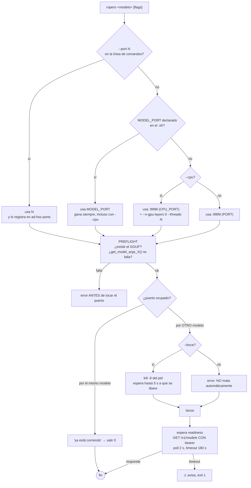

Cuatro invariantes a copiar **tal cual**:

1. **El preflight va antes de tocar el puerto.** No se mata un modelo sano para
   arrancar uno condenado.
2. **No se mata automáticamente sin `--force`.**
3. **`--force` solo afecta al slot destino.**
4. **El registro ad-hoc** existe porque `status` y `stop` son otros procesos.

### 4.4 Descarga de modelos

`ropero_download_gguf <repo> <file> <name> <size> [dest_dir] [dest_name]`:

- 3 posicionales obligatorios, 3 opcionales
- **normalización defensiva** si llegan 5 en vez de 6. El propio código
  documenta el bug: un `size` colado en `name` acababa creando una **carpeta**
  con el nombre del `.gguf` dentro, con el fichero en el sitio equivocado
- expande `~` a mano (bash no lo hace dentro de comillas)
- `dest_name` con `/` crea el subdirectorio
- idempotente: si el fichero final existe y no está vacío, salta
- `hf download` si está; si no, `curl` a la URL de HF
- renombra comparando **rutas absolutas** (si no, `mv X X` falla)
- `ropero_download_safetensors` usa marker `.download_complete`

`21-download-models.sh` tiene 10 llamadas reales y **un `cp` manual** que
duplica el MTP en la raíz.

**Lo que Candil hace mejor** (§12): HTTPS nativo, sin depender del CLI `hf` (que
no está en todas las máquinas, ni en Containers), con reanudación por `Range`,
checksum en streaming y progreso consultable.

### 4.5 Compilación e instalación

`ropero --install` compila llama.cpp con los flags de §3.4 y luego **enlaza los
binarios a `~/.local/bin`**, con reglas distintas por engine. La regla de
tensorrt-llm vale la pena: `~/.venv-tensorrt/bin` es un venv con 69 ejecutables
de los que solo 7 son de tensorrt; linkearlo entero ponía su `python3` por
delante del shim de asdf en el PATH de todo el sistema. Se probó y se revirtió
a mano. **Candil no enlaza nada al PATH**; guarda en `dir` y apunta con
`binary = "<dir>/llama-server"`.

`ropero --check` valida 8 cosas: symlink del propio ropero, symlink de
`ropero.d/`, ejecutables de llama.cpp linkeados, `trtllm-*`, airllm / mlx_lm
disponibles, GGUFs descargados, `llama-server` en PATH **con su versión**, y
`BIN_DIR` en el PATH. → `candil doctor` (§17).

### 4.6 Métricas de `ropero status`

CPU/GHz, RAM, VRAM, temp y fan RPM. Los fans se leen de
`/sys/class/hwmon/hwmonN/fan{1,2}_input` buscando `msi_wmi_platform` — porque
en laptops el fan lo controla el EC del OEM y `nvidia-smi fan.speed` devuelve
`[N/A]`.

**v4 no las implementa.** Son ~200 líneas de shell frágil por plataforma, no
son el objetivo, y ropero sigue ahí. Deuda consciente, no olvido: si hace
falta, `candil status --system`.

---

## 5. ElPaso y el ecosistema

### 5.1 ElPaso — veredicto por módulo

Verificado contra el snapshot (17.554 líneas, 82 módulos).

| Módulo                                                                                                                                                            | Veredicto         | Motivo                                                                                                                                                                                 |
| ----------------------------------------------------------------------------------------------------------------------------------------------------------------- | ----------------- | -------------------------------------------------------------------------------------------------------------------------------------------------------------------------------------- |
| `Downloader.ModelDownloader` + `Registry`                                                                                                                         | ⚠️ **referencia** | Finch en streaming, progreso en ETS, checksum, cancelación, `.tmp`+rename, telemetría. Le faltan rangos, pausa, concurrencia, y no hay forma de **esperar**. Buena base, no está lista |
| `Domain.Router` + `DecisionEngine` + `Scorer` + `TaskCategories` + `Cache` + `EmbeddingMatcher` + `LLMClassifier` + `ModelState` + `AutoTuner` + `RouterAnalyzer` | ✅ **v4, §19**    | la lógica es válida; el acoplamiento a `Personality` + Ecto no                                                                                                                         |
| `HTTP.Server` + `Anthropic.Proxy` + `MessageNormalizer`                                                                                                           | ✅ **v4, §20**    | el normalizador es reutilizable tal cual                                                                                                                                               |
| `Context.*` (Storage, SessionContext, ContextBuilder, ContextSummarizer, PrefixManager, TokenCounter, SessionSupervisor)                                          | ✅ **v4, §18**    | con backend ETS, sin Ecto                                                                                                                                                              |
| `Engine.Adapter` + `HTTPClient`                                                                                                                                   | ✅ **v4, §20**    | se reescriben sobre `Candil.Provider`                                                                                                                                                  |
| `Security.Auth` + `RateLimiter`                                                                                                                                   | ✅ **v4, §20**    | JWT **no** (ver §21 para lo que sí implica)                                                                                                                                            |
| `CostManager`                                                                                                                                                     | ✅ **v4, §14.6**  | presupuesto por consumidor                                                                                                                                                             |
| `Doctor`                                                                                                                                                          | ❌ **descartar**  | sus 10 checks son de ElPaso (pgvector, migraciones, Ollama). Candil usa botica                                                                                                         |
| `Domain.LlamaServerManager`                                                                                                                                       | ❌ **descartar**  | un modelo a la vez, puerto 8081 fijo, delega en `~/bin/localllama`, `Process.sleep(1_000)`. Candil lo hace mejor                                                                       |
| `Domain.ModelManager`                                                                                                                                             | ❌ **descartar**  | circuit breakers de Zaguan, `Repo` para todo, `@circuit_opts` hardcodeados                                                                                                             |
| `Domain.EngineManager`                                                                                                                                            | ❌ **descartar**  | CRUD de Ecto                                                                                                                                                                           |
| `Ecosystem`                                                                                                                                                       | ❌ **descartar**  | `Code.ensure_loaded?` + `apply/3` para Zaguan/Apero: antipatrón en una librería pública                                                                                                |
| `Bootstrap`                                                                                                                                                       | ❌ **descartar**  | verifica pgvector y baja embeddings de Ollama                                                                                                                                          |
| `HTTP.Dashboard`                                                                                                                                                  | ❌ **descartar**  | web                                                                                                                                                                                    |
| `Cluster.*`, `PersonalityManager`                                                                                                                                 | ❌ **descartar**  | multi-nodo / fuera de alcance                                                                                                                                                          |
| `CLI` + 17 mix tasks                                                                                                                                              | ❌ **descartar**  | `model list/start/stop` son stubs que solo hacen `IO.puts`                                                                                                                             |
| `Models.*` (Ecto schemas)                                                                                                                                         | ❌ **descartar**  | sin Postgres en v4                                                                                                                                                                     |

### 5.2 El ecosistema, y quién se reusa

| Librería    | Versión | Qué se reusa                                                                                                  |
| ----------- | ------- | ------------------------------------------------------------------------------------------------------------- |
| **apero**   | 4.0.0   | `Http.stream/7`, `Http.get/3`, `Retry`, `Proc.which/1`, `OS.type/0`, `File`, `Crypto`, `Cache`. **Ya es dep** |
| **arrea**   | 3.0.0   | `LongRunning` (procesos OS), `CircuitBreaker`, `Registry`, telemetría, workers. **Ya es dep**                 |
| **trebejo** | 2.0.0   | `OS.arch/0`. **Se declara dep** (arregla B6)                                                                  |
| **botica**  | 2.1.1   | **solo `Doctor`**, para checks genéricos de memoria y disco                                                   |
| **alaja**   | 3.1.2   | `CLI.Definition`, `Components.Table`, `Printer`, `Printer.Interactive`, `Syntax`. **Dep de GitHub**           |
| **pote**    | 3.0.0   | color, vía alaja. Transitiva                                                                                  |
| **elpaso**  | 0.1.0   | Router, Context, Gateway, MessageNormalizer, CostManager (§5.1)                                               |

**Duplicación a vigilar**: `apero` y `trebejo` se solapan (File, Proc, OS, …).
Candil no toca ninguno: usa `apero` para HTTP y procesos, y no necesita el resto.

---

# PARTE II — Decisiones

## 6. Decisiones cerradas

| #       | Decisión                                                                                                                                                                    | Razón                                                                                                                   |
| ------- | --------------------------------------------------------------------------------------------------------------------------------------------------------------------------- | ----------------------------------------------------------------------------------------------------------------------- | ------------ |
| **C1**  | **Alaja como dep de GitHub** `{:alaja, github: "Lorenzo-SF/alaja"}`                                                                                                         | Los tres docs oscilaban entre `path:` y `github:`. `github:` es lo que ya usan `apero` y `arrea`                        |
| **C2**  | **ETS siempre.** Postgres fuera de v4                                                                                                                                       | "Opcional" en la práctica es "mantenerlo verde un año". Fuera                                                           |
| **C3**  | **Alcance de v4**: fundamentos, ciclo de vida, diagnóstico, Context, Router, Gateway, MCP, RAG. Todo definido en este documento                                             | Es el punto único de conocimiento. No hay v5 difuminado: o está aquí, o no se hace                                      |
| **C4**  | **Gateway en v4**                                                                                                                                                           | Es lo que hace que Candil sea consumible por opencode y cualquier cliente OpenAI-compatible sin instalar la librería    |
| **C5**  | `apero` y `arrea` como dep. `trebejo` **declarada** (opcional)                                                                                                              | Arregla B6                                                                                                              |
| **C6**  | Un solo `mix.exs`                                                                                                                                                           | Igual que los tres docs                                                                                                 |
| **C7**  | `consumer` como parámetro en toda la API con estado                                                                                                                         | La mejor idea de v2/v3. Se mantiene                                                                                     |
| **C8**  | **El puerto es del modelo**, no del engine                                                                                                                                  | H2. `Model.port :: :auto                                                                                                | pos_integer` |
| **C9**  | **`EnginePool` es un registro de instancias `{model, port} → pid`. Sin LRU**                                                                                                | B7. El LRU resolvía un problema que no se tiene: 4 modelos de 20 GB no caben, y tampoco los vas a cachear               |
| **C10** | **Dos estrategias de instalación declaradas por el usuario**: `:precompiled` y `:source` (clonar + `cmake` con **sus** `cmake_args`). Ningún flag por defecto               | H4. ropero compila con `sm_120a` + MXFP4 porque su hardware lo pide. Eso lo sabe el usuario                             |
| **C11** | **Botica no entra en el ciclo de vida.** Su dominio es `doctor`/`doctor --fix`. Se usa solo para checks genéricos                                                           | H3                                                                                                                      |
| **C12** | **`Engine` gana `:api_key`, `:auth_headers`, `:install`, `:base_port`. `Model` gana `:port`, `:source`, `:tags`, `:enabled`, `:launcher`, `:base_url`, `:type: :external`** | H1, H2, C10                                                                                                             |
| **C13** | **Semver major**: 3.x → 4.0.0. Se rompen `Model`, `Engine`, `EnginePool`                                                                                                    | Esos structs son API pública documentada                                                                                |
| **C14** | **Ningún motor de inferencia hardcodeado.** `Launcher` permite externos (vLLM, TGI, LM Studio, Ollama, airllm, tensorrt, mlx) sin código para ninguno                       | El punto ideal: muchos modelos, un engine, reutilizable                                                                 |
| **C15** | **No hay comando de migración.** Análisis (§4) + `candil.toml` a mano (Apéndice A)                                                                                          | Los `.sh` tienen `case` anidados, variables indiretas y `source` entre ellos. El análisis es un artefacto, no un parser |
| **C16** | **ropero no se toca.** Legacy. Su retirada es decisión de Lorenzo                                                                                                           | 50 GB descargados y gunter en producción                                                                                |
| **C17** | **Rutas configurables sin opinión.** `data_dir`, `model_dir`, `log_dir` en el TOML                                                                                          | "Da igual mientras sea configurable"                                                                                    |
| **C18** | **Descarga nativa de HuggingFace por HTTPS**, sin el CLI `hf`. `repo` + `file` + `revision`, o `url` completo                                                               | `hf` no está en todas las máquinas. HTTPS directo da control de `Range`, checksum y progreso                            |
| **C19** | **El CLI es foreground. `--detach` es `nohup` de sí mismo.** Un solo camino de ciclo de vida                                                                                | H5. Ver §11                                                                                                             |
| **C20** | **`instances.json` con un campo `owner` que hoy solo vale `{:pid, os_pid}`**, y un `case` de dispatch con una segunda cláusula reservada para `{:socket, path}`             | Deja la puerta a un daemon sin especular código. Ver §11.4                                                              |
| **C21** | **MCP en la revisión `2025-11-25`**, con handshake `initialize`, cabecera `MCP-Protocol-Version` en HTTP, y **sin** JSON-RPC batching (eliminado en 2025-06-18)             | Los tres docs usaban `2024-11-05`, dos generaciones de retraso                                                          |
| **C22** | **Rutas de fichero siempre absolutas en los args.** `~` se expande al construir, nunca se pasa a `llama-server`                                                             | ropero lo avisa en su propio código: `~` no se expande entre comillas dobles                                            |

## 7. Contradicciones de los documentos previos, resueltas

| Punto                          | v1                           | v2                   | v3                                   | **v4**                                            |
| ------------------------------ | ---------------------------- | -------------------- | ------------------------------------ | ------------------------------------------------- |
| Cuántos bugs                   | "3" (§2.2 lista 8)           | 3                    | 9                                    | **8 de código + 9 de test**                       |
| Alcance de v4                  | 10 fases, 25-35 d            | 8 fases, 17-25 d     | 10 fases, 26-36 d                    | **12 fases, 57-67 d, todo definido**              |
| RAG / MCP / Context / Gateway  | dentro                       | dentro               | dentro                               | **dentro, con especificación completa** (§18-§22) |
| Puerto: modelo o engine        | `[model.X] port`             | igual                | igual                                | **modelo** (C8)                                   |
| Compilar llama.cpp             | no se menciona               | no se menciona       | `Candil.Installer`                   | **sí, con `cmake_args` del usuario** (C10)        |
| API key en la ruta local       | **no se menciona**           | **no se menciona**   | **no se menciona**                   | **H1, bloqueante, Fase 0**                        |
| `Botica.Batteries.LlamaServer` | **no se menciona**           | "opt-in para doctor" | "opt-in para doctor"                 | **fuera de su dominio → de Candil** (C11)         |
| Supervivencia del proceso      | no se menciona               | no se menciona       | no se menciona                       | **H5, §11** (C19, C20)                            |
| Migración de ropero            | `mix candil.migrate` + regex | ídem                 | ídem + shell                         | **no hay comando** (C15)                          |
| `ropero` se borra              | fase 10                      | fase 7               | fase 7                               | **no se toca** (C16)                              |
| MCP protocol version           | `2024-11-05`                 | `2024-11-05`         | `2024-11-05`                         | **`2025-11-25` + header** (C21)                   |
| `~` en los args                | —                            | —                    | `"~/.candil/models/…"` en el ejemplo | **rutas absolutas siempre** (C22)                 |
| Deps del ecosistema            | github                       | path                 | path                                 | **github** (C1)                                   |
| Postgres                       | "opcional" + Ecto            | "opcional" + schemas | "opcional" + Repo                    | **fuera** (C2)                                    |
| Semver                         | no se dice                   | no se dice           | no se dice                           | **major 4.0.0** (C13)                             |
| `model_args`                   | lista                        | mapa TOML            | mapa TOML                            | **lista ordenada** (§10.4)                        |
| Auth del gateway               | API key                      | API key + JWT        | `api_keys` en TOML                   | **API key, con `{env}` opcional; JWT no** (§20.4) |

---

# PARTE III — Arquitectura

## 8. El modelo provider/engine/model

Este es el cambio conceptual central. Hoy Candil tiene `Provider` (remoto) y
`Engine` (local), pero **un `Engine` por modelo**, lo que significa que no se
reutiliza nada. ropero tiene lo contrario: **un motor, muchos modelos**.

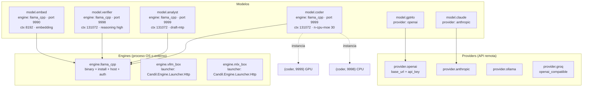

**Las tres reglas**:

1. **Un engine, muchos modelos.** Binario, compilación, host y API key son del
   engine. Flags de sampling y GGUF son del modelo.
2. **Un modelo, muchas instancias.** Una instancia es `(model, port)`. Puedes
   tener `coder` en `:9999` (GPU) y `:9998` (CPU) a la vez.
3. **Un engine puede ser externo.** `launcher` = módulo. Candil habla por HTTP y
   no gestiona el proceso. Con eso, vLLM, TGI, LM Studio, Ollama, airllm,
   tensorrt-llm y mlx-lm quedan cubiertos **sin una línea de código específica
   para ninguno**.

`Model.type` pasa a tener tres valores:

| type        | Apunta a                   | Campos propios                 | Ciclo de vida                              |
| ----------- | -------------------------- | ------------------------------ | ------------------------------------------ |
| `:local`    | un `Engine`                | `port`, `model_args`, `source` | Candil lo arranca (o se lo pide al engine) |
| `:remote`   | un `Provider`              | `name`                         | Candil no arranca nada                     |
| `:external` | un `Engine` con `launcher` | `base_url`, `launcher`         | Candil se engancha, no gestiona            |

`Model.validate/1` (que ya existe y no se llamaba) extiende la regla: `:local`
exige `engine`, `:remote` exige `provider` + `name`, `:external` exige `engine`

- `base_url` + `launcher`.

---

## 9. Capas y ficheros

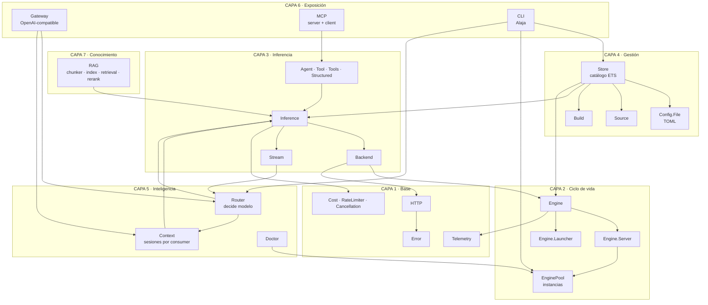

**Regla de una sola dirección**: las capas superiores llaman a las inferiores.
`router` no sabe que existe `gateway`. `inference` no sabe que existe `rag`.
`rag` no sabe que existe `gateway`. Ningún módulo comparte estado global fuera
de `Store`, `EnginePool` y las tablas ETS declaradas explícitamente.

**Excepción documentada**: `Stream` aparece con una flecha desde `Router`. Es
because el router necesita abortar un stream cuando decide que otro modelo
atiende. Se resuelve con el `Cancellation` existente, no con una dependencia
inversa.

### 9.1 Ficheros

```
lib/candil/
  # ── existentes, modificados ──
  model.ex              ♻️ +port +source +tags +enabled +launcher +base_url +:external
  engine.ex             ♻️ +api_key +auth_headers +install +base_port
  engine/server.ex      ♻️ +headers +orden de flags
  engine/launcher.ex    ✅ ya existe — se le añade Launcher.Http
  engine/health_poller.ex   ✅ sin cambios
  engine/server/external.ex ✅ sin cambios
  engine_pool.ex        ♻️ registro de instancias
  backend/llama_cpp.ex       ♻️ B1, B2
  backend/openai_compat.ex   ♻️ B3, B4
  inference/chat.ex          ♻️ H1
  inference/embeddings.ex    ♻️ H1 + B4
  config.ex            →  store.ex   ♻️ B5 + validar en registro
  detector.ex          ♻️ B6
  installer.ex         ♻️ B8 + C10
  provider.ex          ✅ +api_key string (B5)
  cost.ex              ♻️ +por consumer
  rate_limiter.ex      ♻️ +por consumer

  # ── nuevos: gestión ──
  store.ex              🆕 catálogo ETS hidratado del TOML
  source.ex             🆕
  source/{huggingface,url,local}.ex  🆕
  build.ex              🆕
  build/{precompiled,source_build}.ex  🆕

  # ── nuevos: consumo ──
  cli.ex                🆕
  cli/commands/{models,run,stop,status,config,engine,doctor,context,router,gateway,mcp,rag}.ex  🆕
  doctor.ex             🆕

  # ── nuevos: inteligencia ──
  context.ex            🆕 facade
  context/{store,session,builder,summarizer,prefix_manager}.ex  🆕
  router.ex             🆕 facade
  router/{decision_engine,cache,embedding_matcher,llm_classifier,scorer,
          task_categories,model_state,analyzer,auto_tuner,consumer}.ex  🆕

  # ── nuevos: exposición ──
  gateway.ex            🆕 facade
  gateway/{endpoint,router,auth,consumer_registry,request_id,error_handler}.ex  🆕
  gateway/handlers/{chat_completions,messages,embeddings,models,health,metrics}.ex  🆕
  gateway/normalizer.ex 🆕 (de ElPaso)
  mcp.ex                🆕 facade
  mcp/{protocol,message,error,client,server}.ex  🆕
  mcp/client/{stdio,http}.ex  🆕
  mcp/server/{tools,resources}.ex  🆕
  mcp/transport/{stdio,http}.ex  🆕
  rag.ex                🆕 facade
  rag/{chunker,chunk,document,index,retrieval,rerank,embedder}.ex  🆕
  rag/index/{memory,postgres}.ex  🆕

  # ── mix tasks ──
  lib/mix/tasks/candil.migrate.ex  🆕 (solo el de ElPaso → TOML, NO ropero)
```

**Deps que añade v4**: `toml`, `nimble_options`, `plug`, `bandit`, y `alaja`
por GitHub. Opcionales: `trebejo`, `botica`. `pgvector`/`ecto_sql` **no entran**
(C2).

---

## 10. Config TOML

### 10.1 Ubicación y precedencia

`~/.config/candil/candil.toml`, override con `CANDIL_CONFIG=/ruta`.

De menor a mayor: defaults del struct → `config.exs` de Elixir (retrocompat) →
`candil.toml` → registro programático en runtime.

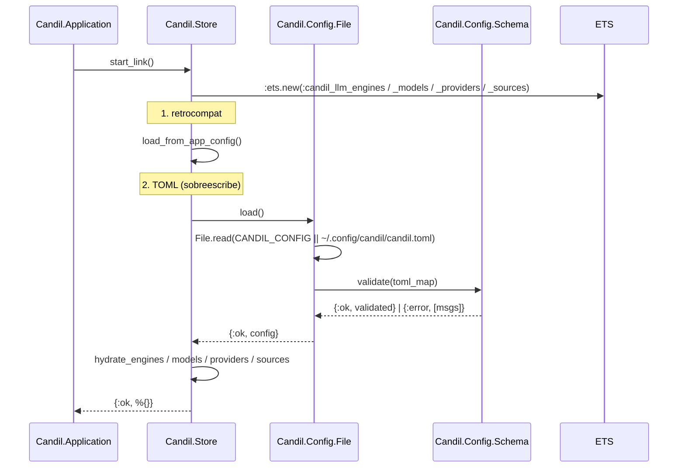

### 10.2 `[engine.<alias>]` — instalación con las dos estrategias

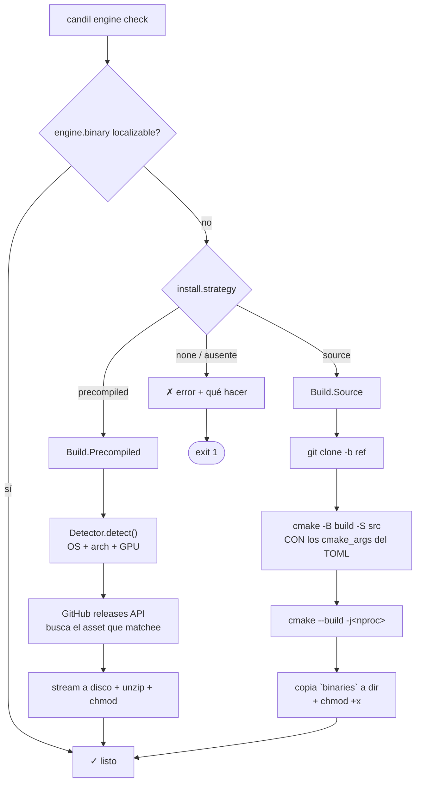

```toml
# ── Vía fácil: precompilado para tu SO+arch ──────────────────
[engine.llama_cpp]
binary    = "llama-server"
host      = "127.0.0.1"
base_port = 10000

[engine.llama_cpp.install]
strategy = "precompiled"
version  = "latest"           # o "b4561"
dir      = "~/.candil/llm/bin"
sha256   = "..."              # opcional

# ── Vía con control: clonar + compilar con TUS flags ──────────
[engine.llama_cpp_custom]
binary    = "~/.candil/llm/bin/llama-server"
host      = "127.0.0.1"
base_port = 10000

[engine.llama_cpp_custom.install]
strategy  = "source"
repo      = "https://github.com/ggml-org/llama.cpp"
ref       = "b4561"
src_dir   = "~/.candil/src/llama.cpp"
build_dir = "~/.candil/build/llama.cpp"
generator = "ninja"          # o "make"
jobs      = 0                # 0 = nproc
dir       = "~/.candil/llm/bin"
binaries  = ["llama-server", "llama-cli"]
# Los flags son TUYOS. Candil no pone ninguno por defecto.
# Estos son los de ropero para CachyOS/CUDA + RTX 5080 (Blackwell):
cmake_args = [
  "-DCMAKE_BUILD_TYPE=Release",
  "-DCMAKE_CUDA_ARCHITECTURES=120a",
  "-DCMAKE_CUDA_FLAGS=--use_fast_math -O3 -lineinfo",
  "-DGGML_CUDA=ON", "-DGGML_CUDA_FA=ON", "-DGGML_CUDA_FA_QUANTS=ON",
  "-DGGML_CUDA_MMQ_MXFP4=ON", "-DGGML_CUDA_MMQ_NVFP4=ON",
  "-DGGML_CUDA_NO_VMM=ON", "-DGGML_CUDA_COMPRESSION_MODE=speed",
  "-DGGML_CUDA_FORCE_MMQ=OFF", "-DGGML_CUDA_FORCE_CUBLAS=OFF",
  "-DGGML_CUDA_F16=OFF", "-DGGML_RPC=ON", "-DGGML_NATIVE=ON",
  "-DGGML_AVX2=ON", "-DGGML_AVX512=ON", "-DGGML_OPENMP=ON",
  "-DCMAKE_INTERPROCEDURAL_OPTIMIZATION=ON",
  "-DCMAKE_CXX_FLAGS=-march=native -O3 -ftree-vectorize",
  "-DBUILD_SHARED_LIBS=OFF",
  "-DLLAMA_BUILD_SERVER=ON", "-DLLAMA_BUILD_TOOLS=ON",
  "-DLLAMA_BUILD_EXAMPLES=OFF", "-DLLAMA_BUILD_TESTS=OFF",
  "-DLLAMA_BUILD_UI=OFF"
]
# macOS/Metal, en su lugar:
#   "-DCMAKE_OSX_ARCHITECTURES=arm64", "-DGGML_METAL=ON",
#   "-DGGML_METAL_USE_MPS=ON", "-DGGML_METAL_FLASH_ATTN=ON",
#   "-DGGML_METAL_USE_BF16=ON", "-DGGML_METAL_EMBED_LIBRARY=ON"

# ── Autenticación: ropero lo necesita ────────────────────────
[engine.llama_cpp.auth]
api_key_env = "LLAMA_API_KEY"   # o: api_key = "sk-local-dev-key"
headers     = []

# ── Engine externo: Candil habla, no gestiona ────────────────
[engine.vllm_box]
launcher   = "Candil.Engine.Launcher.Http"
host       = "10.0.0.5"
base_port  = 11434
# sin binary, sin install: el launcher trae la base_url
```

**Por qué es mejor que el `Detector` de 3.0**: el `Detector` elige el asset de la
release _y no acierta si tu GPU es nueva_. Con `strategy = "source"` y
`CMAKE_CUDA_ARCHITECTURES` explícito, el binario es el que quieres, y cambiar de
GPU es cambiar una línea del TOML.

**Candil no enlaza nada al PATH.** Guarda en `dir` y apunta con
`binary = "<dir>/llama-server"`. ropero tuvo que inventar reglas especiales por
engine para no enlazar un venv entero y tumbar el `python3` del sistema.

### 10.3 `[model.<alias>]`

```toml
[model.coder]
type         = "local"
engine       = "llama_cpp"
context_size = 131072
port         = 9999                    # :auto = EnginePool.claim
usage        = ["chat", "code", "completion"]
tags         = ["gpu", "moe", "code"]
model_args   = [                       # lista ordenada, §10.4
  "--n-gpu-layers", "-1", "--n-cpu-moe", "30", "--no-kv-offload",
  "--cache-type-k", "q8_0", "--cache-type-v", "q8_0", "--cache-prompt",
  "--context-shift", "--kv-unified", "--jinja",
  "--reasoning-format", "deepseek", "--load-mode", "none",
  "--temp", "0.7", "--top-p", "0.8", "--top-k", "20", "--min-p", "0.0",
  "--repeat-penalty", "1.05", "--repeat-last-n", "64",
  "--batch-size", "4096", "--ubatch-size", "1024", "--parallel", "1",
  "--threads", "12", "--n-predict", "8192", "--keep", "1024"
]

# ── Cómo se consigue el fichero. Esto es lo único que hay que
#    añadir al modelo para absorber lo que hace ropero. ───────
[model.coder.source]
kind        = "huggingface"     # huggingface | url | local
repo        = "unsloth/Qwen3-Coder-30B-A3B-Instruct-GGUF"
file        = "Qwen3-Coder-30B-A3B-Instruct-UD-Q4_K_XL.gguf"
revision    = "main"            # opcional
dest        = "~/.candil/models"
# dest_name   = "..."          # renombra al descargar
# sha256      = "..."          # verificación
# hf_token_env = "HF_TOKEN"     # repos privados; default HF_TOKEN

# ── Ficheros auxiliares (el draft MTP, el mmproj) ────────────
[model.analyst.draft]
kind     = "huggingface"
repo     = "unsloth/Qwen3.8-27B-GGUF"
file     = "MTP/mtp-Qwen3.8-27B-Q4_0.gguf"
dest     = "~/.candil/models"
dest_name = "mtp-Qwen3.8-27B-Q4_0.gguf"   # hf deja el subdir, ropero lo copia

# ── Modelo enganchado a un servidor externo ──────────────────
[model.tgi]
type         = "external"
engine       = "tgi_box"
launcher     = "Candil.Engine.Launcher.Http"
base_url     = "http://10.0.0.5:8080"
context_size = 32768
usage        = ["chat"]

# ── Remoto ───────────────────────────────────────────────────
[model.gpt4o]
type = "remote"; name = "gpt-4o"; provider = "openai"
context_size = 128000; usage = ["chat", "completion"]

[provider.openai]
type = "openai"; base_url = "https://api.openai.com"
api_key = { env = "OPENAI_API_KEY" }

[provider.anthropic]
type = "anthropic"; base_url = "https://api.anthropic.com"
api_key = { env = "ANTHROPIC_API_KEY" }

# ── Consumidores ─────────────────────────────────────────────
[consumer.default]
model_default = "coder"
[consumer.posadero]
model_default = "embed"
[consumer.opencode]
model_default = "coder"

# ── Rutas: configurables, sin opinión ───────────────────────
[general]
data_dir        = "~/.candil"
log_dir         = "~/.candil/logs"
default_consumer = "default"
```

### 10.4 `model_args` es una lista, y el orden importa

Cambio deliberado frente a v3, que usaba `[model.X.args]` como mapa TOML.

**Razón**: `llama-server` usa la **última** aparición de un flag. Con un mapa el
orden se pierde (los mapas de Elixir no lo tienen) y no se puede expresar
`--cpu` como override que gana.

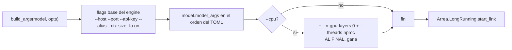

**Y las rutas siempre absolutas** (C22). `~` se expande al construir los args,
nunca llega a `llama-server`:

```elixir
# en Engine.Server.build_args/2
defp absolutize(args) do
  Enum.map(args, fn
    ~r/^~/ <> rest -> Path.expand(rest)
    other -> other
  end)
end
```

ropero lo avisa en su propio código: `# IMPORTANTE: ruta ABSOLUTA en
model-draft. ~ no expande en comillas dobles.`

---

## 11. Puertos, instancias y supervivencia del proceso

### 11.1 Estado de una instancia

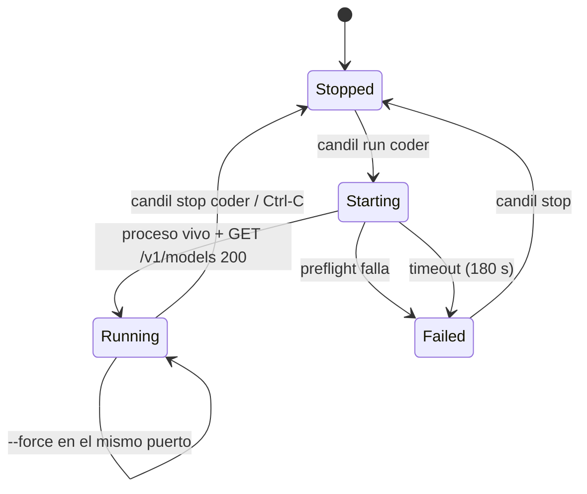

### 11.2 Resolución del puerto

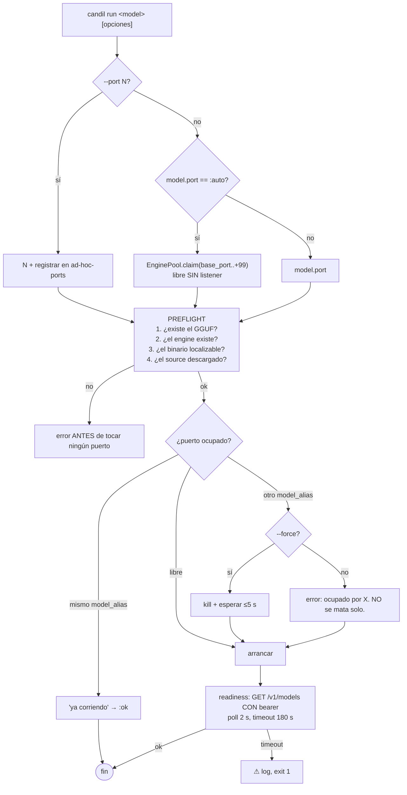

**El probe lleva bearer** a propósito. `GET /health` no requiere auth en
llama-server, así que no distingue "arrancado" de "sirviendo el modelo
correcto". `/v1/models` sí, y devuelve el `id`, que es el `--alias` que le
pasamos. Es lo que hace `get_model_on_port` en ropero.

### 11.3 Supervivencia: el CLI es foreground, `--detach` es `nohup` (C19)

**Un solo camino de ciclo de vida.** El motor vive en la VM del proceso que lo
arrancó. Eso significa que el proceso es el dueño, y que si muere, el motor
muere con él. Es la semántica correcta, y es la de `tmux` o de un `&`.

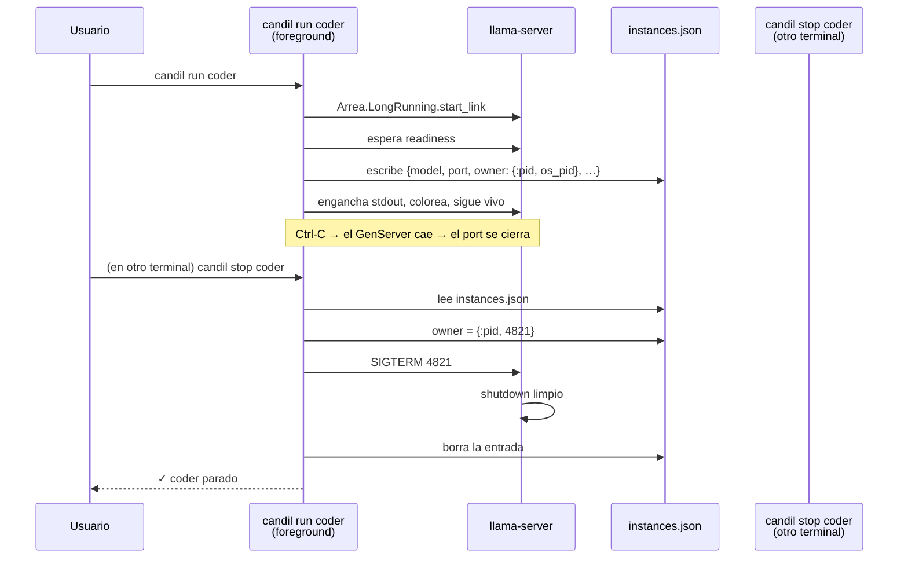

**`--detach` no es un segundo camino: es este mismo con `nohup`.**

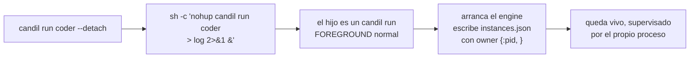

Es literalmente lo que hace ropero (`nohup … &` + `disown`), y tiene una
ventaja: **solo hay un camino de código para el ciclo de vida**, así que solo
hay una cosa que puede estar rota.

Consecuencias, todas correctas:

| Situación                               | Qué pasa                                                    |
| --------------------------------------- | ----------------------------------------------------------- |
| `candil run coder` + Ctrl-C             | el engine muere. Es lo que quieres                          |
| `candil run coder --detach`             | un proceso `candil run` normal, con nohup, dueño del engine |
| matan al proceso detached               | el engine muere. Sin zombis                                 |
| `candil stop coder` desde otro terminal | lee `instances.json`, saca el pid, le manda la señal        |
| la VM se muere sola                     | el engine se va con ella. Nunca queda un huérfano           |

### 11.4 `instances.json` y la puerta a un daemon (C20)

```
<data_dir>/run/
  instances.json     # [{model, port, owner, engine, pid, started_at, healthy}]
  ad-hoc-ports       # un puerto por línea, de --port
```

```json
[
  {
    "model": "coder",
    "port": 9999,
    "engine": "llama_cpp",
    "pid": 4821,
    "owner": { "kind": "pid", "pid": 4821 },
    "started_at": "2026-10-01T12:00:00Z",
    "healthy": true
  }
]
```

`owner` es una **tupla etiquetada** con una sola variante válida hoy:

```elixir
defp stop_instance(inst) do
  case inst.owner do
    # v4: el dueño es un proceso del sistema. Le mandamos la señal.
    %{kind: :pid, pid: pid} when pid > 0 -> signal(pid, :term)
    # v5: el dueño será un daemon. Le hablamos por su socket.
    # %{kind: :socket, path: path} -> Control.request(path, {:stop, inst})
  end
end
```

La segunda rama está **escrita pero no compilada**, y el `case` la hace obvia.
Cuando haga falta un daemon, se implementa la rama y **nada más cambia**: ni
`candil stop`, ni `candil status`, ni el resto de la CLI. Es la puerta que
pedías, y cuesta 6 líneas en vez de un rediseño.

**Escritura atómica** (tmp + rename). Al leer, se podan las entradas cuyo `pid`
ya no existe — los `nohup` dejan zombis, y un JSON sin podar miente.

---

## 12. `Candil.Source` — descargar sin el CLI `hf`

| kind          | campos                                                                    | cómo                                                                                                    |
| ------------- | ------------------------------------------------------------------------- | ------------------------------------------------------------------------------------------------------- |
| `huggingface` | `repo`, `file`, `revision`, `dest`, `dest_name`, `sha256`, `hf_token_env` | `GET https://huggingface.co/{repo}/resolve/{revision}/{file}`, con `Authorization: Bearer` si hay token |
| `url`         | `url`, `file`, `dest`, `sha256`                                           | `GET {url}` a fichero                                                                                   |
| `local`       | `path`                                                                    | no hace nada; comprueba que exista                                                                      |

**Requisitos no negociables** — algunos no los tiene ni ropero ni ElPaso:

- streaming a disco, **nunca** a memoria (un GGUF son 17 GB)
- **checksum en streaming** con `:crypto.hash_init/update/final` sobre bloques
  de 1 MB. Arregla B8, donde `Installer.verify_checksum/2` hace `File.read` de
  17 GB
- **reanudación por `Range: bytes=N-`** cuando el `.part` ya existe y el
  servidor responde 206
- `.part` + rename atómico
- progreso legible desde otro proceso (`:atomics` con los bytes escritos)
- `dest_name` para renombrar — el caso `MTP/mtp-….gguf` de ropero, donde `hf`
  deja el subdirectorio y hay que aplanarlo
- marker `.complete` por modelo, para idempotencia
- `source.present?/1` y `source.size/1` para el doctor

---

## 13. `Candil.Build` — las dos estrategias de instalación

```elixir
defmodule Candil.Build do
  @type strategy :: :precompiled | :source | :none
  @type t :: %__MODULE__{
          strategy: strategy(),
          version: String.t(),        # :precompiled
          dir: String.t(),            # destino de los binarios
          sha256: String.t() | nil,
          repo: String.t(),           # :source
          ref: String.t(),
          src_dir: String.t(),
          build_dir: String.t(),
          generator: :ninja | :make,
          jobs: non_neg_integer(),   # 0 = nproc
          cmake_args: [String.t()],   # LOS DEL USUARIO
          binaries: [String.t()]
        }
  def new(map) :: t() | {:error, [String.t()]}
  def install(Engine.t(), Build.t(), opts) :: {:ok, %{path: String.t()}} | {:error, term()}
  def check(Engine.t()) :: {:ok, Engine.t()} | {:error, term()}
end
```

`Build.from_source/2` corre `git clone` + `cmake -B … -S …` + `cmake --build`
como un proceso supervisado, emite progreso por etapas, es cancelable, y
**propaga el error de cmake textualmente**. Si el usuario cierra el CLI a
medias, el hijo se mata con el padre (el mismo comportamiento que el `trap` de
ropero).

`cmake_args` **es lo único que se le pasa a cmake**. Candil añade
`-DCMAKE_BUILD_TYPE=Release`, `-B` y `-S` si faltan, y nada más. Si no compila,
es que los flags están mal, y el error lo dice cmake.

---

## 14. Módulos nuevos — especificación de API

### 14.1 `Candil.Store` (antes `Candil.Config`)

```elixir
defmodule Candil.Store do
  @moduledoc """
  Catálogo de engines, modelos, providers y sources en ETS,
  hidratado del TOML al arrancar. Sustituye a `Candil.Config` (3.0).
  Rompe API a propósito (C13). Los nombres de tabla no cambian.
  """
  use GenServer

  @table_engines   :candil_llm_engines
  @table_models    :candil_llm_models
  @table_providers :candil_llm_providers
  @table_sources   :candil_llm_sources

  @spec start_link(keyword()) :: GenServer.on_start()
  @spec register_engine(Engine.t()) :: :ok | {:error, [String.t()]}
  @spec register_model(Model.t()) :: :ok | {:error, [String.t()]}
  @spec register_provider(Provider.t()) :: :ok | {:error, [String.t()]}
  @spec register_source(atom(), Source.t()) :: :ok
  @spec get_engine(atom()) :: {:ok, Engine.t()} | {:error, :not_found}
  @spec get_model(atom()) :: {:ok, Model.t()} | {:error, :not_found}
  @spec get_provider(atom()) :: {:ok, Provider.t()} | {:error, :not_found}
  @spec get_source(atom()) :: {:ok, Source.t()} | {:error, :not_found}
  @spec list_engines() :: [Engine.t()]
  @spec list_models() :: [Model.t()]
  @spec list_providers() :: [Provider.t()]
  @spec deregister_model(atom()) :: :ok
  @spec reload() :: :ok | {:error, term()}
end
```

**Cambio clave**: `register_model/1` **valida** antes de insertar. En 3.0
`Model.validate/1` existía pero no se llamaba en ningún sitio.

### 14.2 `Candil.Model` 4.0

```elixir
@enforce_keys [:alias, :type]
defstruct alias: nil,
          type: :local,                 # :local | :remote | :external
          engine: nil,                  # alias del engine
          provider: nil,                # alias del provider (:remote)
          name: nil,                    # nombre en el provider (:remote)
          base_url: nil,                # (:external)
          launcher: nil,                # (:external)
          model_dir: nil,               # se deriva de source.dest
          filename: nil,
          context_size: 4096,
          port: :auto,                  # C8
          usage: [:chat, :completion],
          model_args: [],               # lista ordenada
          source: nil,                  # %Source{}
          draft: nil,                   # %Source{} — el MTP
          tags: [],
          checksum_sha256: nil,
          enabled: true
```

`file_path/1` sigue igual: rechaza `..`, devuelve `nil` para remotos.

### 14.3 `Candil.Engine` 4.0

```elixir
@enforce_keys [:alias]
defstruct alias: nil,
          binary: nil,               # "llama-server" | ruta absoluta
          binary_dir: nil,           # legacy
          host: "127.0.0.1",         # ⚠ ropero usa 0.0.0.0
          base_port: 10000,
          port: 8080,                # legacy / externos
          api_key: nil,              # string | {:system, "VAR"} | nil
          auth_headers: [],
          launcher: nil,             # module() | nil
          install: nil,              # %Build{}
          precompiled_version: :latest,
          checksum_sha256: nil,
          start_args: []
```

**Resolución del binario**, parando en el primero que exista: `binary` como
ruta → `binary` como nombre vía `Apero.Proc.which/1` → `binary_dir` →
`Build.precompiled/1` si está declarado → `Build.from_source/1` si está
declarado → `{:error, {:binary_not_found, msg}}`.

**Ningún paso es implícito**: los dos últimos solo corren si están en el TOML.

### 14.4 `Candil.EnginePool` 4.0

```elixir
defmodule Candil.EnginePool do
  @moduledoc """
  Registro de instancias de engine vivas. Una instancia es {model_alias, port}.
  El mismo modelo puede estar vivo en varios puertos (GPU y CPU), que es lo que
  hace --cpu. Sustituye al LRU de 3.0 (B7).
  """
  use GenServer
  # state: %{{alias, port} => %{pid, model, engine, started_at, healthy}}

  @spec put(atom(), pos_integer(), pid(), Model.t(), Engine.t()) :: :ok
  @spec delete(atom(), pos_integer()) :: :ok
  @spec get(atom(), pos_integer()) :: {:ok, instance()} | :error
  @spec by_model(atom()) :: [instance()]
  @spec list() :: [instance()]
  @spec count() :: non_neg_integer()
  @spec ports() :: [pos_integer()]
  @spec claim_port(pos_integer(), pos_integer()) :: {:ok, pos_integer()} | {:error, :no_free_port}
end
```

`claim_port/2` reserva del rango y comprueba con `:gen_tcp.connect/4` que no hay
nadie escuchando — que es como se distingue un puerto libre de uno con un
ropero muerto encima.

### 14.5 `Candil.Engine.Launcher.Http`

```elixir
defmodule Candil.Engine.Launcher.Http do
  @behaviour Candil.Engine.Launcher

  @impl true
  def launch(%Engine{host: host, port: port} = engine, %Model{} = model) do
    {:ok, %{base_url: "http://#{host}:#{port}", pid: nil}}
  end
end
```

`pid: nil` porque el proceso no es nuestro: `Server.External.terminate/2` con
`pid: nil` no manda nada. Es el mismo contrato que el `Launcher` que ya existe
en 3.0, con una implementación de referencia. Con ella, vLLM, TGI, LM Studio,
Ollama, airllm, tensorrt-llm y mlx-lm quedan cubiertos.

### 14.6 `Candil.Cost` ampliado

```elixir
defmodule Candil.Cost do
  @spec estimate(String.t(), non_neg_integer(), non_neg_integer()) :: {:ok, float()} | :unknown
  @spec track(atom(), Model.t(), Inference.response()) :: :ok      # por consumer
  @spec total(atom()) :: %{input: non_neg_integer(), output: non_neg_integer(), usd: float()}
  @spec reset(atom()) :: :ok
end
```

`track/3` acumula en ETS por `{consumer, model}`. Los modelos locales valen
`0.0` por definición. La tabla de precios sale a un fichero de datos, con
`@deprecated` en la tabla embebida (los datos actuales son de 2024).

---

## 15. H1 — autenticación en la ruta local

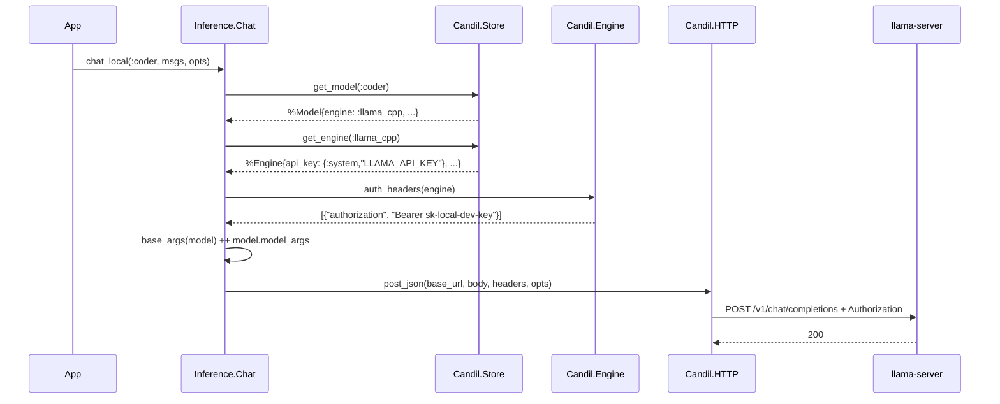

**Cambios concretos**:

1. `Engine.auth_headers/1`. Si `api_key` es `nil` → `[]`, de modo que el
   comportamiento por defecto **no cambia** y los tests de 3.0 siguen verdes.
2. `Engine.base_url_and_headers/2` (nuevo). `base_url/1` queda deprecated un
   release.
3. `Inference.Chat.do_chat_local/3`, `Inference.Embeddings.do_embed_local/3` y
   `Stream.chat/4` dejan de mandar `[]`.
4. `Engine.Server.build_args/2` incluye `--api-key` cuando el engine lo tiene.
   Cambiar los args de un engine vivo exige reiniciarlo, y `status` lo marca.

---

## 16. CLI

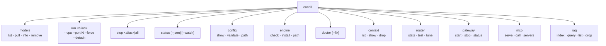

**Equivalencia con ropero**, comando a comando:

| ropero                      | candil 4.0                      | Nota                                |
| --------------------------- | ------------------------------- | ----------------------------------- |
| `ropero list`               | `candil models list`            | + tamaño y estado de descarga       |
| `ropero <m>` (foreground)   | `candil run <m>`                | **foreground en ambos** (C19)       |
| `ropero <m> --background`   | `candil run <m> --detach`       | `nohup` de sí mismo                 |
| `ropero <m> --cpu`          | `candil run <m> --cpu`          | idéntico                            |
| `ropero <m> --port N`       | `candil run <m> --port N`       | idéntico                            |
| `ropero <m> --force`        | `candil run <m> --force`        | idéntico                            |
| `ropero status`             | `candil status`                 | + `--json`, `--watch`               |
| `ropero stop X` / `all`     | `candil stop X` / `all`         | idéntico                            |
| `ropero --check`            | `candil doctor`                 | + checks de config, source, puertos |
| `ropero --install`          | `candil engine install`         | con la config del TOML              |
| `ropero status --craft`     | —                               | era para iterar el layout           |
| métricas de `ropero status` | `candil status --system` (o no) | §4.6                                |

**El `--foreground` se queda como default**, a diferencia de mi iteración
anterior. Con (b) tiene sentido: el proceso es el dueño, y para "background" se
usa `--detach` o un `&`, no un flag que invierte la semántica.

---

## 17. `Candil.Doctor`

```
$ candil doctor

  Candil 4.0.0 · ~/.config/candil/candil.toml

  ✓ config        válido · 11 modelos · 1 engine · 1 provider
  ✓ binario       llama_cpp → ~/.candil/llm/bin/llama-server (v=b4561)
  ✓ sources       9/11 descargados
                  (faltan qwenvision, deepcoder — en fired/)
  ✓ puertos       :9990 :9998 :9999 :10000-10099 libres
  ✓ auth          engine llama_cpp: api_key_env=LLAMA_API_KEY (seteado ✓)
  ✓ gpu           CUDA 12.8 · 15.2/16.0 GB VRAM libre
  ✓ memoria       41.3 GB libres   ← de Botica

  0 errores · 0 advertencias.
```

**Usa botica** para los checks genéricos (memoria, disco) y los suyos para lo de
LLM. `doctor --fix` delega en `Botica.Doctor.fix/1` para lo que botica sepa
arreglar, y para el resto dice el comando exacto. Es la interacción correcta:
cada uno en su dominio.

---

## 18. Context compartido

**De**: `ElPaso.Context.*` · **A**: `Candil.Context.*` · **Fase 6**

### 18.1 El problema

Hoy `Candil.Conversation` guarda historial **en el proceso que llama**. Si
posadero y opencode están en la misma VM, cada uno tiene el suyo, y no se puede
compartir, resumir, ni mover entre modelos. `ElPaso` resolvió esto con Postgres
y schemas Ecto; aquí es ETS.

### 18.2 Modelo

Una sesión está identificada por **`{consumer, session_id}`**. El consumer
particiona: el contexto de `opencode` nunca se mezcla con el de `posadero`, ni
aunque usen el mismo `session_id`.

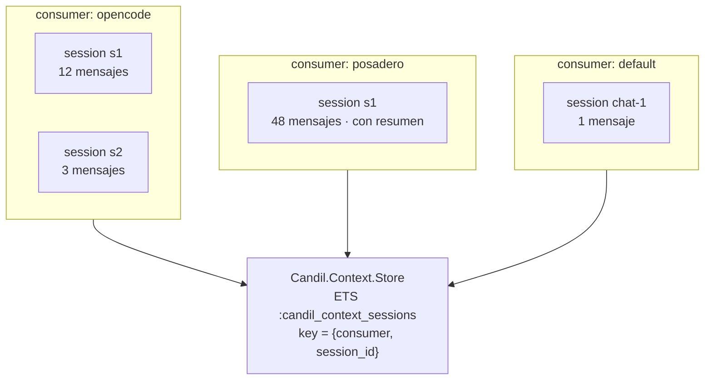

### 18.3 API

```elixir
defmodule Candil.Context.Session do
  @enforce_keys [:id, :consumer]
  defstruct [:id, :consumer, :created_at, :updated_at, :last_used_at,
             model_current: nil, messages: [], summary: nil, metadata: %{}]

  def new(consumer, id) :: t()
  def add_message(t(), role :: String.t(), content :: String.t()) :: t()
  def touch(t()) :: t()
  def tokens(t()) :: non_neg_integer()
end

defmodule Candil.Context.Store do
  use GenServer
  @table :candil_context_sessions
  # key {consumer, session_id} → %Session{}

  @spec start_link(keyword()) :: GenServer.on_start()
  @spec create(atom(), String.t()) :: {:ok, Session.t()} | {:error, term()}
  @spec get(atom(), String.t()) :: {:ok, Session.t()} | {:error, :not_found}
  @spec update(atom(), String.t(), (Session.t() -> Session.t())) :: :ok
  @spec append_message(atom(), String.t(), String.t(), String.t()) :: :ok
  @spec delete(atom(), String.t()) :: :ok
  @spec list(atom()) :: [Session.t()]
  @spec count(atom()) :: non_neg_integer()
  @spec gc() :: non_neg_integer()      # por TTL
  @spec gc(atom()) :: non_neg_integer() # y por LRU si excede max
end
```

**Evicción**: TTL (24 h por defecto) **y** LRU por `max_sessions` (1000). Las
dos, no una: el TTL recoge sesiones muertas, el LRU recoge un proceso que
genera sesiones sin parar. Un `handle_info(:gc, …)` programado a `ttl/10`
(mínimo 1 h) llama a `gc/0`.

### 18.4 Builder

```elixir
defmodule Candil.Context.Builder do
  @spec build(Session.t(), [map()], keyword()) :: {:ok, [map()]} | {:error, :context_exceeded}
  def build(session, messages, opts)
end
```

Construye el array final: **system prompt** (del `PrefixManager`) +
**resumen** (si hay) + **historial reciente** que quepa en
`context_size - tokens(mensajes nuevos) - margen`.

Si aun así no cabe, devuelve `{:error, :context_exceeded}` en vez de truncar en
silencio. Un error explícito es mejor que una conversación mutilada.

**Reutiliza `Candil.Conversation.TokenEstimator`**, que ya existe, en vez del
`String.length/4` que propuso v3 (peor estimador).

### 18.5 Summarizer

```elixir
defmodule Candil.Context.Summarizer do
  @spec maybe_summarize(Session.t(), keyword()) :: {:ok, Session.t()} | {:error, term()}
  def maybe_summarize(session, opts)
end
```

Cuando `tokens(session) > summarize_after_tokens` (8000) o
`length(messages) > summarize_after_messages` (50): llama a
`[context] summarizer_model`, resume en un párrafo que preserva decisiones
claves, guarda en `session.summary`, y **trunca** los mensajes ya resumidos
(los deja: el Builder los descarta por antiguo, no los borra — así el usuario
puede auditar qué se resumió).

Si el modelo falla, **la sesión se queda como estaba**. Un fallo del
summarizer nunca destruye contexto.

### 18.6 PrefixManager

```elixir
defmodule Candil.Context.PrefixManager do
  use GenServer
  @table :candil_prefix_cache
  # key: {model_alias, sha256(system_prompt)} → %{prompt, expires_at}

  @spec put(atom(), String.t(), pos_integer()) :: :ok   # ttl_ms
  @spec get(atom(), String.t()) :: {:ok, String.t()} | :miss
  @spec stats() :: %{hits: non_neg_integer(), misses: non_neg_integer()}
end
```

Cachea system prompts largos por modelo, para que el provider pueda reutilizar
su KV cache entre peticiones. **No evita el envío**: el prompt va siempre, pero
con la misma forma byte a byte el provider puede cachear. Los contadores
sirven para saber si funciona en tu setup.

### 18.7 Integración con la inferencia

```elixir
Candil.chat_with_context(:coder, "s1", [%{role: "user", content: "hola"}],
  consumer: :posadero)
```

No es un camino paralelo: es el mismo `Inference`, con `Context` inyectando
los mensajes construidos y guardando la respuesta. Si un consumidor no pasa
`session_id`, el contexto no se toca.

### 18.8 Config

```toml
[context]
enabled                  = true
max_sessions             = 1000
session_ttl_seconds      = 86400      # 24 h
summarize_after_messages = 50
summarize_after_tokens   = 8000
summarizer_model         = "verifier" # un modelo barato
context_margin_tokens    = 512        # margen para la respuesta
prefix_cache_ttl_ms      = 600000
```

### 18.9 Tests

- aislamiento: `create(:posadero, "s1")` y `create(:opencode, "s1")` no se ven
- TTL: una sesión con `last_used_at` viejo se recoge en `gc/0`
- LRU: con `max_sessions: 2`, la tercera desaloja la más antigua
- Builder: con `context_size` pequeño devuelve `{:error, :context_exceeded}`,
  no una lista truncada en silencio
- Summarizer: con el modelo summarizer caído, la sesión queda intacta

---

## 19. Router

**De**: `ElPaso.Domain.Router` + `DecisionEngine` · **A**: `Candil.Router` ·
**Fase 7**

### 19.1 Qué decide

Dado un prompt y un consumer, qué modelo responde. `elpaso` lo acopló a
`PersonalityManager` + Ecto; aquí la unidad es `%Model{}` y el catálogo es el
de `Store` (C11). Sin Ecto, sin `Repo`, sin personas.

### 19.2 Las cuatro capas

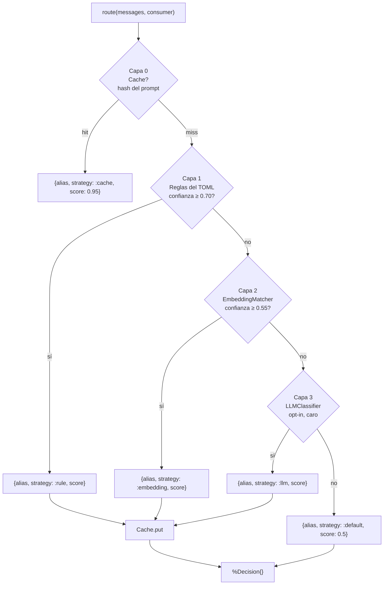

| Capa           | Coste          | Cuándo                         | Fuente                                |
| -------------- | -------------- | ------------------------------ | ------------------------------------- |
| 0 · Cache      | ~0             | siempre primero                | ETS, TTL 300 s                        |
| 1 · Reglas     | ~0             | keywords del TOML              | `[router.rules.*]`                    |
| 2 · Embeddings | 1 request      | si hay modelo con `embeddings` | `EmbeddingMatcher`                    |
| 3 · LLM        | 1 request caro | **opt-in**                     | `LLMClassifier` con un modelo pequeño |
| 4 · Default    | 0              | siempre                        | `consumer.model_default`              |

**La 3 es opt-in** porque cuesta una inferencia para decidir. Con `[router]
enable_llm_classifier = false` (default) nunca se llega.

### 19.3 API

```elixir
defmodule Candil.Router do
  @type strategy :: :cache | :rule | :embedding | :llm | :default
  @type decision :: %__MODULE__.Decision{
          model_alias: atom(),
          strategy: strategy(),
          score: float(),          # 0.0..1.0
          reason: String.t(),
          alternatives: [{atom(), float()}],
          timestamp: DateTime.t()
        }
  defmodule Decision do
    @enforce_keys [:model_alias, :strategy, :score, :reason]
    defstruct [:model_alias, :strategy, :score, :reason, :alternatives, :timestamp]
  end

  @spec route([map()], keyword()) :: {:ok, decision()} | {:error, term()}
  def route(messages, opts \\ [])
  # opts: consumer, candidates, skip_cache, force_strategy

  @spec pin(atom(), atom()) :: :ok        # consumer → modelo forzado
  @spec unpin(atom()) :: :ok
  @spec pinned?(atom()) :: {:ok, atom()} | :error
  @spec stats(atom()) :: map()
  @spec resolve(decision(), keyword()) :: {:ok, Model.t(), Engine.t() | Provider.t()}
end
```

`pin/2` es lo que hace que `posadero` pueda fijar `embed` y no pelear con
`opencode` por el `coder`.

### 19.4 Los módulos

| Módulo                    | Responsabilidad                                                                            | Notas                            |
| ------------------------- | ------------------------------------------------------------------------------------------ | -------------------------------- |
| `Router`                  | facade: `route/2`, `pin/2`, `unpin/1`, `stats/1`                                           |                                  |
| `Router.DecisionEngine`   | orquesta las 4 capas                                                                       | el `cond` de §19.2               |
| `Router.Cache`            | ETS, `hash(prompt) → {alias, expires_at}`                                                  | TTL `[router] cache_ttl_seconds` |
| `Router.Scorer`           | reglas del TOML → score por modelo                                                         | `hits / length(words)`           |
| `Router.TaskCategories`   | clasificador por keywords: `:code`, `:reasoning`, `:fast`, `:embed`, `:vision`             | sin ML                           |
| `Router.EmbeddingMatcher` | similitud coseno contra un índice de prompts etiquetados                                   | necesita un modelo `embeddings`  |
| `Router.LLMClassifier`    | pide a un modelo pequeño que clasifique                                                    | opt-in                           |
| `Router.ModelState`       | `{:ready, url}` \| `{:starting, pid}` \| `{:stopped}` \| `{:error, r}` por `(model, port)` | se apoya en `EnginePool`         |
| `Router.Consumer`         | `model_default`, `max_concurrent`, `rate_limit_per_minute`, `pinned`                       | lee `[consumer.*]`               |
| `Router.Analyzer`         | uso por modelo, latencia, coste, errores                                                   | para `candil router stats`       |
| `Router.AutoTuner`        | ajusta pesos de la Tabla de afinidad con datos reales                                      | opt-in, necesita volumen         |

**El Router arranca el engine si hace falta.** `resolve/2` devuelve el modelo y
el engine; el `Gateway` llama a `Engine.ensure_started/2` antes de inferir, con
el mismo preflight y el mismo `--force` que la CLI (§11.2). Sin eso, la primera
petición al gateway con un modelo local tardaría 30 s y habría que conocer los
detalles del arranque.

### 19.5 Afinidad

```toml
[router]
enabled              = true
confidence_threshold = 0.70
embedding_threshold  = 0.55
enable_llm_classifier = false
enable_cache         = true
cache_ttl_seconds    = 300
auto_tune            = false

[router.rules.code]
match  = ["code", "function", "refactor", "bug", "compile", "elixir", "python"]
model  = "coder"
weight = 1.0

[router.rules.reasoning]
match  = ["reason", "explain", "why", "analyze", "prove"]
model  = "verifier"

[router.rules.fast]
match  = ["quick", "short", "summarize", "list"]
model  = "gpt4o"

# afinidad learned, escrita por AutoTuner
[router.affinity]
"coder"    = { chat = 0.4, code = 0.95, reasoning = 0.3 }
"verifier" = { chat = 0.3, code = 0.4, reasoning = 0.95 }
```

### 19.6 Tests

- **Property**: la misma entrada + el mismo estado del cache → la misma decisión
  (misma entrada, misma salida)
- `pin/2` fuerza la decisión aunque haya reglas que digan otra cosa
- un consumer sin candidatos compatibles → `{:error, :no_models_for_consumer}`,
  no un `hd(models)` que puede ser un modelo de embeddings
- la capa 2 no se invoca si no hay modelo `embeddings` configurado
- la capa 3 no se invoca con `enable_llm_classifier: false`

---

## 20. Gateway (OpenAI-compatible)

**De**: `ElPaso.HTTP.Server` + `Anthropic.Proxy` + `MessageNormalizer` ·
**A**: `Candil.Gateway` · **Fase 8**

### 20.1 Para qué

Es lo que hace que Candil sea consumible **sin instalar la librería**:
opencode, `openai-python`, `curl`, cualquier cliente OpenAI-compatible. Y
sirve de endpoint Anthropic-compatible para los que solo hablan ese dialecto.

### 20.2 Rutas

| Método | Ruta                               | Handler                      |
| ------ | ---------------------------------- | ---------------------------- |
| POST   | `/c/:consumer/v1/chat/completions` | `ChatCompletions`            |
| POST   | `/c/:consumer/v1/messages`         | `Messages` (Anthropic)       |
| POST   | `/c/:consumer/v1/embeddings`       | `Embeddings`                 |
| GET    | `/c/:consumer/v1/models`           | `Models`                     |
| POST   | `/v1/chat/completions`             | igual, `consumer = default`  |
| POST   | `/v1/messages`                     | igual, `consumer = default`  |
| POST   | `/v1/embeddings`                   | igual, `consumer = default`  |
| GET    | `/v1/models`                       | igual                        |
| GET    | `/health`                          | `Health`                     |
| GET    | `/metrics`                         | `Metrics` (texto Prometheus) |

El prefijo `/c/:consumer` es lo que permite que opencode y posadero compartan
gateway sin mezclarse. Sin prefijo, `default_consumer`.

### 20.3 Flujo

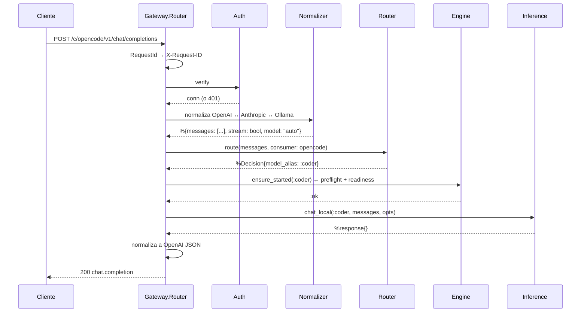

`model: "auto"` dispara el router. Un `model` concreto lo salta. Eso es lo que
permite que un cliente siga funcionando si el router decide mal.

### 20.4 Auth

```elixir
defmodule Candil.Gateway.Auth do
  @behaviour Plug
  @impl true
  def call(conn, _opts) do
    case auth_mode() do
      :none    -> conn
      :api_key -> verify_api_key(conn)
    end
  end
end
```

```toml
[gateway]
enabled  = false              # se arranca con `candil gateway start`
host     = "127.0.0.1"
port     = 7777
auth     = "none"             # none | api_key
# En "none" solo escucha en loopback y avisa al arrancar.
# En "api_key":
api_keys = [{ env = "CANDIL_GATEWAY_KEY" }]     # secretos fuera del TOML
rate_limit_per_minute = 600
```

**JWT no entra en v4.** Se puede añadir sin tocar el resto (una rama más en
`Auth.call/2`), pero nadie lo pidió y son 400 líneas. `auth = "none"` con
loopback es el default, y `candil gateway start` avisa si lo cambias.

Comparación con credenciales en **tiempo constante** (`Plug.Crypto.secure_compare/2`),
para que un attacker no pueda distinguir "clave casi correcta" de "no existe"
por el tiempo de respuesta.

### 20.5 Streaming

`Stream` de Candil (SSE) reescrito a chunked HTTP:

```
data: {"choices":[{"delta":{"content":"Hola"},"index":0}]}

data: {"choices":[{"delta":{},"finish_reason":"stop","index":0}]}

data: [DONE]
```

Con `Transfer-Encoding: chunked`, `Cache-Control: no-cache` y
`X-Accel-Buffering: no`. Si el cliente desconecta, el `Enum.reduce_while` corta
y se manda `Cancellation.cancel/1`.

### 20.6 Métricas

`GET /metrics` expone contadores que ya existen:
`[:candil, :llm, :chat, :start/:stop]` y los de `Arrea`. Se formatea como
texto Prometheus **a mano** (20 líneas), sin `telemetry_metrics_prometheus`:
`elpaso` arrastra esa dependencia y aquí no aporta.

```
# HELP candil_requests_total Requests by model and consumer
# TYPE candil_requests_total counter
candil_requests_total{model="coder",consumer="opencode",status="ok"} 128
candil_requests_total{model="verifier",consumer="posadero",status="error"} 2
# HELP candil_request_duration_seconds
# TYPE candil_request_duration_seconds summary
candil_request_duration_seconds_sum{model="coder"} 214.7
candil_request_duration_seconds_count{model="coder"} 128
```

### 20.7 Tests

- `Plug.Test` contra cada ruta
- `model: "auto"` con un solo modelo candidato: responde ese
- `model: "auto"` sin candidatos: `400` con el error de OpenAI, no un crash
- streaming: 3 chunks + `[DONE]`, y `content-type: text/event-stream`
- auth: `auth = "none"` pasa; `api_key` rechaza sin cabecera, acepta con
  clave buena, rechaza con clave mala **en el mismo tiempo**
- normalizer: el mismo mensaje en dialecto OpenAI y Anthropic produce el
  mismo `Decision`

---

## 21. MCP

**Fase 9**

### 21.1 Revisión del protocolo (C21)

Verificado contra la especificación: la revisión actual es **`2025-11-25`**, en
la era de _handshake_. Los tres documentos previos usaban `"2024-11-05"`, dos
generaciones de retraso.

Tres consecuencias concretas que un servidor debe cumplir:

1. **Handshake `initialize`** obligatorio antes que nada. El cliente manda la
   revisión que soporta; el servidor responde con la suya.
2. **Cabecera `MCP-Protocol-Version`** en **todas** las peticiones HTTP
   posteriores. Si falta, se asume `2025-03-26` por retrocompatibilidad. Si
   trae una versión no soportada, `400`.
3. **Sin JSON-RPC batching** (se eliminó en `2025-06-18`). Una petición por
   mensaje.

### 21.2 Transports

| Transport | Para                                           | Notas                                     |
| --------- | ---------------------------------------------- | ----------------------------------------- |
| `stdio`   | que opencode y demás lo lancen como subprocess | el shim por defecto                       |
| `http`    | compartido, y para clientes remotos            | header `MCP-Protocol-Version` obligatorio |

### 21.3 API

```elixir
defmodule Candil.MCP do
  @default_version "2025-11-25"
  @supported_versions ["2025-11-25", "2025-06-18", "2025-03-26", "2024-11-05"]

  @spec version() :: String.t()
  @spec supported? (String.t()) :: boolean()

  # servidor
  @spec serve(keyword()) :: {:ok, pid()} | {:error, term()}
  #   transport: :stdio | :http, port, tools

  # cliente
  @spec connect(keyword()) :: {:ok, client()} | {:error, term()}
  @spec list_tools(client()) :: {:ok, [map()]} | {:error, term()}
  @spec call_tool(client(), String.t(), map()) :: {:ok, term()} | {:error, term()}
  @spec disconnect(client()) :: :ok
end
```

### 21.4 Methods

Servidor: `initialize`, `tools/list`, `tools/call`, `resources/list`,
`resources/read`, `prompts/list`, `prompts/get`.
Cliente: los mismos, en la otra dirección.

### 21.5 Las tools de Candil

`Candil.Tool` ya tiene struct, macro `use Candil.Tool` y registry
(`Candil.Tool` es un GenServer en el árbol). El servidor MCP expone lo que haya
registrado, y acepta una lista explícita:

```elixir
Candil.MCP.serve(transport: :stdio, tools: :registered)
Candil.MCP.serve(transport: :stdio, tools: [MyApp.Weather])
Candil.MCP.serve(transport: :http, port: 7778, tools: :registered)
```

Y al revés: un consumidor puede registrar tools propias y exponerlas sin que
Candil sepa qué hacen. Es lo que hace posadero con sus 29 tools del vault, sin
que candil conozca el vault.

### 21.6 Handshake

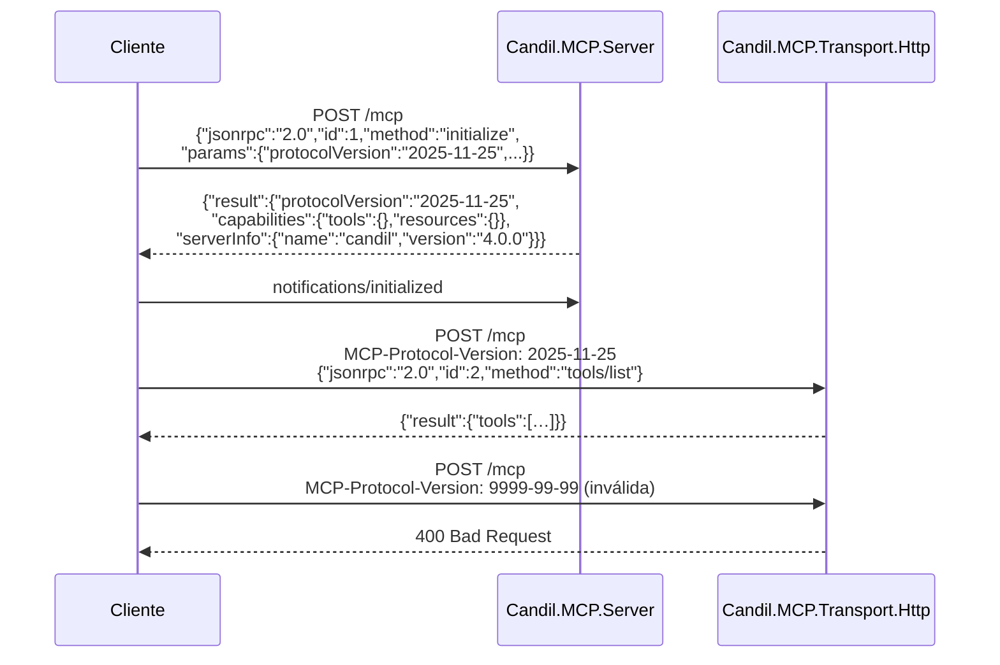

### 21.7 Tests

- `initialize` con cada revisión soportada responde la misma
- `initialize` con una revisión no soportada responde con la del servidor, no un error
- HTTP: sin `MCP-Protocol-Version` → se asume `2025-03-26` y funciona
- HTTP: con una versión inválida → `400`
- **batching: dos requests en un array → error** (se eliminó en 2025-06-18)
- `tools/list` lista lo registrado
- `tools/call` invoca y devuelve el resultado como `content: [{type: "text"}]`
- un tool que lanza → `error` con `-32603`, no tumba el servidor

---

## 22. RAG

**Fase 10**

### 22.1 Qué es

Chunking, indexado, retrieval híbrido y rerank. Es la pieza que posadero
necesita para el vault, y que `ElPaso.Context.EmbeddingClient` +
`Postgres/pgvector` hacen a medias.

### 22.2 Modelo

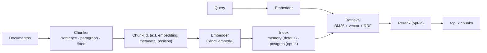

### 22.3 API

```elixir
defmodule Candil.RAG do
  @spec create_index(String.t(), keyword()) :: :ok | {:error, term()}
  @spec drop_index(String.t()) :: :ok
  @spec list_indexes() :: [String.t()]
  @spec index(String.t(), String.t(), keyword()) :: {:ok, non_neg_integer()} | {:error, term()}
  #   devuelve cuántos chunks indexó
  @spec search(String.t(), String.t(), keyword()) :: {:ok, [RAG.Chunk.t()]} | {:error, term()}
  @spec embedder(String.t()) :: {:ok, Model.t()} | {:error, term()}
end

defmodule Candil.RAG.Chunk do
  @enforce_keys [:id, :text]
  defstruct [:id, :text, :embedding, :metadata, :position, :score, :document_id]
end

defmodule Candil.RAG.Document do
  defstruct [:id, :path, :chunks, :metadata, :indexed_at]
end
```

`index/3` acepta un path (recorre el directorio, respecting un `.ragignore`) o
texto suelto.

### 22.4 Chunker

Estrategias `:sentence` (default, respeta puntos), `:paragraph`, `:fixed`.
Medida en **tokens**, no en caracteres — un chunk de 512 caracteres son ~128
tokens, y si el contexto es de 4096 llevas 4 chunks donde caben 16. Reutiliza
`Conversation.TokenEstimator`.

El solapamiento (`chunk_overlap`, 50 por defecto) existe para que una idea que
cae justo en la frontera no se pierda. Es la mitad del recall de cualquier
chunking ingenuo.

### 22.5 Retrieval: híbrido con RRF

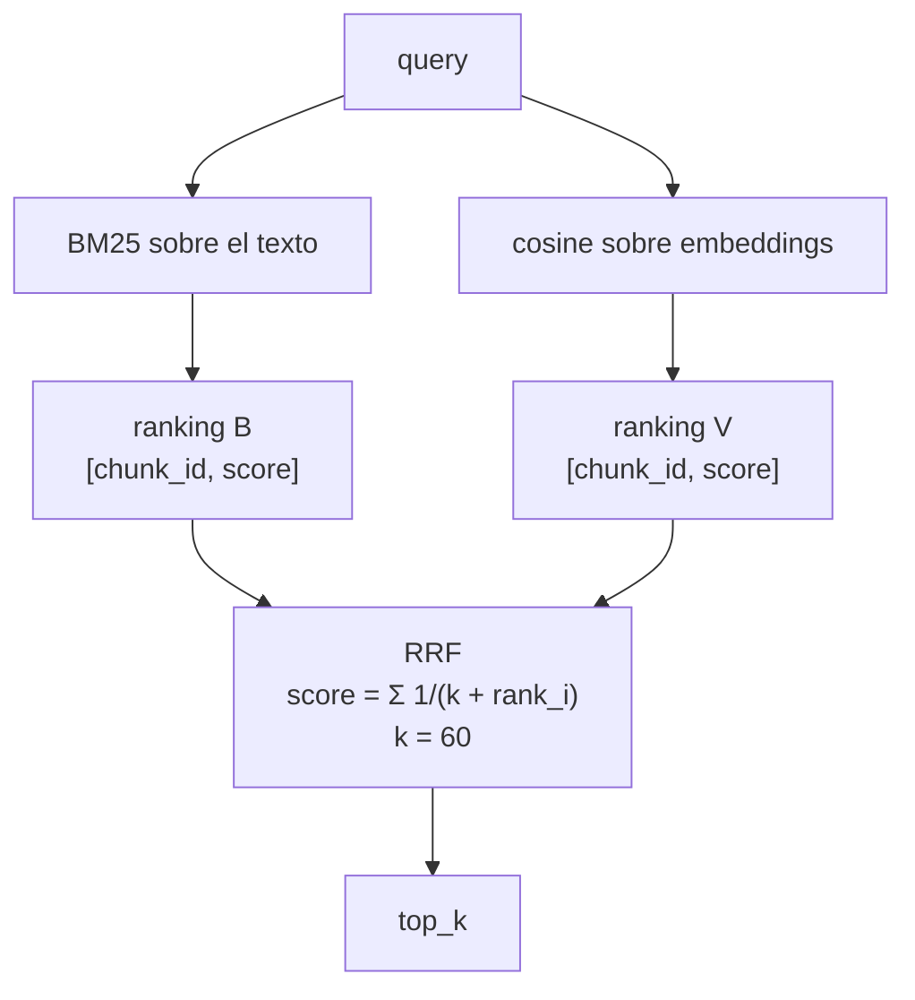

**RRF** (Reciprocal Rank Fusion) en vez de sumar scores normalizados: los
scores de BM25 y de coseno viven en escalas distintas y sumar sin normalizar
es arbitrario. RRF solo usa **el puesto**, no el valor, y funciona sin
calibrar. Es lo estándar para recuperación híbrida, y son 10 líneas.

Cosine sobre un índice de memoria con búsqueda lineal: vale hasta ~50k chunks.
Por encima, el backend de Postgres con pgvector. **No se pone HNSW en el índice
en memoria** — para 50k documentos lineales es más rápido que el coste de
construir el índice.

### 22.6 Rerank

Opt-in, `[rag] rerank_model`. Un cross-encoder reordena los `top_k` candidatos.
Si no hay modelo configurado, se devuelven tal cual. Nunca es el default,
porque son 100× más caro que el retrieval.

### 22.7 Config

```toml
[rag]
backend          = "memory"       # memory | postgres
embedder         = "embed"        # alias de un modelo con usage = ["embeddings"]
chunker          = "sentence"     # sentence | paragraph | fixed
chunk_size       = 512            # tokens
chunk_overlap    = 50
top_k            = 10
rrf_k            = 60
rerank_model     = ""             # vacío = sin rerank
# si backend = "postgres":
# url = "postgres://localhost/candil"
# table = "candil_rag"
```

### 22.8 Tests

- chunker: un texto de 10k tokens sale en ~20 chunks de 512, con solapamiento
  verificable (el último token del chunk N es el primero del N+1)
- chunker: `:sentence` no parte una frase por la mitad
- retrieval: un documento que contiene la palabra exacta sale primero vía BM25
- retrieval: un documento semánticamente cercano sale primero vía vector
- RRF: un chunk que está 1º en ambas listas gana a uno que está 1º en una y
  5º en la otra
- sin `embedder` configurado: `search/3` devuelve `{:error, :no_embedder}` con
  un mensaje que dice cuál falta, no un crash

---

# PARTE IV — Plan de ejecución

Cada fase: objetivo, ficheros, **criterio de aceptación ejecutable**, tag.
Ninguna termina con "funciona".

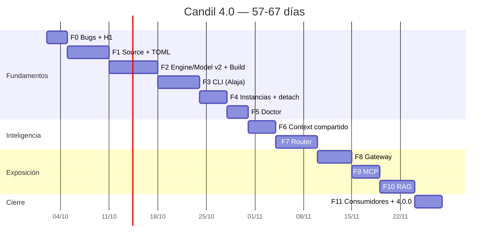

## Fase 0 — Bugs y H1 (3 d)

**Objetivo**: los 8 bugs, los tests stale, y la ruta local capaz de hablar con
un servidor con api-key.

### 0.1 Baseline (30 min)

```bash
cd ~/workspace/github/candil
mix deps.get
mkdir -p docs/baseline
mix compile --warnings-as-errors 2>&1 | tee docs/baseline/compile.txt
mix test 2>&1                     | tee docs/baseline/test.txt
mix credo --strict 2>&1           | tee docs/baseline/credo.txt
mix dialyzer 2>&1                 | tee docs/baseline/dialyzer.txt
mix deps.audit                    | tee docs/baseline/audit.txt
```

**No seguir si `mix compile` falla.**

### 0.2 Los 4 stubs de backend (2 h)

`LlamaCpp.chat/3` y `chat_stream/3` delegan en `Inference.Chat.do_chat_local/3`
y `Stream.chat/4`. Resolver el alias con
`%Model{alias: a} | a when is_atom(a) | a when is_binary(a)`, y el string con
`String.to_existing_atom/1`.

`OpenAICompat.chat_stream/3`: **eliminar `build_chunk_stream/1`**. Un stream
vacío con `Process.sleep(50)` no es una feature a arreglar: quitarlo hace que
quien lo use reciba un `FunctionClauseError` explícito en vez de un stream que
miente.

`OpenAICompat.embed/3`: una request con `input: texts`. Fallback por texto solo
para Ollama.

> `agent_test.exs` y `structured_test.exs` **pasan a tener contenido real**:
> hasta ahora no probaban nada porque el backend devolvía error siempre.

### 0.3 H1 — cabeceras en la ruta local (3 h)

Toca `Engine`, `Engine.Server`, `Inference.Chat`, `Inference.Embeddings`,
`Stream`. Detalle en §15.

```bash
# 1. Un llama-server de verdad, como ropero
llama-server --model ~/.candil/models/jina-code-embeddings-1.5b-Q8_0.gguf \
  --port 39999 --api-key sk-test-key -fa on --embedding &
sleep 20

# 2. Candil debe poder hablar con él
iex> engine = %Candil.Engine{alias: :t, binary: "llama-server",
#           host: "127.0.0.1", port: 39999, api_key: "sk-test-key"}
iex> Candil.Engine.start(engine, model)
iex> Candil.embed(:embed_test, ["hola", "adios"])
# Antes: {:error, %Candil.Error{reason: :http_error_401}}
# Después: {:ok, [[0.012, ...], [0.008, ...]]}

# 3. Y sin api_key debe fallar, para confirmar que el header llega
iex> Candil.embed(:embed_test, ["hola"], api_key: nil)
# → 401  ✓
```

> **Este test valida el diseño entero.** Si pasa, la absorción es viable.

### 0.4 B5 — `api_key` acepta string (15 min)

`validate_api_key/1` acepta `nil | binary | {:system, var}`. `resolve_provider/1`
resuelve el `{:system, var}` en lectura. **No** usar `{:literal, s}`:
indirección que no aporta y complica el matching de todos los que leen el
struct.

### 0.5 B6 — `trebejo` declarada (30 min)

`{:trebejo, github: "Lorenzo-SF/trebejo", optional: true, runtime: false}`.
`Detector.safe_arch/0` → `{:ok, arch} | {:error, :trebejo_not_available}`.

### 0.6 B7 — `EnginePool` sin LRU (1 h)

`put/1` pasa a `call`, no `cast`. Se quitan `get/0` y `evict/0` — API rota a
propósito (C13) — con un `get/0` deprecated durante un release.

### 0.7 B8 — checksum en streaming (1 h)

`:crypto.hash_init/update/final` sobre bloques de 1 MB. Coste: 10 MB de RAM, no
17 GB.

### 0.8 Tests stale (1 h)

`config_test.exs:9` → `:candil_llm_engines`, **una** aridad.
`engine_test.exs:39-42` → `~/.candil/llm/bin`. **El código tiene razón en
ambos casos**; se arreglan los tests. Luego `mix test --trace` y el resto, uno a
uno, anotando en el commit si era bug de código o de test.

**Criterio de aceptación**

```bash
mix compile --warnings-as-errors   # 0 warnings
mix test                          # 0 failures
mix credo --strict                # 0 issues
mix dialyzer                      # 0 errores
# y el test manual de 0.3, con y sin api_key
```

**Tag**: `candil-3.1.0`. No `3.0.1`: cambian structs públicos.

## Fase 1 — Source y config TOML (6 d)

**Objetivo**: un TOML que se lee, y un `pull` que baja 17 GB con progreso,
reanudación y checksum sin comerse la RAM. **Sin** el CLI `hf`.

### 1.1 Deps (10 min)

```elixir
{:toml, "~> 0.7"},
{:nimble_options, "~> 1.1"},
{:trebejo, github: "Lorenzo-SF/trebejo", optional: true, runtime: false},
```

### 1.2 `Candil.Source` (3 d)

Los requisitos de §12. **El test de reanudación es el importante**: se corta la
descarga a la mitad, se relanza, y se comprueba que el fichero final tiene el
tamaño correcto y el checksum pasa.

```bash
mix test test/candil/source/
mix test test/candil/source/streaming_integration_test.exs
#   - streaming a disco, RAM acotada
#   - Range: bytes=N- → reanuda y NO duplica
#   - checksum mal → borra el .part y falla
#   - sha256 ok → marker .complete
#   - dest_name renombra (caso MTP/)
#   - hf_token_env añade Authorization
```

### 1.3 `Candil.Config.Schema` + `File` (2 d)

NimbleOptions. Secciones: `general`, `engine` (con `install` y `auth`), `model`
(con `source` y `draft`), `provider`, `consumer`. Reutilizar
`Model.validate/1` y `Provider.validate/1`, que ya existen y no se llamaban.

Escritura atómica. `CANDIL_CONFIG` respetado. `:enoent` → config vacío, no error
(regla dura 12).

### 1.4 `Candil.Store` (1 d)

Renombrar `Config` → `Store`, hydrate del TOML después de
`load_from_app_config()`, y **validar en el registro**.

**Criterio de aceptación**

```bash
cat > /tmp/t.toml <<'EOF'
[general]
data_dir = "/tmp/candil-test"
[engine.llama_cpp]
binary = "llama-server"
base_port = 10000
[model.coder]
type = "local"
engine = "llama_cpp"
port = 9999
context_size = 131072
model_args = ["--n-gpu-layers", "-1", "--jinja"]
[model.coder.source]
kind = "huggingface"
repo = "unsloth/Qwen3-Coder-30B-A3B-Instruct-GGUF"
file = "Qwen3-Coder-30B-A3B-Instruct-UD-Q4_K_XL.gguf"
dest = "/tmp/candil-test/models"
EOF

CANDIL_CONFIG=/tmp/t.toml mix run -e '
  {:ok, m} = Candil.Store.get_model(:coder)
  {:ok, e} = Candil.Store.get_engine(:llama_cpp)
  true = m.port == 9999
  true = m.model_args == ["--n-gpu-layers", "-1", "--jinja"]
  true = m.source.repo == "unsloth/Qwen3-Coder-30B-A3B-Instruct-GGUF"
  true = e.base_port == 10000
  IO.puts("TOML OK")'

CANDIL_CONFIG=/tmp/t.toml mix run -e 'Candil.Source.fetch(Candil.Store.get_source(:coder))'
ls -la /tmp/candil-test/models/   # el .gguf está, no hay .part
```

**Tag**: `candil-3.2.0`

## Fase 2 — Engine/Model v2 y Build (7 d)

**Objetivo**: un motor, muchos modelos, con el puerto en el modelo, y **las
dos estrategias de instalación de §10.2 funcionando**.

### 2.1 `Model` y `Engine` v4 (2 d)

Los structs de §14.2 y §14.3. `Model` gana `port`, `source`, `draft`, `tags`,
`enabled`, `launcher`, `base_url`, y `type: :external`. `Model.validate/1`
extiende con `:external`.

### 2.2 `Candil.Build` (3 d)

`precompiled/1` y `from_source/2` (§13).

```bash
mix test test/candil/build/precompiled_test.exs
mix test test/candil/build/source_test.exs
#   - git clone de un repo fixture
#   - cmake_args se pasan VERBATIM   ← blinda C10
#   - --build usa el generator declarado (ninja/make)
#   - jobs=0 → nproc
#   - binaries se copian a dir y quedan ejecutables
#   - error de cmake → {:error, texto} con el stderr
#   - cancelación mata el proceso hijo
```

Sobre llama.cpp de verdad, a mano, no en CI:

```bash
cat > /tmp/build-test.toml <<'EOF'
[engine.llama_cpp.install]
strategy  = "source"
repo      = "https://github.com/ggml-org/llama.cpp"
ref       = "b4561"
src_dir   = "/tmp/llama.cpp"
build_dir = "/tmp/llama.cpp/build"
generator = "ninja"
dir       = "/tmp/llama-bin"
binaries  = ["llama-server", "llama-cli"]
cmake_args = [
  "-DCMAKE_BUILD_TYPE=Release", "-DCMAKE_CUDA_ARCHITECTURES=120a",
  "-DGGML_CUDA=ON", "-DGGML_CUDA_FA=ON", "-DGGML_CUDA_MMQ_MXFP4=ON",
  "-DGGML_CUDA_MMQ_NVFP4=ON", "-DGGML_CUDA_NO_VMM=ON",
  "-DGGML_CUDA_COMPRESSION_MODE=speed", "-DGGML_NATIVE=ON",
  "-DGGML_AVX512=ON", "-DBUILD_SHARED_LIBS=OFF",
  "-DLLAMA_BUILD_SERVER=ON", "-DLLAMA_BUILD_TOOLS=ON"
]
EOF

CANDIL_CONFIG=/tmp/build-test.toml mix run -e 'Candil.Build.install(:llama_cpp)'
# → 20-40 min, acompañado con `candil engine install --watch`
/tmp/llama-bin/llama-server --version     # debe funcionar
```

### 2.3 `EnginePool` como registro de instancias (1.5 d)

`{alias, port} → %{pid, model, engine, started_at, healthy}`. `claim_port/2`
comprueba con `:gen_tcp.connect/4` que no hay nadie escuchando.

### 2.4 El `candil.toml` de ropero, a mano (0.5 d)

**Aquí se materializa C15**: no hay comando, se escribe el TOML. El Apéndice A
es el punto de partida.

```bash
cp candil.toml ~/.config/candil/candil.toml
$EDITOR ~/.config/candil/candil.toml

candil config validate
#   ✓ candil.toml válido · 11 modelos · 1 engine · 1 provider
#   ✓ todos los models tienen engine, port y context_size

candil models list
#   alias      type   ctx      port  usage                 size      state
#   coder      local  131072   9999  chat,code,completion  17.7 GB   downloaded
#   analyst    local  131072   9999  chat,reasoning        13.1 GB   downloaded
#   verifier   local  131072   9998  chat,reasoning        12.1 GB   downloaded
#   designer   local  131072   9998  chat,reasoning        12.1 GB   downloaded
#   embed      local  8192     9990  embeddings             1.6 GB   downloaded
#   coder_lite local  131072   9999  chat,completion       14.5 GB   downloaded
#   gpt4o      remote 128000   -     chat,completion        -        -
```

**Tag**: `candil-3.3.0`. ropero sigue vivo y sin tocar.

## Fase 3 — CLI con Alaja (6 d)

### 3.1 Dep y escript (0.5 d)

```elixir
{:alaja, github: "Lorenzo-SF/alaja"},
escript: [main_module: Candil.CLI],
```

`Candil.CLI.main/1` llama a `Application.ensure_all_started(:candil)` antes de
nada, o la CLI no ve el catálogo de ETS. **Este detalle se olvida siempre y
cuesta una hora de desconcierto.**

```bash
mix escript.build && ./candil version    # Candil 4.0.0-dev
```

### 3.2 Comandos de modelos (1.5 d)

`list` (tabla con Alaja), `pull` (barra leyendo el `:atomics` del `Source`),
`info`, `remove` (con confirmación).

### 3.3 Comandos de ciclo de vida (2 d)

`run` con el `:auto` de §11.2, el preflight, `--force`, `--cpu`,
`--detach`; `stop`; `status` con `--json` y `--watch`.

**El modo foreground engancha y colorea la salida del proceso**, que es lo que
hace `colorize` en ropero: un `awk` que colorea por patrón (`OOM|CUDA
error|segfault` → rojo, `tok/s|eval time` → magenta, `loaded|server listening`
→ color del modelo). 25 líneas, y es lo que hace legible un arranque de 20 GB.

**Criterio de aceptación**

```bash
$ ./candil models list          # la tabla de arriba

$ ./candil run coder
✓ coder arrancado en :9999 (pid 4821) · 27.4s · ctx 131072
# … y sigue vivo, coloreado, en primer plano

$ ./candil run coder --detach
✓ coder detached (pid 5102) · log: ~/.candil/logs/coder-9999.log

$ ./candil status
SLOT   PORT   STATE  MODEL    PID    UPTIME   ENGINE
dGPU   9999   ON     coder    5102   0m04s    llama-server
CPU    9998   OFF    -        -      -        -
-      9990   OFF    -        -      -        -

$ ./candil run coder --detach
✓ coder ya está corriendo en :9999           # idempotente

$ ./candil run analyst
✗ :9999 está ocupado por 'coder' (pid 5102).
  candil no mata automáticamente. Usa:
    candil stop coder
  o --force para rotar interactivamente.
$ ./candil run analyst --detach --force
⚠ --force: matando 'coder' en :9999 (pid 5102)
✓ analyst detached (pid 5233) · 31.2s

$ ./candil run verifier --cpu --detach
✓ verifier detached (pid 5301) · 8.1s · ngl 0

$ ./candil status --json | jq -r '.[0].model'   # "analyst"
$ ./candil stop all
✓ 3 instancias paradas
```

Cada mensaje es una línea del código de ropero, traducida. La fase no está
terminada hasta que la salida sea esa.

**Tag**: `candil-4.0.0-alpha.1`

## Fase 4 — Instancias, detach y engines externos (4 d)

### 4.1 `instances.json` y `--detach` (1.5 d)

§11.3 y §11.4. Escritura atómica, poda de entradas con pid muerto.

```bash
$ ./candil run coder --detach
$ cat ~/.candil/run/instances.json | jq '.[0]'
{ "model": "coder", "port": 9999, "owner": {"kind": "pid", "pid": 5102}, ... }

$ ./candil stop coder
✓ coder parado (owner pid 5102)
```

### 4.2 `Launcher.Http` (1.5 d)

§14.5. Con ella, vLLM, TGI, LM Studio, Ollama, airllm, tensorrt-llm y mlx-lm
quedan cubiertos sin código específico.

```bash
$ ./candil run tgi
✓ tgi enganchado a http://10.0.0.5:8080 (externo, no gestionado)
$ ./candil stop tgi
✓ tgi desconectado (el proceso sigue vivo: no es nuestro)
```

### 4.3 Health (1 d)

`HealthPoller` a 5 s, reutilizado tal cual. `status` lo usa para la columna
`STATE` de verdad, no un `ON`/`OFF` por presencia en el registro.

**Criterio de aceptación**

```bash
$ ./candil run coder --detach
$ ./candil run embed --detach
$ ./candil run verifier --cpu --detach
$ ./candil status
SLOT   PORT   STATE  MODEL    PID    UPTIME   ENGINE
dGPU   9999   ON     coder    5102   12m03s   llama-server
-      9990   ON     embed    5201   11m58s   llama-server
CPU    9998   ON     verifier 5301   11m55s   llama-server
                                       3 instancias

$ ./candil run coder --port 10500 --detach
$ ./candil status | grep 10500          # aparece
$ ./candil stop coder                   # para LAS DOS
✓ 2 instancias de 'coder' paradas

# matar el dueño se lleva el engine con él (sin huérfanos)
$ kill 5102; sleep 3
$ pgrep -a llama-server | grep coder    # nada
```

**Tag**: `candil-4.0.0-alpha.2`

## Fase 5 — Doctor (3 d)

### 5.1 `Candil.Doctor` (2 d)

Los checks de §17. **Usa botica** para los genéricos y los suyos para lo de
LLM. `doctor --fix` delega en `Botica.Doctor.fix/1` para lo que botica sepa
arreglar.

### 5.2 Limpieza de deuda (1 d)

- `Cost` con precios de 2024 → fichero de datos, `@deprecated` en la tabla
  embebida. Los locales valen `0.0`.
- El moduledoc de `Application` dice `{:arrea, "~> 2.1.0"}` y arrea está en
  3.0.0. Corregir.
- Quitar los TODOs y los `Process.sleep` fuera de health polling.
- Nota en el repo de botica: `Batteries.LlamaServer` está fuera de su dominio
  y su sitio es candil. **No se borra desde aquí.**

**Criterio de aceptación**

```bash
$ ./candil doctor
# 0 errores, y cada advertencia dice qué hacer
$ ./candil doctor --fix
# arregla lo que puede, y lista lo que no con el comando exacto

$ mix test && mix credo --strict && mix dialyzer
$ mix deps.audit
```

**Tag**: `candil-4.0.0-alpha.3`

## Fase 6 — Context compartido (4 d)

**Objetivo**: sesiones en ETS particionadas por consumer, con resumen
automático. Detalle en §18.

```bash
mix test test/candil/context/
#   - aislamiento: create(:posadero,"s1") y create(:opencode,"s1") no se ven
#   - TTL: gc/0 recoge la sesión vieja
#   - LRU: con max_sessions: 2, la tercera desaloja la más antigua
#   - Builder: con context_size pequeño → {:error, :context_exceeded},
#     no una lista truncada en silencio
#   - Summarizer: con el modelo caído, la sesión queda intacta

# integración, de verdad
$ ./candil run verifier --detach
$ mix run -e '
  Candil.chat_with_context(:verifier, "s1",
    [%{role: "user", content: "recuerda: mi API key está en $CANDIL_KEY"}],
    consumer: :posadero)
  Candil.chat_with_context(:coder, "s1",
    [%{role: "user", content: "¿qué sabes de mí?"}],
    consumer: :opencode)
  # el segundo NO debe saber nada del primero'
```

**Tag**: `candil-4.0.0-alpha.4`

## Fase 7 — Router (6 d)

**Objetivo**: las cuatro capas de §19.2, con el motor arrancado si hace falta.

```bash
mix test test/candil/router/
#   - property: misma entrada + mismo cache → misma decisión
#   - pin/2 gana a las reglas
#   - sin candidatos → {:error, :no_models_for_consumer}
#   - la capa 2 no corre sin modelo embeddings
#   - la capa 3 no corre con enable_llm_classifier: false

$ ./candil router test "refactoriza este módulo de Elixir"
→ coder (rule, score 0.80)
  alternativas: verifier 0.20, gpt4o 0.00

$ ./candil router test "explícame por qué esto es O(n log n)"
→ verifier (rule, score 0.60)

$ ./candil router stats
consumer    model      calls   p50      p95      errors
opencode    coder      128     820ms    3.1s     2
posadero    embed      47      12ms     40ms     0
```

**Tag**: `candil-4.0.0-beta.1`

## Fase 8 — Gateway (5 d)

**Objetivo**: endpoint OpenAI-compatible que enruta. Detalle en §20.

```bash
mix test test/candil/gateway/

$ ./candil gateway start
✓ gateway en http://127.0.0.1:7777 (auth: none, solo loopback)

$ curl -X POST localhost:7777/v1/chat/completions \
    -H 'Content-Type: application/json' \
    -d '{"model":"auto","messages":[{"role":"user","content":"hola"}]}'
# → arranca coder si hace falta, enruta, responde OpenAI-compatible

$ curl -X POST localhost:7777/c/posadero/v1/embeddings \
    -d '{"model":"embed","input":["uno","dos"]}'
# → embeddings, con el consumer posadero

$ curl localhost:7777/metrics | head -5
$ curl localhost:7777/health
```

**Un cliente OpenAI de verdad** como prueba de aceptación:

```python
from openai import OpenAI
c = OpenAI(base_url="http://127.0.0.1:7777/v1", api_key="not-needed-in-none-mode")
print(c.chat.completions.create(model="auto",
      messages=[{"role":"user","content":"hola"}]).choices[0].message.content)
```

Si eso imprime algo, el gateway es un gateway. No hace falta que pase un test
nuestro para saber que funciona.

**Tag**: `candil-4.0.0-beta.2`

## Fase 9 — MCP (4 d)

**Objetivo**: servidor y cliente, en `2025-11-25`. Detalle en §21.

```bash
mix test test/candil/mcp/
#   - initialize con cada revisión soportada
#   - initialize con una no soportada → responde la del servidor
#   - HTTP sin MCP-Protocol-Version → asume 2025-03-26 y funciona
#   - HTTP con versión inválida → 400
#   - batching (array de requests) → error
#   - tools/list lista lo registrado
#   - un tool que lanza → error -32603, no tumba el servidor

# stdio, el shim por defecto
$ echo '{"jsonrpc":"2.0","id":1,"method":"initialize",
         "params":{"protocolVersion":"2025-11-25","capabilities":{},
                   "clientInfo":{"name":"test","version":"1"}}}' \
  | ./candil mcp serve --transport stdio

# http
$ ./candil mcp serve --transport http --port 7778
$ curl -X POST localhost:7778/mcp \
    -H 'MCP-Protocol-Version: 2025-11-25' \
    -d '{"jsonrpc":"2.0","id":2,"method":"tools/list"}'
```

**Tag**: `candil-4.0.0-rc.1`

## Fase 10 — RAG (5 d)

**Objetivo**: chunking, índice, retrieval híbrido, rerank opcional. §22.

```bash
mix test test/candil/rag/
#   - chunker: 10k tokens → ~20 chunks de 512, solapamiento verificable
#   - chunker: :sentence no parte una frase
#   - retrieval: palabra exacta sale primero vía BM25
#   - retrieval: semánticamente cercano sale primero vía vector
#   - RRF: 1º en ambas listas gana a 1º en una y 5º en la otra
#   - sin embedder → {:error, :no_embedder} con el nombre del que falta

$ ./candil run embed --detach
$ ./candil rag index vault --path ~/lasaca/PENDIENTE
✓ 1.284 documentos · 18.402 chunks · 31.2s

$ ./candil rag query vault "dónde está la decisión sobre el daemon"
1. [0.82] PENDIENTE/principal/daemon.md:44
     "…el dueño es un proceso, no un daemon. Si hace falta uno,
      se cambia el dispatch de owner, no el código de stop…"
```

**Tag**: `candil-4.0.0-rc.2`

## Fase 11 — Consumidores, docs y 4.0.0 (4 d)

### 11.1 Cablear posadero (1.5 d)

`Posadero.LLM.Ropero` se puede borrar: son 250 líneas que existen solo para
sortear H1. Se sustituye por `Candil.Store.get_model/1` + `Candil.embed/3`.

```bash
cd ~/workspace/github/lasaca/posadero
git rm lib/posadero/llm/ropero.ex
mix test                    # 0 failures
grep -r "LLM.Ropero" lib/   # 0
```

### 11.2 gunter / opencode (0.5 d)

Los aliases (`coder`, `analyst`, `verifier`, `designer`, `embed`) ya existen en
Candil con los mismos puertos. Se cambia `ropero <alias> --background` por
`candil run <alias> --detach` en `_shunt-lib.sh`, y el `base_url` del
`opencode.jsonc` al gateway si se quiere.

### 11.3 Docs (1 d)

`README.md`, `docs/CONFIG.md` (el TOML comentado), `docs/ENGINES.md` (las dos
estrategias con ejemplos reales de CUDA y Metal), `docs/MIGRATION.md` (copia el
Apéndice A, ajusta rutas, valida), `docs/DESIGN.md` (este documento),
`docs/CONSUMERS.md` (cómoOPENCODE y posadero se aíslan).

### 11.4 Cierre (1 d)

```bash
$ mix compile --warnings-as-errors
$ mix test && mix test --cover          # ≥ 70%
$ mix credo --strict
$ mix dialyzer
$ mix docs                              # 0 warnings
$ mix deps.audit
$ mix deps.unlock --check-unused
$ ./candil doctor                       # 0 errores

$ git tag candil-4.0.0 && git push --tags
```

**Fin del plan.** 57-67 días.

---

# Apéndices

## A — El `candil.toml` equivalente a ropero

Punto de partida para la Fase 2.4. **No lo genera ningún comando** (C15): es la
traducción de §4. Ajusta `data_dir`, `model_dir` y `log_dir` a donde tengas
las cosas.

```toml
[general]
data_dir         = "~/.candil"
log_dir          = "~/.candil/logs"
default_consumer = "default"

[engine.llama_cpp]
binary    = "~/.candil/llm/bin/llama-server"
host      = "127.0.0.1"
base_port = 10000

[engine.llama_cpp.install]
strategy  = "source"
repo      = "https://github.com/ggml-org/llama.cpp"
ref       = "b4561"
src_dir   = "~/.candil/src/llama.cpp"
build_dir = "~/.candil/build/llama.cpp"
generator = "ninja"
dir       = "~/.candil/llm/bin"
binaries  = ["llama-server", "llama-cli"]
# Los cmake_args de tu hardware. Ver docs/ENGINES.md.
# CachyOS/CUDA + RTX 5080: los de ropero, con 120a y MXFP4/NVFP4.
# macOS/Metal: GGML_METAL_* y -mcpu=native.
cmake_args = [ ... ]

[engine.llama_cpp.auth]
api_key_env = "LLAMA_API_KEY"     # default en ropero: sk-local-dev-key

# ── ropero.d/qwencoder.sh ──────────────────────────────────────
[model.coder]
type         = "local"
engine       = "llama_cpp"
context_size = 131072
port         = 9999
usage        = ["chat", "code", "completion"]
tags         = ["gpu", "moe", "code"]
model_args   = ["--n-gpu-layers","-1", "--n-cpu-moe","30",
                "--no-kv-offload", "--cache-type-k","q8_0",
                "--cache-type-v","q8_0", "--cache-prompt",
                "--context-shift", "--kv-unified", "--jinja",
                "--reasoning-format","deepseek", "--load-mode","none",
                "--temp","0.7", "--top-p","0.8", "--top-k","20",
                "--min-p","0.0", "--repeat-penalty","1.05",
                "--repeat-last-n","64", "--batch-size","4096",
                "--ubatch-size","1024", "--parallel","1",
                "--threads","12", "--n-predict","8192", "--keep","1024"]
[model.coder.source]
kind = "huggingface"
repo = "unsloth/Qwen3-Coder-30B-A3B-Instruct-GGUF"
file = "Qwen3-Coder-30B-A3B-Instruct-UD-Q4_K_XL.gguf"
dest = "~/.candil/models"

# ── ropero.d/qwen.sh ───────────────────────────────────────────
[model.analyst]
type         = "local"
engine       = "llama_cpp"
context_size = 131072
port         = 9999
usage        = ["chat", "reasoning"]
tags         = ["gpu", "mtp"]
# ⚠ OJO (C22): --model-draft necesita RUTA ABSOLUTA.
# "~" no se expande dentro de las comillas del argumento.
model_args   = ["--n-gpu-layers","99", "--no-kv-offload",
                "--spec-type","draft-mtp",
                "--model-draft","/home/lorenzo/.candil/models/mtp-Qwen3.8-27B-Q4_0.gguf",
                "--n-gpu-layers-draft","-1",
                "--spec-draft-n-max","5", "--spec-draft-n-min","1",
                "--spec-draft-backend-sampling",
                "--cache-type-k","q8_0", "--cache-type-v","q8_0",
                "--cache-prompt", "--context-shift", "--kv-unified",
                "--jinja", "--reasoning-format","deepseek",
                "--chat-template-kwargs",'{"enable_thinking": false}',
                "--load-mode","none", "--temp","0.7", "--top-p","0.8",
                "--top-k","20", "--min-p","0.0",
                "--presence-penalty","1.5", "--repeat-penalty","1.0",
                "--repeat-last-n","64", "--batch-size","4096",
                "--ubatch-size","1024", "--parallel","1",
                "--n-predict","16384", "--keep","1024"]
[model.analyst.source]
kind = "huggingface"
repo = "unsloth/Qwen3.8-27B-GGUF"
file = "Qwen3.8-27B-UD-Q3_K_XL.gguf"
dest = "~/.candil/models"
# el draft va aparte; dest_name aplana el subdirectorio MTP/ que deja HF
[model.analyst.draft]
kind      = "huggingface"
repo      = "unsloth/Qwen3.8-27B-GGUF"
file      = "MTP/mtp-Qwen3.8-27B-Q4_0.gguf"
dest      = "~/.candil/models"
dest_name = "mtp-Qwen3.8-27B-Q4_0.gguf"

# ── ropero.d/gptoss_high.sh ────────────────────────────────────
[model.verifier]
type         = "local"
engine       = "llama_cpp"
context_size = 131072
port         = 9998
usage        = ["chat", "reasoning"]
tags         = ["cpu", "reasoning"]
model_args   = ["--n-gpu-layers","99", "--temp","0.8", "--top-k","40",
                "--min-p","0.05", "--repeat-penalty","1.1",
                "--threads","12", "--threads-batch","24",
                "--reasoning-format","auto",
                "--chat-template-kwargs",'{"reasoning_effort":"high"}',
                "--batch-size","4096", "--ubatch-size","1024",
                "--n-predict","16384", "--slot-prompt-similarity","0.2",
                "--keep","8192", "--cache-type-k","q8_0",
                "--cache-type-v","q8_0", "--jinja", "--kv-unified",
                "--load-mode","auto", "--spec-type","ngram-simple",
                "--spec-ngram-simple-size-n","6",
                "--spec-ngram-simple-size-m","16",
                "--spec-draft-n-min","1", "--spec-draft-n-max","2"]
[model.verifier.source]
kind = "huggingface"
repo = "bartowski/openai_gpt-oss-20b-GGUF-MXFP4-Experimental"
file = "openai_gpt-oss-20b-MXFP4.gguf"
dest = "~/.candil/models"

# designer = idéntico a verifier con "reasoning_effort":"medium"

# ── ropero.d/devstral.sh ───────────────────────────────────────
[model.coder_lite]
type         = "local"
engine       = "llama_cpp"
context_size = 131072
port         = 9999
usage        = ["chat", "completion"]
tags         = ["gpu"]
model_args   = ["--n-gpu-layers","-1", "--no-kv-offload",
                "--cache-type-k","q8_0", "--cache-type-v","q8_0",
                "--cache-prompt", "--cache-reuse","512",
                "--kv-unified", "--context-shift",
                "--batch-size","4096", "--ubatch-size","1024",
                "--parallel","1", "--threads","12",
                "--threads-batch","16", "--poll","30", "--jinja",
                "--chat-template-kwargs",'{"enable_thinking": false}',
                "--reasoning-format","deepseek", "--temp","0.6",
                "--top-k","20", "--top-p","0.95", "--min-p","0.05",
                "--repeat-penalty","1.0", "--repeat-last-n","64",
                "--seed","-1", "--n-predict","4096", "--keep","1024",
                "--load-mode","none"]
[model.coder_lite.source]
kind = "huggingface"
repo = "unsloth/Devstral-Small-2-24B-Instruct-2512-GGUF"
file = "Devstral-Small-2-24B-Instruct-2512-UD-Q4_K_XL.gguf"
dest = "~/.candil/models"

# ── ropero.d/embed.sh ──────────────────────────────────────────
[model.embed]
type         = "local"
engine       = "llama_cpp"
context_size = 8192
port         = 9990
usage        = ["embeddings"]
tags         = ["embed"]
model_args   = ["--embedding", "--pooling","last",
                "--embd-normalize","2", "--batch-size","1024",
                "--ubatch-size","1024", "--parallel","4", "--jinja"]
[model.embed.source]
kind = "huggingface"
repo = "jinaai/jina-code-embeddings-1.5b-GGUF"
file = "jina-code-embeddings-1.5b-Q8_0.gguf"
dest = "~/.candil/models"

# ── Remotos ────────────────────────────────────────────────────
[model.gpt4o]
type = "remote"; name = "gpt-4o"; provider = "openai"
context_size = 128000; usage = ["chat", "completion"]
[provider.openai]
type = "openai"; base_url = "https://api.openai.com"
api_key = { env = "OPENAI_API_KEY" }

# ── Consumidores ───────────────────────────────────────────────
[consumer.default]
model_default = "coder"
[consumer.posadero]
model_default = "embed"
[consumer.opencode]
model_default = "coder"
```

**Cambios deliberados respecto a ropero**:

|                           | ropero                    | candil        | por qué                                                                                   |
| ------------------------- | ------------------------- | ------------- | ----------------------------------------------------------------------------------------- |
| `HOST`                    | `0.0.0.0`                 | `127.0.0.1`   | 0.0.0.0 expone a la red local sin querer. Si necesitas LAN, se configura                  |
| rutas                     | `~/models/gguf`           | configurables | C17                                                                                       |
| symlinks a `~/.local/bin` | sí, con reglas especiales | **no**        | ropero enlazó un venv entero y tumbó el `python3` del sistema. Candil apunta con `binary` |
| `ROPERO_<M>_<P>`          | overrides en runtime      | no se migran  | son interactivos; se editan el TOML o se pasan por CLI                                    |
| métricas de `status`      | sí                        | no            | §4.6                                                                                      |

**Los modelos de `fired/`** (`qwenvision`, `muse`, `nemotron`, `next`, `qwopus`,
`internivision`, `airgptoss`, `tensorrt-llm`, `mlx_lm`) no entran en el TOML. Si
los quieres, se copian desde la tabla de §4.1. `qwenvision` es el caso
interesante: necesita un `--mmproj` con **ruta absoluta** al segundo fichero.

**Equivalencia, a comprobar a mano una vez** (no es un test):

```bash
# Con ropero parado y candil gestionando coder:
./candil run coder &
sleep 40
pgrep -a llama-server | grep -- --model
# La línea debe coincidir con la de `ropero coder`, salvo en
# --host, --port, --alias y --api-key (los pone el engine).
# Si algo no cuadra, la diferencia va al TOML, no al código.
```

## B — El bug de posadero

`Posadero.LLM.Ropero` existe porque `Candil` no puede hablar con los servidores
de ropero. Está escrito, testeado, y documentado en su moduledoc.

Con H1 arreglado, ese módulo se borra y se sustituye por `Candil.Store.get_model/1`

- `Candil.embed/3`. No es "cablear posadero a candil" (que era la Fase 8 de v3,
  3-4 días): es **borrar 250 líneas que existen solo para sortear un bug de
  candil**. Media hora de trabajo y 250 líneas de deuda menos.

Si H1 no se arregla, eso no se puede hacer, y posadero mantiene dos clientes de
LLM para siempre.

## C — Qué corrige este documento

1. **H1**: los tres docs ignoran que la ruta local no puede autenticar. Sin
   eso, absorber ropero no funciona, y ningún test de los tres lo habría
   detectado.
2. **H2/H3**: el modelo de datos de ropero no encaja (puerto, instancias, binario
   compilado). Y `Botica.Batteries.LlamaServer` está fuera del dominio de
   botica.
3. **H4**: dos estrategias de instalación, con los flags del usuario.
4. **H5**: la supervivencia del proceso. `--detach` es `nohup` de sí mismo, y
   el `owner` de `instances.json` tiene una segunda cláusula reservada para el
   daemon.
5. **Alcance**: v4 define **todo** — Router, Gateway, Context, MCP y RAG con su
   API, su config, sus tests y su fase. No hay v5 difuminado.
6. **Fases**: 12 en vez de 10-11, y la absorción de ropero va en la Fase 2, no
   en la 7.
7. **No hay comando de migración.** Los `.sh` tienen `case` anidados, variables
   indiretas y `source` entre ellos. El análisis es un artefacto (Apéndice A).
8. **Semver**: nadie decía que `Model`, `Engine` y `EnginePool` son structs
   públicos documentados. Cambiarlos es un major.
9. **ropero no se toca** (C16).
10. **`model_args` es lista**, y el `--cpu` va al final. Un mapa pierde el orden,
    y llama-server usa la última aparición.
11. **`~` no se expande en los args** (C22). El ejemplo de v3 lo tenía mal.
12. **Descarga sin `hf`**: HTTPS nativo con `Range`, checksum en streaming y
    progreso.
13. **MCP en `2025-11-25`**, con handshake, cabecera de versión y sin batching.
    Los tres docs usaban `2024-11-05`.
14. **Criterios**: cada fase termina con un comando que tiene que salir en verde.

## D — Reglas duras

1. Un solo `mix.exs`.
2. `consumer` en toda la API con estado.
3. TOML es la fuente de verdad; `config.exs` sigue funcionando.
4. ETS siempre. Postgres no.
5. Ningún GenServer con dos responsabilidades.
6. Ningún `Process.sleep` en producción, salvo polling.
7. **Ningún `String.to_atom/1` con input externo.** `String.to_existing_atom/1`,
   y si falla `{:error, :unknown_model}`. El gateway recibe `model` de la red.
8. **Ningún fichero de más de 1 GB se lee entero en memoria.** Checksum en
   streaming.
9. Candil no depende de Posadero. Ni al revés.
10. Alaja solo en `lib/candil/cli/**` y `doctor.ex`.
11. Toda API pública tiene `@spec`. Dialyzer limpio.
12. Sin TOML, todo arranca con defaults.
13. **Ningún `cmake_args` por defecto.** Los flags de compilación los pone quien
    tiene el hardware.
14. Nada se borra sin temporada de convivencia en producción.
15. Todo número de un `--help` está en el código, no hardcodeado dos veces.
16. **Rutas de args siempre absolutas.** `~` se expande al construir.
17. **Una sola dirección entre capas.** `router` no sabe que existe `gateway`;
    `inference` no sabe que existe `rag`.

## E — Preguntas abiertas

| #   | Pregunta                                                  | Bloquea  | Recomendación                                                          |
| --- | --------------------------------------------------------- | -------- | ---------------------------------------------------------------------- |
| Q1  | ¿Los modelos de `fired/` entran en el TOML?               | Fase 2.4 | no. Se documentan en §4.1 y se añaden si hacen falta                   |
| Q2  | ¿El `mmproj` de qwenvision es `source` o `model_args`?    | Fase 2.4 | `model_args` con ruta absoluta. Es un fichero auxiliar, no el modelo   |
| Q3  | ¿Gateway en `127.0.0.1` o también en LAN?                 | Fase 8   | loopback por defecto; `host` configurable. `auth = "none"` en loopback |
| Q4  | ¿JWT en el gateway?                                       | v5       | no en v4. Una rama más en `Auth` si hace falta                         |
| Q5  | ¿Métricas de sistema en `status`?                         | v5       | no, mientras ropero exista                                             |
| Q6  | ¿Candil en Hex o solo git?                                | Fase 11  | git. Con deps por GitHub, Hex no aporta nada                           |
| Q7  | ¿airllm / tensorrt / mlx como engines de primera clase?   | v5       | no. `Launcher.Http` los cubre, y es la respuesta correcta              |
| Q8  | ¿Quién compila si no hay cmake ni red?                    | Fase 2.2 | no hay modelo. Se dice claro, con las dos opciones que sí hay          |
| Q9  | ¿El `[context]` se persiste entre reinicios?              | Fase 6   | no en v4. ETS. Si hace falta, `Context.Backend.Disk` sin DB            |
| Q10 | ¿Los consumers pueden tener tablas de afinidad distintas? | Fase 7   | sí, `[consumer.X] affinity`, sobrescribe `[router.affinity]`           |
